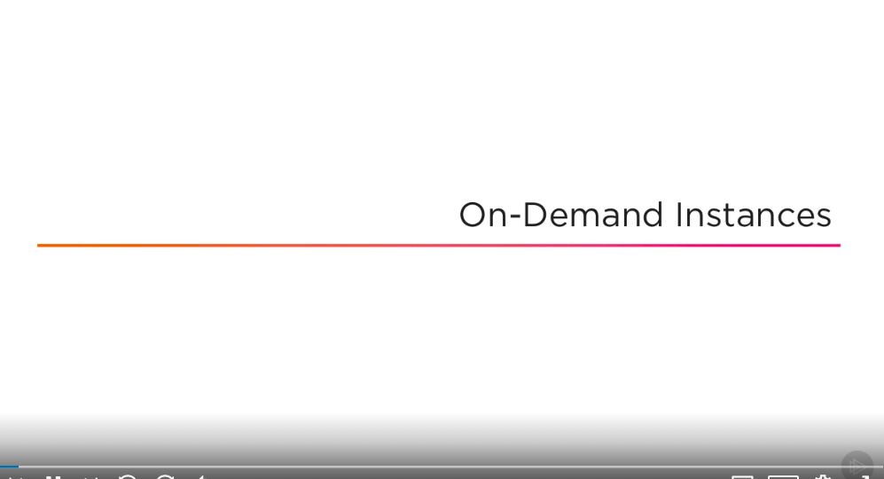
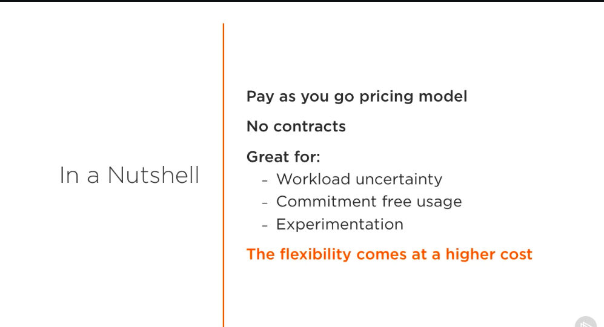
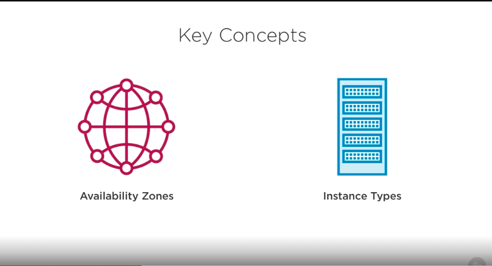
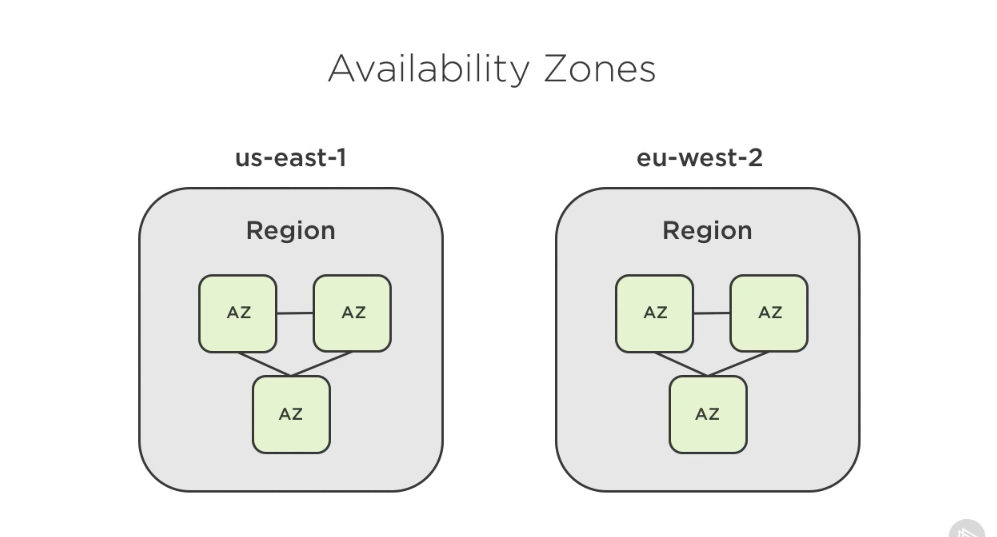
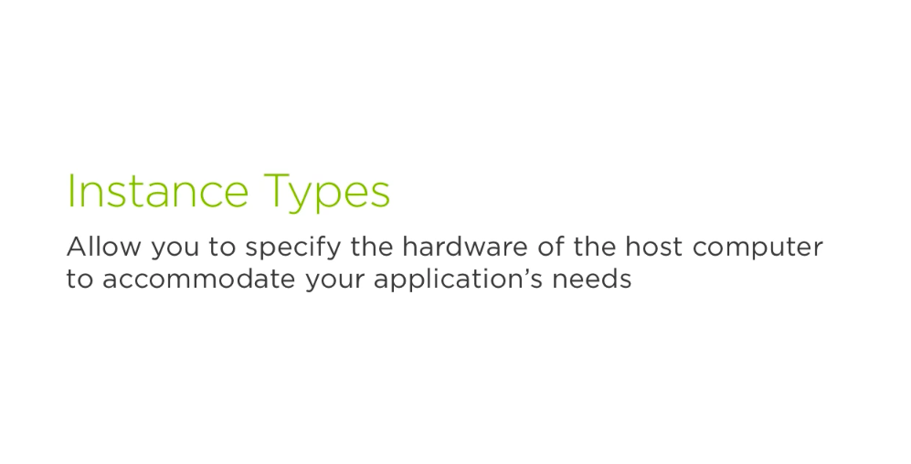
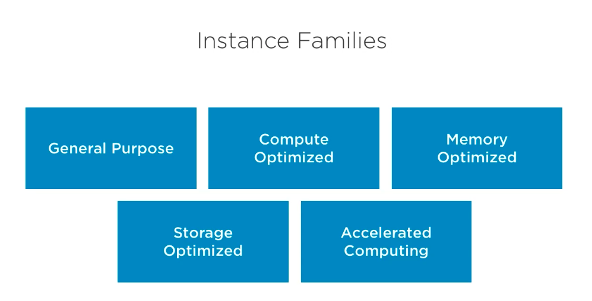
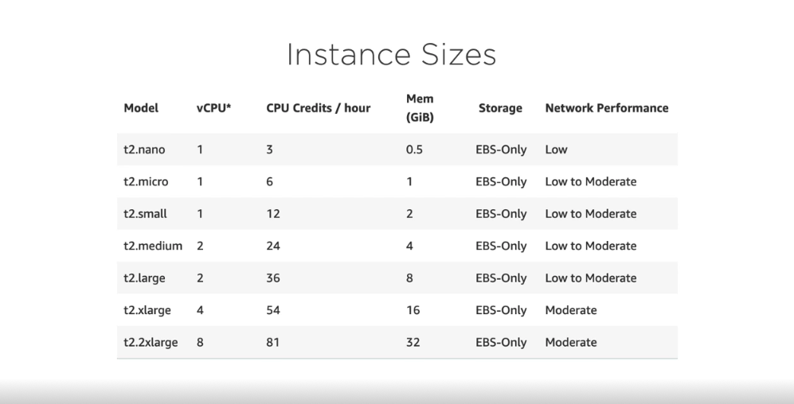
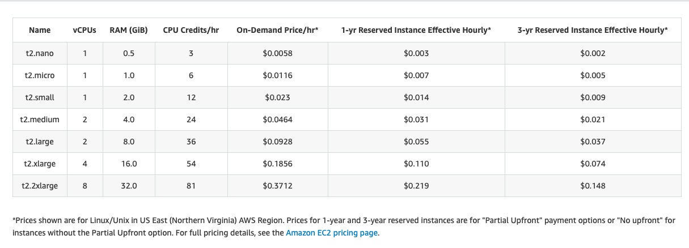

# 1. On-demand Instances #

- The first type of EC2 instance that we're going to be talking about is the on-demand instance type. On-demand instances follow a pay as you go model, where you pay for compute capacity, in other words, resources for your application on a per second basis. With this instance type, you don't need to worry about contracts or long term commitments, making it very common amongst EC2 users. 

- They grant flexibility in multiple scenarios, for example when you aren't sure how to handle a certain type of workload and want to experiment with different types and amounts of servers. In this case, you might not be worried about cost optimization just yet and want the piece of mind from commitment free usage. Or you might only need some servers for a short amount of time, for example, if you wanted to spin up a server for an hour solely for the purpose of learning how to connect to it with SSH. Although this instance type is frequently used because of these characteristics, the pricing also reflects that. In exchange for flexibility, you are paying a premium compared to other instance types. We'll cover the less expensive options that AWS offers throughout this course, but first let's go over some important concepts that you'll need to know before launching any type of instance on EC2. 

- The two things that we'll need to know about are availability zones and instance types. EC2 is a service that is offered in multiple locations across the world. Each of the geographic areas that it operates in are known as regions. This can be something like us-east-1 for the East coast of the United States, or eu-west-2 for London. Within each of these regions are multiple availability zones, or AZs for short, which are essentially one or more datacenters. Regions are completely isolated from each other to provide fault tolerant and highly available systems. 

- In the event that something were to happen in one region, the other ones would be completely unaffected. Availability zones are similar, they can communicate with each other, but are isolated for the same purpose. It's useful to know about availability zones because when you launch an instance, it will be launched in the region that's currently selected within the AWS console. Being aware of this will let you plan out where you want to have your instances live, in case, for example, you want to keep the instance in a specific region because that's where the majority of your users are. Additionally, you'll only be able to see the instances that belong to the region you've selected. So don't panic if you don't see all of your instances listed in the console. 

- The next important concept is the instance type, not be confused with the instance type that we've talked about so far, like the on-demand instance type. Every application has its own requirements and requires different hardware to run efficiently. For example, an application that needs to be optimized for an in-memory database might have different needs than a financial or video encoding application. EC2 accommodates these needs by allowing you to choose the hardware through the instance types that we're talking about. 

- There are many types available, each with their own unique features and sizes, so Amazon groups them up into instance families, so that they're a little bit easier to navigate. There are currently five different families to choose from - general purpose, compute, memory, and storage optimized, and lastly, accelerated computing. Generally speaking, you'll know fairly quickly what type of family you should start looking into based off of your business needs or type of application. 

- Let's look at the available options for an EC2 T2 type, which belongs to the general purpose family. As you can see, there are multiple options to choose from, each called a model or size. With each option having a different amount of memory and virtual CPUs. Based on benchmarks or requirements that you've predicted for how much resources your application is going to need, you might select the size on the lower end, like a t2.micro, or something a little more powerful like the t2.xlarge. Note that sizes, types, and families are always changing, so it's always best to consult a documentation to find out about the latest offerings from EC2. 

- We now have a solid foundation of some of the key concepts around EC2 and on-demand instances. Remember, this type of instance is amazing for spinning up servers quickly without having to worry about contracts or commitments. The resources are there for you when you need them, and you can tap into them whenever you'd like, even if it's for a short amount of time. 

