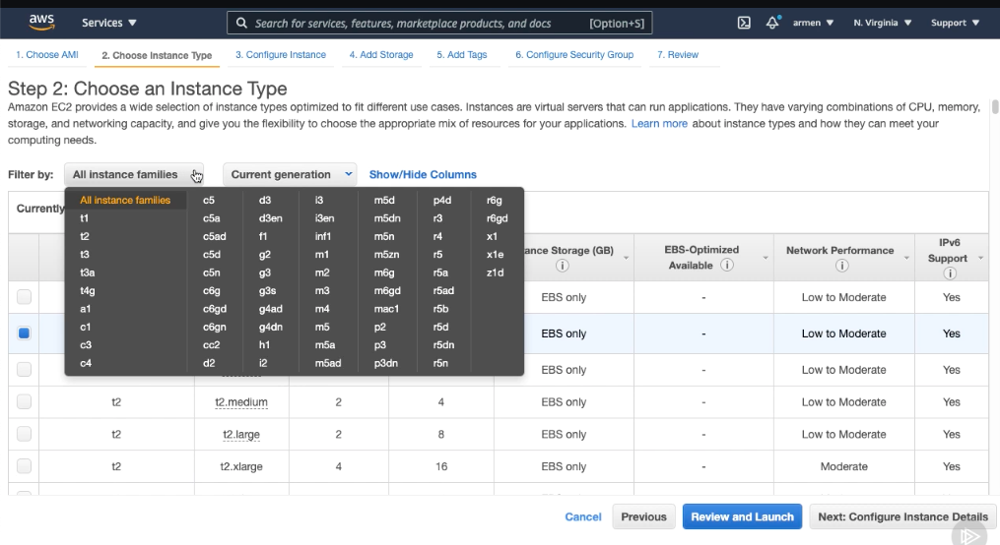
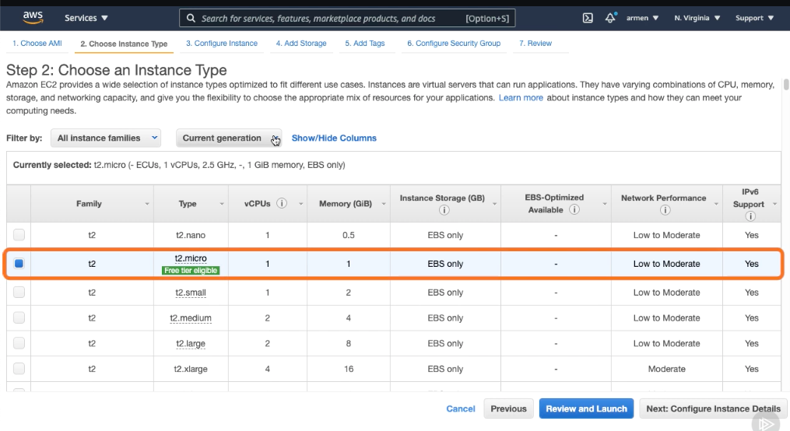
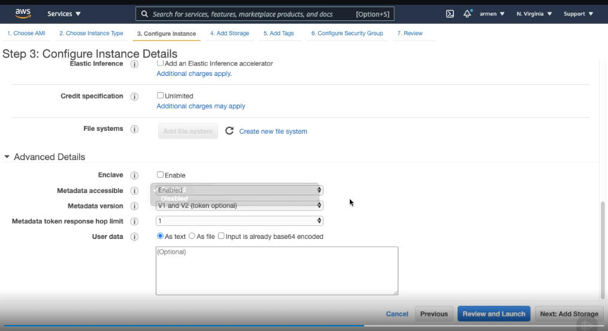

# Launching an On-demand Instance #
- We're currently logged in to the AWS console. To get started, let's go to the EC2 dashboard. 

- From here, let's hit the Launch Instance button. We mentioned that on‑demand instances are very common within EC2, so by default, hitting this button will create an instance of the on‑demand type.

 - Now, we're presented with a series of steps with each of them containing several configuration options that we can use to fine tune our instance to meet our needs.First things first, we're going to have to select an Amazon machine image. 
 

 - We'll be covering AMIs later on in this course, so for now think of them as the operating system that we want to run on our instance. Linux is a great choice for servers, so we'll go ahead and use the Amazon Linux 2 AMI. Next is the instance type. As you can see, we have all of the EC2 instance types listed here.
 

- You'll notice that by default the instances are sorted by type with the smaller sized ones listed first. We could also go ahead and filter them by family and generation if we wanted to narrow our results. Let's select the t2.micro type, which is eligible in Amazon's Free tier and is great for experimentation. 
 

- Now, we could technically skip the rest of the configuration and launch our instance by hitting Review and Launch. Alternatively, you can also go through each step and make more customizations as needed. 

- Let's quickly gloss over the following steps. On the Configure Instance page, we can do things like choose the number of instances that we want to launch, configure the instances network and IAM settings, choose what happens to our instance when an OS level shutdown occurs, and enable monitoring using a service provided by Amazon called CloudWatch. 

- By default, EC2 instances will have an HTTP endpoint that we can access to view its metadata. In the Advanced Details section, we can choose to disable this endpoint. In this same section, we can provide custom scripts that run after our instance starts using user data.

- Next, we can configure the storage devices on our instance, choosing the amount of space that we want to have available. After this step, we can add tags to our instance, which are key value pairs that allow us to describe or identify it. For example, we could add a tag with the key environment with its value set to development. 

- Next, we can make some changes to the instance's security settings through the Security Group section. Again, we'll cover all of these topics soon. The last page gives us a breakdown of the options that we have chosen to launch our instance with. 

- Let's hit Launch. Now, we need to specify a key pair to use. A key pair is a file that we're going to keep on our local machine that will allow us to connect to our instance. 

- We can use an existing key pair if we've created one in the past or create one. Let's create one. We'll name it test‑key‑pair. Now, let's hit Download and then hit Launch. And there we have it, our instance is now launching. If you hit View Instances, you'll notice a new instance present.

