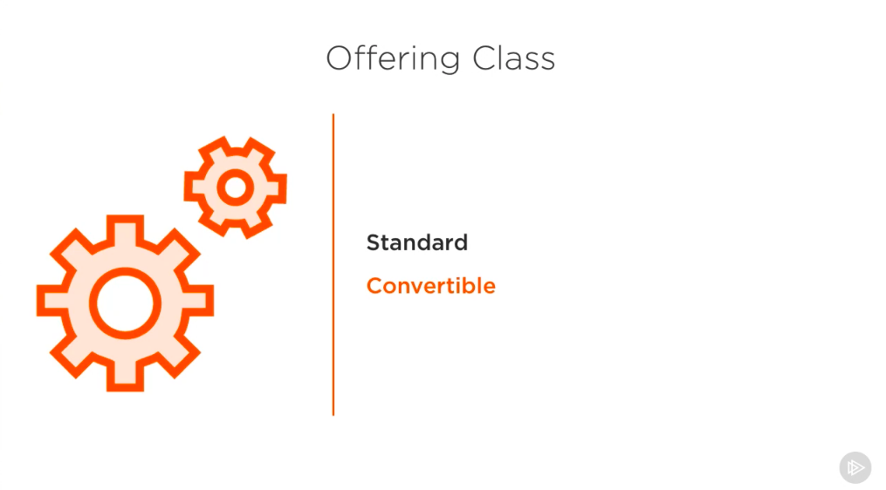
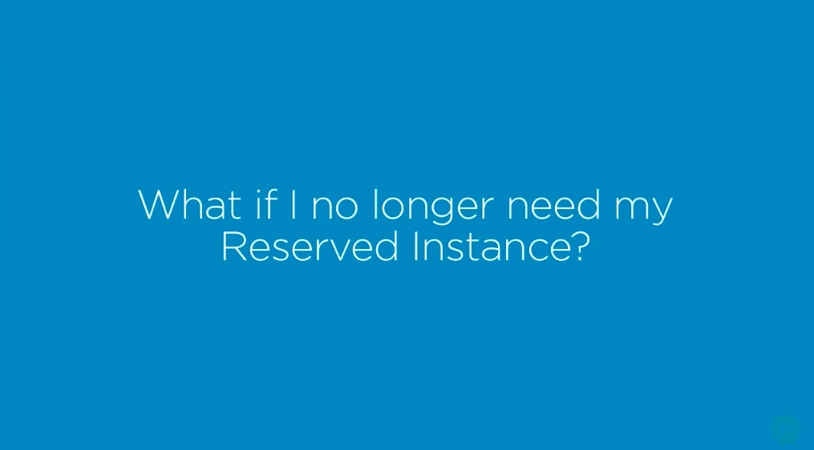

# 2. Reserved Instances #

- Now that we know a little bit more about on-demand instances, let's learn about EC2's reserved instances, or RIs for short. As the name implies, when you purchase a reserved instance, you're going to reserve your compute capacity so that it's yours for a certain amount of time. The length of time that you purchased the instance for is called the term, which can be 1 or 3 years. 

- There's a few other things that you need to decide on as well, including the instance type, availability zones, tenancy, and the platform that you'd like to run. 

- If you're not familiar with all of those concepts, don't worry, we'll explain them shortly. Customizing and purchasing an RI can be compared to building a phone plan. You pick and choose all of the options up front and then make a commitment for a certain amount of time. At this point, you might be thinking, why on earth would I want to configure all of these options and be locked for a minimum of 1 year? Well, in return for your commitment, Amazon offers a noteworthy incentive, they advertise up to a 75% discount off of on-demand pricing. As expected, by paying more up front, and having a longer term length, you can expect a discount closer to the maximum percentage offered. 

- There are three types of reserved instances to choose from. Standard, convertible, and scheduled. 

- Let's talk about standard RIs first because the other two inherit most of the same features, but have a few unique properties.

- As mentioned, upon launching an RI, you're going to need to make some choices as to what it is you need from an instance. The first and one of the most important choices is going to be the instance type. As we discussed, the instance type will determine the type of machine that you'll be running. It is important because you don't want to run into a situation where you blindly choose this type and then be committed to using it. If you need to get a feel for your requirements, you can experiment with some temporary on-demand instances for a low cost.

- The next decision to make will be the platform, in other words, the operating system. There are two different flavors of Linux offered, as well as Windows. 

- Next, is the tenancy. There are two options for this, default and dedicated. Default tends to be the most common amongst AWS customers, and that means that under the hood they will share the same hardware, even though the instances have no way of interacting with each other. Dedicated means that your instances are ran on hardware specific to your account. We have a whole section on dedicated instances, so we'll take a more in depth look into this concept soon.

- Next is the payment option. There are three options to choose from here. All upfront, partial upfront, and no upfront. AWS is flexible with the amount that is required upon purchase. If you choose partial upfront or no upfront, the remaining balance is going to be split up and due in monthly increments over the term. As you may have guessed, by choosing all upfront, you'll be provided with the largest discount. After the payment option is the term. You can purchase an RI on a 1 or 3 year term. 

- Now let's talk about the offering class and introduce our second type of RI, the convertible RI. 

- The offering class lets you specify if you'd like your RI to be the standard or convertible type. The two are very similar, except for the fact that convertible reserved instances grant more flexibility. 

- This, of course, comes at a cost. The discount percentage will be lower compared to a standard RI. The main difference in flexibility that I'm referring to is the ability to exchange the instance. With standard RIs, you can change the instance type, for example, you could go from a t2.micro to a t2.medium, but you wouldn't be able to switch to another type of instance, for example, to an a1 instance. With the convertible RI, you'll be able to switch the instance to a new one with different attributes and a totally different family, as long as it ends up being of equal or greater value. This means that you need to ask yourself a couple of questions. Do you anticipate that you'll need or want to change the instance type during the course of the term? Or, if Amazon offers a new enticing instance type, do you want to be able to use it? It boils down to your focus. Is it around savings or flexibility? Aside from that, they're both available on 1 or 3 year terms, and standard RIs can be resold. We'll talk about reselling instances shortly. 

- The last and optional setting is the availability zone. 

- Whenever we purchase an RI, we become eligible for a discount anytime that we launch instance that matches the exact parameters we have specified. This discount will be applied to our billing for the entire length of the term. Now remember how we discussed the concept of regions and how they consist of several availability zones? Well, you can choose to make your discount apply across all availability zones with a region. If you do this, it's what's known as a regional RI. The other option is to reserve the capacity, as it's called, in a single availability zone. This means that your discount will only be applied to instances within that availability zone, which in turn means some flexibility that will be lost. However, the benefit of doing this is that in the unlikely event that EC2 ran out of resources in that availability zone, your instance would have the highest priority to run because you were most specific about location.

- We talked about standard and convertible reserved instances.

- Now let's introduce the last type, The scheduled RI.Scheduled RIs allow you to reserve compute capacity on a daily, weekly, or monthly basis for a 1 year term. These make a great choice when you need some extra resources on a very fixed basis. For example, if for the next year, every night at 5:00 you needed to run a maintenance script or if every weekend you needed to perform some platform upgrades, if you didn't want to be paying for idle resources whenever it wasn't those times, a scheduled RI might be a good fit.

- For this type, you need to be certain not only about the fact that you'll have the instance for a year, but the frequency of use as well.

- Now things change, and it's hard to tell what your business or technological needs will be in a years' time. This fact is especially true for startups. When thinking about purchasing an RI, you might be asking yourself, what if I no longer need my instance? That's a very important question and valid concern. Thankfully, there's a good solution available. The Amazon Reserved Instance Marketplace. If you decide that you no longer need an RI, you can list it on the marketplace and potentially find a buyer that's interested in the configuration that you've chosen. 

- On the flip side, if you become interested as the buyer, there are opportunities to purchase RIs for cheaper and with terms shorter than 1 year. The entire process, including the financials, is done through Amazon, and there's absolutely no difference in the quality of the instance. At the end of the day, what's up for sale is compute capacity on an AWS machine. The marketplace makes a great vehicle for getting rid of unused instances.

- It reduces the hesitance associated with committing for a year and might help you score a deal on an instance that meets your needs. Now that you know a little bit more about RIs, you might be asking, are they for me? When compared to other EC2 instance types, RIs are best suited for steady-state workloads. This means that your workload, whether it's incoming traffic to a web app or the resources required for processing image files, for example, is predictable and does not vary sporadically. Your applications need to be constantly running and do not suffer the same ups and downs as, for example, an ecommerce site, which might get 10 times the users because of a holiday sale. Second, do you know and believe that you'll be you'll using the instance in the long term? Additionally, after purchasing a reserved instance that's not of the schedule type, they're going to be built regardless of if it's used or not.

- So, on top of how long you'll need it for, you also need to be certain about how frequently you'll be using it. Let's quickly recap the types or reserved instances before launching one. Standard RIs are customized to suit your needs. 

- When you purchase one, you're actually purchasing the eligibility for the discount. So anytime you create one that matches the parameters you specified, the discount will be applied. Convertible RIs are like standard, but with the ability to change the instance type, size, and other attributes. 

- Scheduled RIs are like standard RIs, but allow you to only purchase the times that you need to use them, whether it's a certain day or a time of day. 