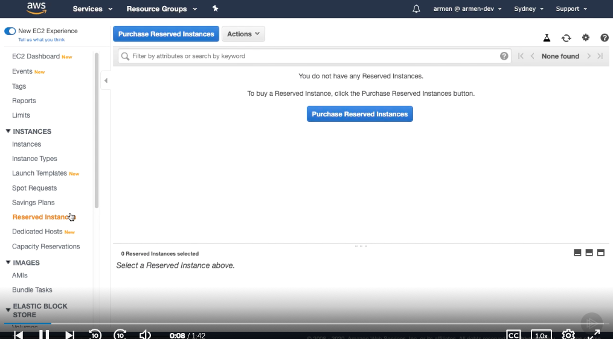
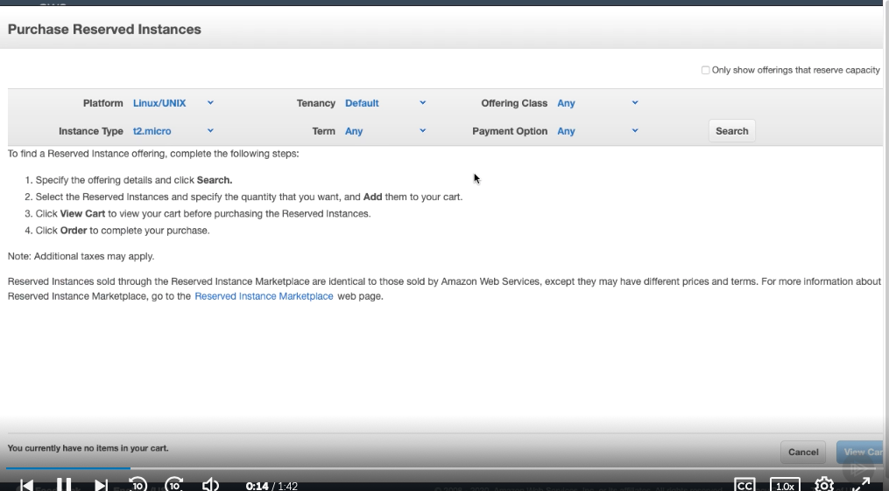
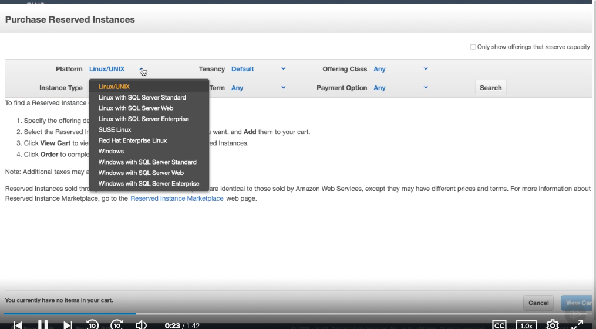
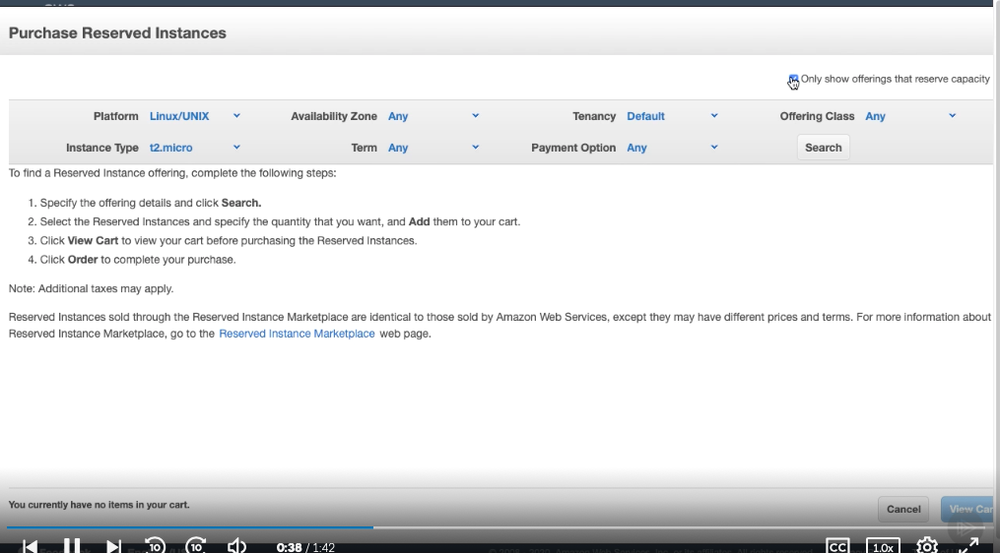
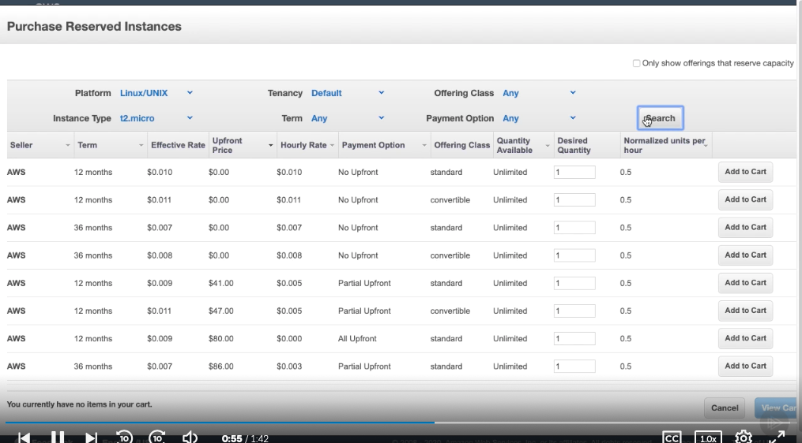
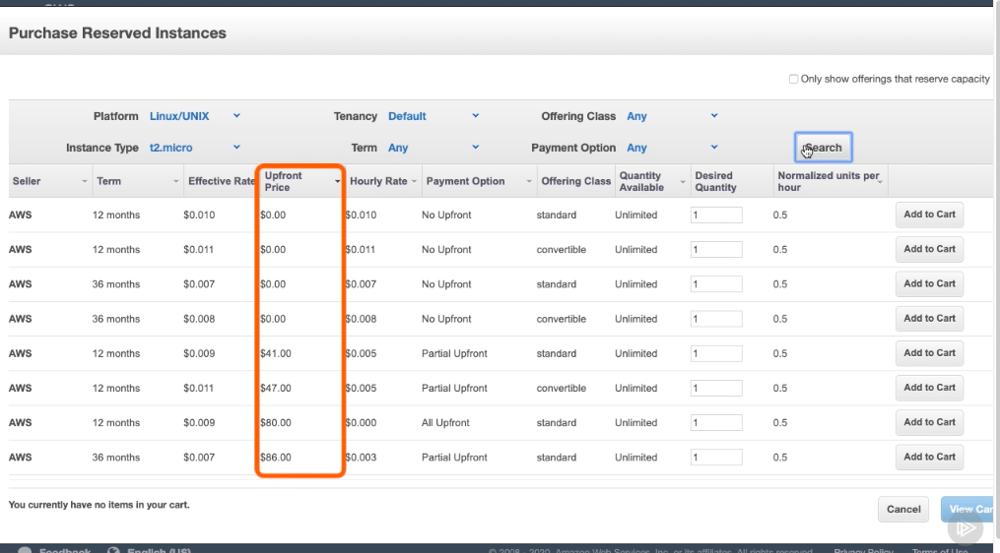
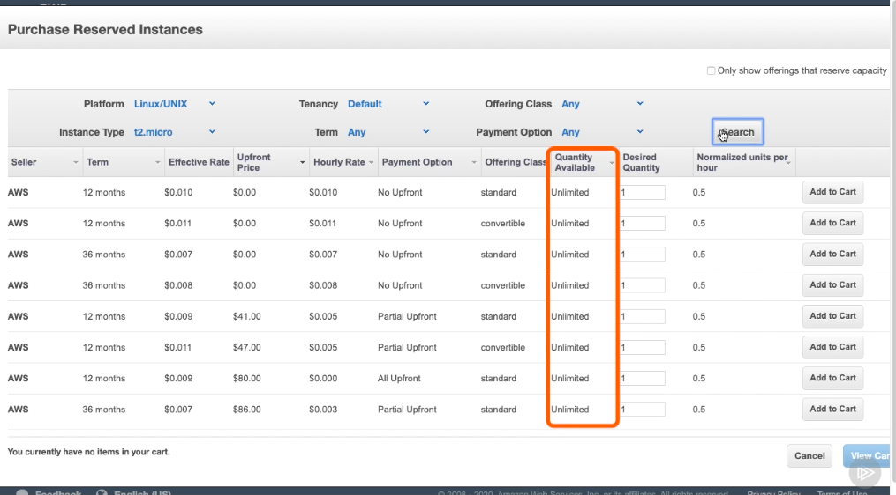
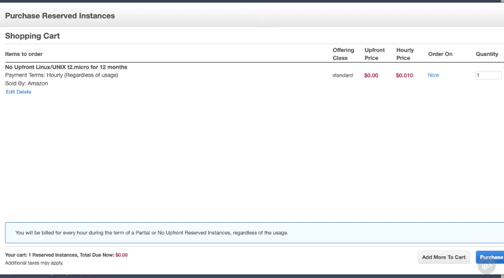

# Launching a Reserved Instance #

- Let's launch a reserved instance. From the EC2 Dashboard, hit Reserved Instances on the sidebar. If we were to have any of them, this is where they would be listed. To create one, hit Purchase Reserved Instances.

- From here, we are able to specify exactly what we want to purchase using the provided filters. We can select the platform, the tenancy, offering class, instance type, which, as you can tell, there are a lot of, term, and payment option. 

- By selecting the checkbox that says, Only show offerings of that reserve capacity, another drop‑down becomes available, giving us the option to select an Availability Zone. If this checkbox is unchecked, we will be buying a regional RI. Now, let's hit Search. 

- As you can see, we are presented with multiple instances that are for sale On the left is where we can see who the seller is. 

- Instances can be available from Amazon or third‑party sellers. We can also see each instance's payment details, such as the amount that we're going to have to pay upfront and how many instances of that kind are available to purchase. 

- When buying from Amazon, the quantity available is unlimited, whereas third‑party sellers will have a fixed amount. Let's select the first one and hit Add to Cart and then hit View Cart. 

- We're presented with our shopping cart where we get a brief overview of what we're purchasing. If we wanted to go through with this instance, we would hit Purchase, and just like when we launched our on‑demand instance, we would see one launching in the Reserved Instances section of our dashboard.

