# 3. Spot Instances #

- Let's talk about spot instances. A spot instance is just an EC2 instance that is not being used, and because of that is being offered for a steep discount.

- When I say significantly, I'm not kidding. Amazon advertises up to a 90% discount from on-demand pricing. They can be compared to something like a vacation home. When you're in slow season, you offer it for next to nothing to family and friends because it wasn't going to be used anyways. 

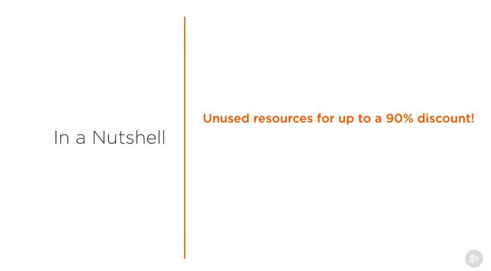

- Understanding how spot instances work and implementing them in your application's infrastructure, even if it's occasionally, can lower your costs significantly. What's the catch here? It's simple, in a rare case that the compute power you requested is no longer available, AWS provides an interruption notice to your instance, which gives it a 2-minute warning before it is shut down. 

- Within this window is when you would want to wrap things up and do a proper shutdown within your application. Going back to the vacation home analogy, if your friends and family were to be staying at your property for a very discounted rate and you suddenly got thousands of requests to rent it out for the next day, you'd likely give them a short notice and ask them to leave by the following day.

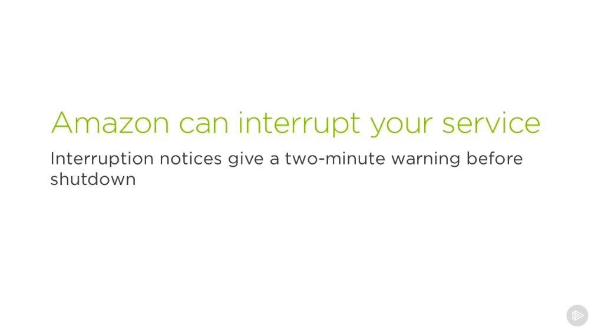

- Let's talk about when and why your instance might be interrupted. There are three reasons that this might happen. Price, capacity, and constraints. 

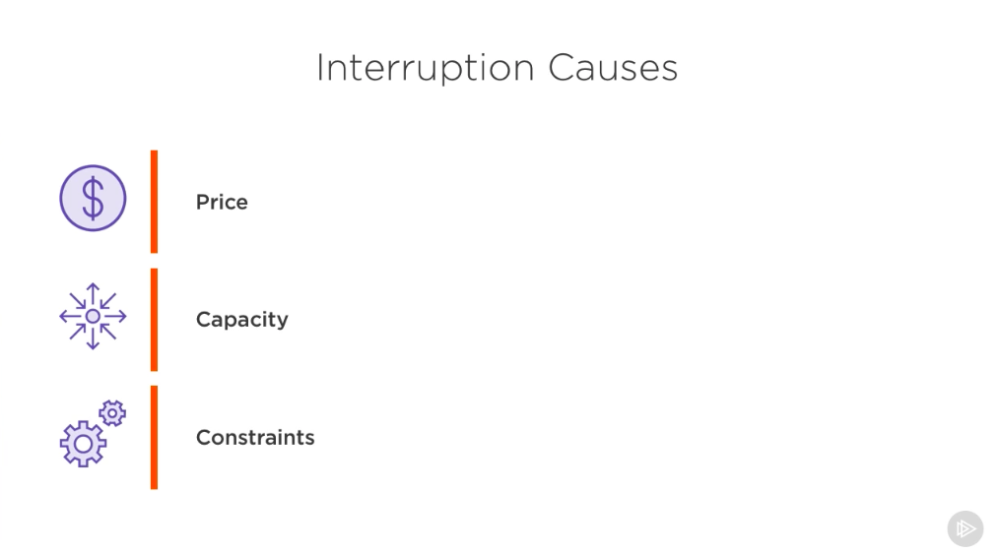

- Must like on-demand instances, spot instances have an hourly price called the spot price. But instead of being fixed, it is gradually adjusted based on the long-term supply and demand trends. In order to purchase one, you must submit a spot instance request, specifying the maximum per hour price that you are willing to pay. You are able to submit a one-time or a persistent request. With the persistent type, your request will be reopened if your instance gets terminated. When you submit your request, if the price you are willing to pay exceeds the current spot price value, EC2 fulfills your request and you have your instance. However, if the price falls below the spot price, your instance will get interrupted. Let's use a hypothetical example to illustrate the scenario. If the price of an on-demand instance was $1 per hour and the current spot price was $ 0.05 per hour, and you were willing to pay up to $ 0.15 per hour, you would immediately have your request fulfilled. However, if the spot price rose to $ 0.20 per hour, your instances would be shut down, as there would likely be others in line to pay that much, especially considering it is still a good deal compared to the on-demand price. 

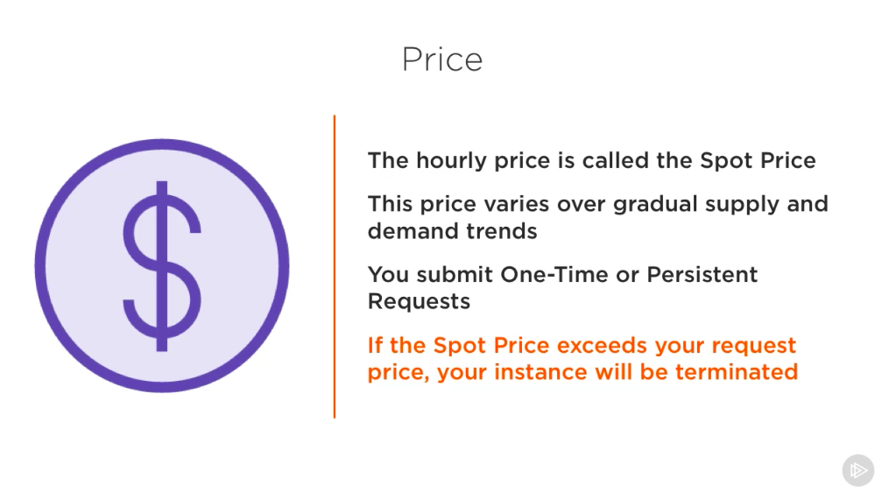
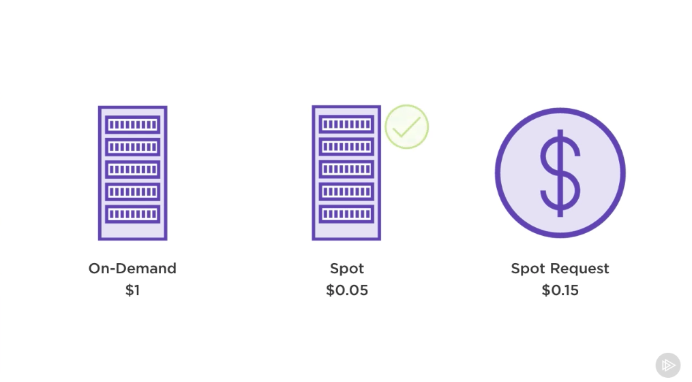
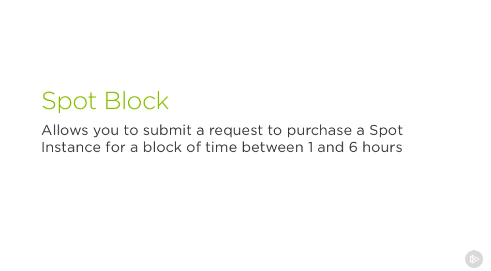

- While we're on the topic of purchasing spot instances, let's talk about spot blocks. In the event that you only want your spot instance to run for a finite duration, a spot block will provide you with a chunk of time between 1 and 6 hours, instead of running indefinitely or until an interruption notice. Another reason that your instance could get interrupted is if there aren't any unused resources left with EC2. This is rare, but could potentially happen. For example, if there were 1000 instances in an availability zone and 750 of them were being used, there would definitely be enough to accommodate some spot requests. However, if it was Black Friday and a customer who ran a popular ecommerce site received a ton of traffic and had to spin up 200 extra servers, there would be significantly less capacity available. This would in turn result in some interruption requests being issued and your instance might be one of the ones affected. 

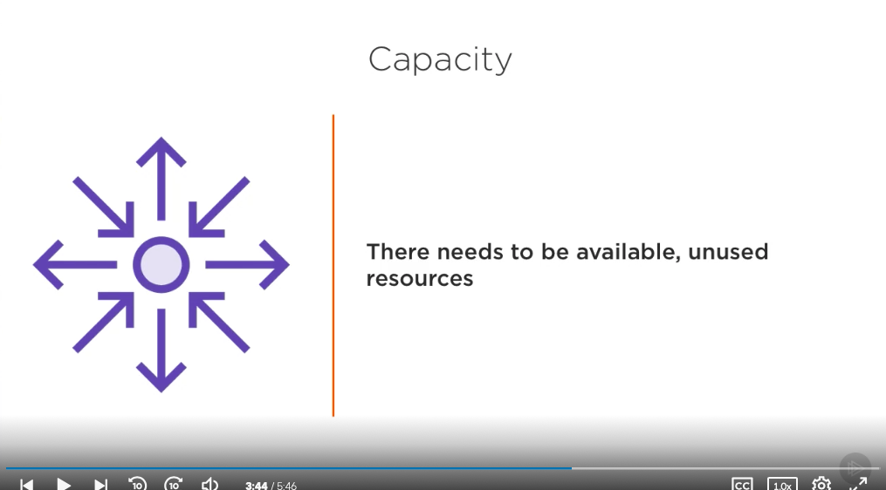
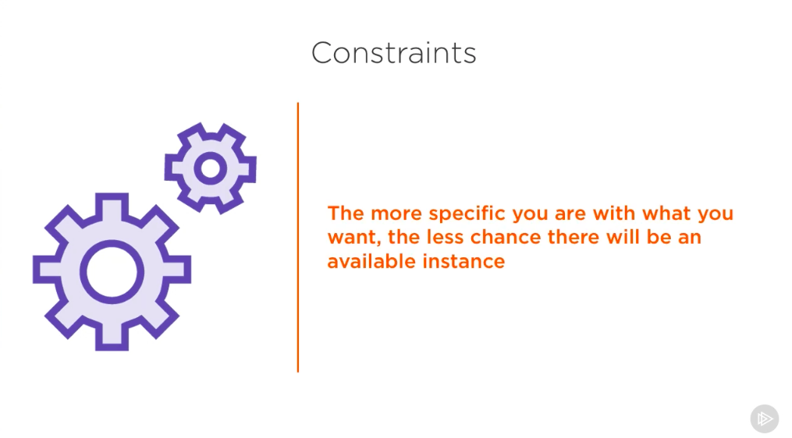

- Lastly, if you were to specify several constraints on what you wanted from an instance, such as the availability zone, and there was simply no unused resources that matched your exact constraints, your instance would be terminated as well. I'm going to highlight where spot instances shine. Primarily, they're great at providing you with inexpensive resources you might need, if you're flexible with when you'll get them and have applications that can recover from unexpected failures. For example, imagine you had a backlog of profile images that you needed to resize for a social media application. 

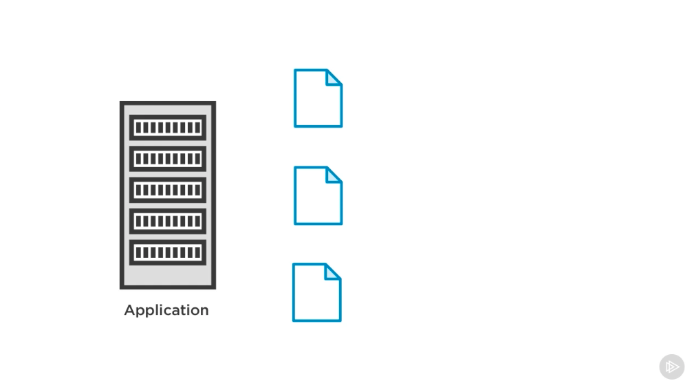
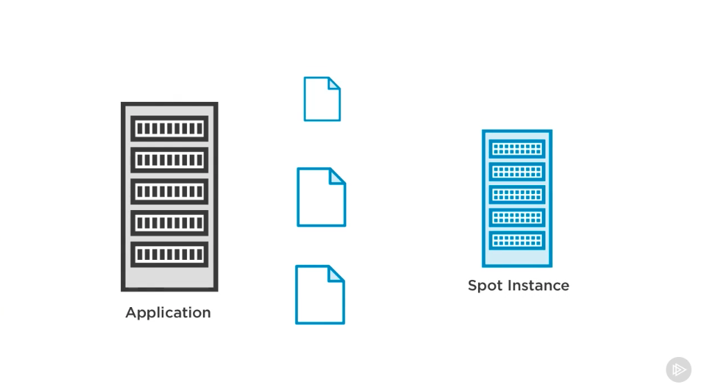
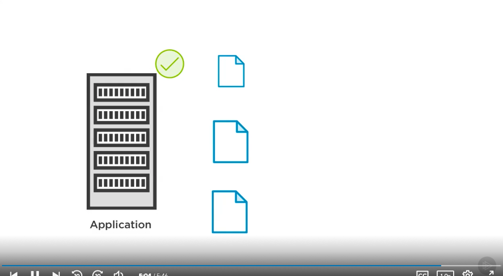

- Perhaps the only reason to resize these images was to reduce space on the system that stored them. So it wasn't a mandatory task, it was more of an optimization. If you had a process that could be occasionally put to work on this task, thereby slowing reducing the size of the backlog, that would be great. In this case, a spot instance might be a good match. Whenever the resources are available for a very discounted price, you could spin up a server and have this task be worked on. It would meter criteria of having flexible runtimes because we wouldn't care what time of day it ran and in the event of a service interruption, both the application and the backlog would remain in a stable state. Another strategy is to compliment an existing feed of servers for added resources.

- For example, with a stateless web application, servers can be introduced and removed with minimal effect on the system. If we had a few on-demand instances always running, we could configure spot instances to be spun up to help us with our incoming traffic if they were available at a low cost. This would help to reduce the load across the other servers, and if they were to get interrupted, the other instances would still be able to handle the load. While spot instances make a great addition to any infrastructure, they're typically not meant to handle 100% of your workload. Now, let's see how we can launch one.

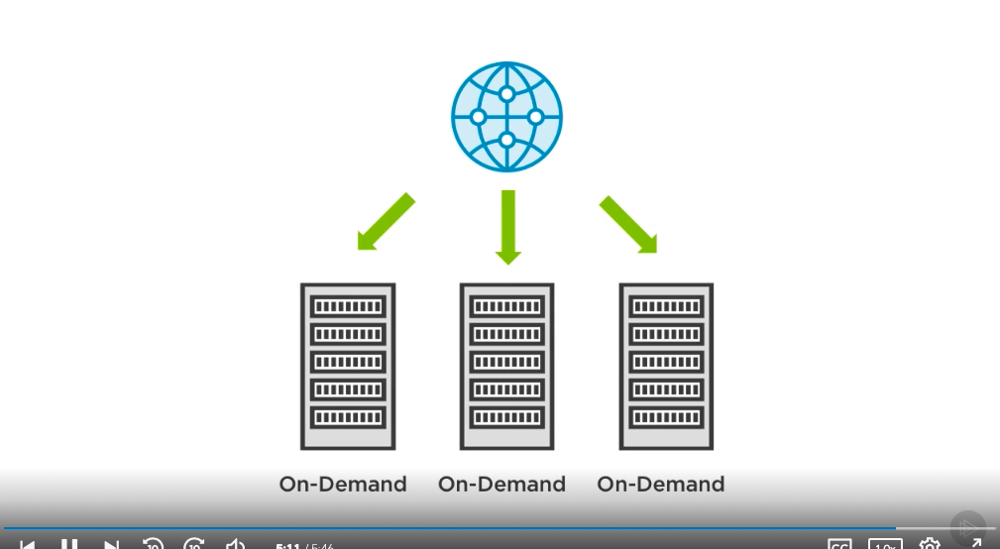