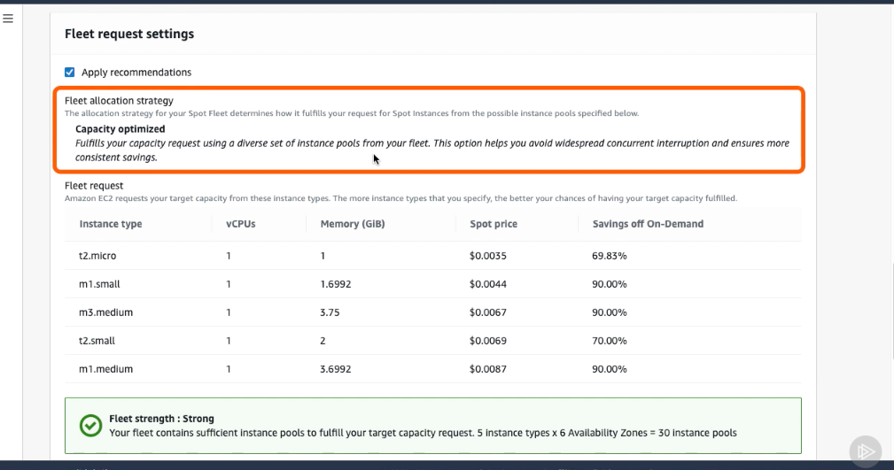

# Launching a Spot Instance #

- To launch a Spot Instance, visit the EC2 dashboard, click Spot Requests in the left‑hand menu, and hit Request Spot Instances. 

- The first thing we see are some presets that can be used to help prepopulate some of the configuration options. The last tile is for creating a Spot block. Like we discussed in the last section, you're able to choose a time between 1 and 6 hours. 

- Let's go ahead and stick with the Load balancing preset. Moving on, we can see some more configuration options. First off, we can select an AMI. I'll go ahead with the Amazon Linux 2 AMI. Next, we can select the minimum compute unit. In other words, the minimum amount of hardware specifications that we need for our application or task.

- We can do this by choosing as specs and explicitly specify the amount of virtual CPUs and memory that we wanted, or we could go ahead and select the exact instance type and size if we had one in mind.

- I know that I want to select a t2.micro for this example, so I'll hit Change instance type. Note that all of the instance types are listed with their specs, as well as their price and how much savings you receive when compared to the on‑demand price. I know that t2.micros fall under the general‑purpose type, so I'll filter these down and then select t2.micro. We also have options to configure the network, select a specific availability zone, and select the key pair that we'll be using. 

- The next thing we'll do is select our target capacity. Target capacity just means how many instances or virtual CPUs we'd like to launch. We'll select 2 in order to spin up two servers. 

- Note that launch templates are outside the scope of this course, but if we had selected one earlier, we could also select a number of on‑demand instances to launch when fulfilling our request. 

- You could do this to implement the strategies we discussed in the last section where you have a fleet of instances containing a mixture of Spot and on‑demand instance types. 

- Next, we have some recommendations that are suggested for us based on our configuration. Listed are several instance types that meet our minimum spec requirements of t2.micro that EC2 will use to build our Spot fleet. 

- The combination of an instance type plus an availability zone is known as an instance pool. Since we specified that our instances can be in any of the six possible availability zones, that means we will be requesting our instances from 30 different pools. 

- You'll also notice that we have a default fleet allocation strategy applied. These strategies can be used to achieve different goals, for example, to obtain the lowest possible prices or to diversify our instance types to avoid interruption. And that's it, we're provided with an overview of what we're requesting, including our target capacity, the instance configuration, an overview of how much we're going to pay, and what we'll save. 

- Let's hit Launch to submit our request. As you can see, our request is now being fulfilled and we're successfully launching our Spot nstances.

