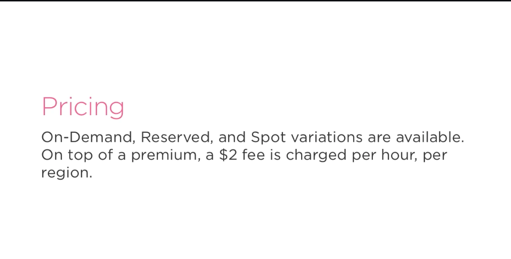

# Dedicated Instances #

- Let's talk about last instance type, the dedicated instance. We mentioned earlier that by default EC2 instances share the underlying hardware that they are run on. 

- For certain business requirements, AWS offers dedicated instances and dedicated hosts, which allow the customer to run their applications on hardware that is not shared with any other AWS customers or on physical hardware that is exclusively theirs to use. As you may have guessed, this comes at a cost. 

- You can expect to pay more for these types of instances. So why would you want hardware that's dedicated? There are typically two reasons for this. Some businesses with strict regulatory requirements, for example those in the financial or healthcare sector, require a dedicated infrastructure for the processing of sensitive information. On the other hand, there is also software that uses hardware-based licenses, meaning licenses are only valid on the hardware that you've registered them with. Let's discuss these topics a little more. We'll start off by talking about dedicated instances. 

- EC2 instances share hardware by default, so if three customers purchase c4 large instances, there may, for example, be one larger instance that uses advanced software known as a hypervisor to allocate the resources advertised for each instance accordingly. 

- If you had a shared instance, let's call it i-1, you might be sharing the physical hardware with other AWS customers, in this case i-2 and i-3. When you purchase a dedicated instance, your instance will not share hardware with other AWS customers, but might share hardware from other non-dedicated instances from the same account, in other words, that were created by you. So in this case, i-2 and i-3 would be instances that you owned. However, with this type of instance, you won't have insight into the hardware that you'll be getting and every time you launch this type of instance, it might be placed on new hardware. 

- For example, our instance in this case had an id of 101. If we were to stop and start our instances again, it might end up on a new machine with an id of 102, somewhere else in the data center. This would satisfy one of the requirements that we had mentioned in the last example, not sharing any hardware because of regulatory requirements, however, it wouldn't satisfy the condition of having a fixed set of hardware to use for licenses. 

- Now, let's discuss what dedicated hosts are. These give you the most insight into the host. You're essentially purchasing a machine that's sitting in a data center. In this case, you'd known beforehand that you were purchasing an entire c4 instance, and going off of the previous example, it would always have the same id, for example, 101. Using a dedicated host, you know what the hardware is and you're able to run instances on it the way you choose to do so. 

- For example, you could launch eight large instances, four 2xlarge instances, or two 4xlarge instances, so on and so forth. The only constraint is that each instance that you place on the machine must be of the same family and size. 

- You are not able to mix and match, for example, one 2xlarge size instance and several large or medium sized ones. As you can tell, this is the most flexible method and is best suited for hardware-based licenses, as we mentioned, but will also satisfy a requirement of having hardware that's isolated from other AWS accounts.

- One last thing to note as well is that dedicated instances are essentially spin offs of the other instance types, not something totally different. They come in on-demand, reserved, and spot form, and follow the pertaining pricing models, but with a higher cost to run them.

# Snapshots #

