# Launching a Dedicated Host #

- To get started, select Dedicated Hosts from the sidebar and then Allocate Dedicated Host. Now, we need to select an instance family. 

- I'm going to select a1. We can then choose to support multiple instance types or a single one. If we support multiple instance types, it means we can launch any of the types that belong to the family onto the host. 

- In our case, that means any of the a1 instance types. If we don't go ahead with this route, we'll have to specify a single type that we want to support. Next, we need to select an availability zone and then decide if we'd like to allow instance auto‑placement.

- We're going to be paying for this dedicated host regardless of if there are instances running on it or not. Because of this, auto‑placement will try to launch other EC2 instances on this machine if there is free space. By having this option disabled, you'll have to manually specify which instances you want launched on it.

- We also have the option of host recovery, which will use host‑level health checks to determine any failures on the machine. If there are any present, host recovery will automatically restart their running instances onto a new replacement host. 

- Lastly, we have the option to buy multiple dedicated hosts with the configuration we've specified and add some optional tags to our host. And that's it for the configuration. If we hit Allocate host, we'll have created our dedicated host and we'll be able to start adding instances to it.

# Snapshots #
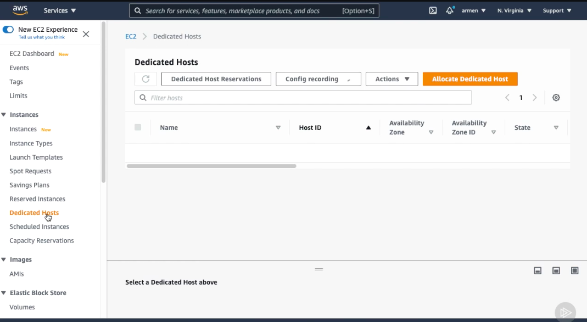
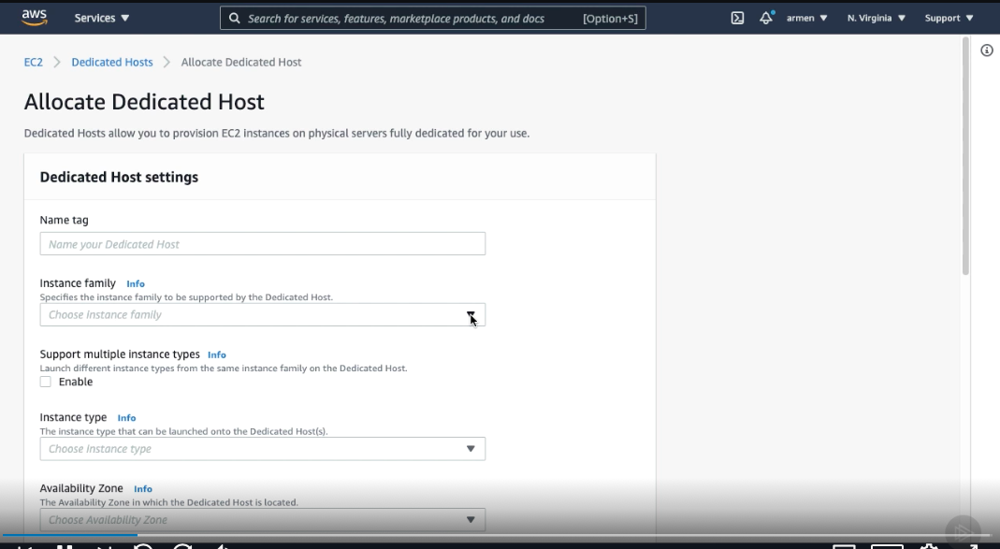
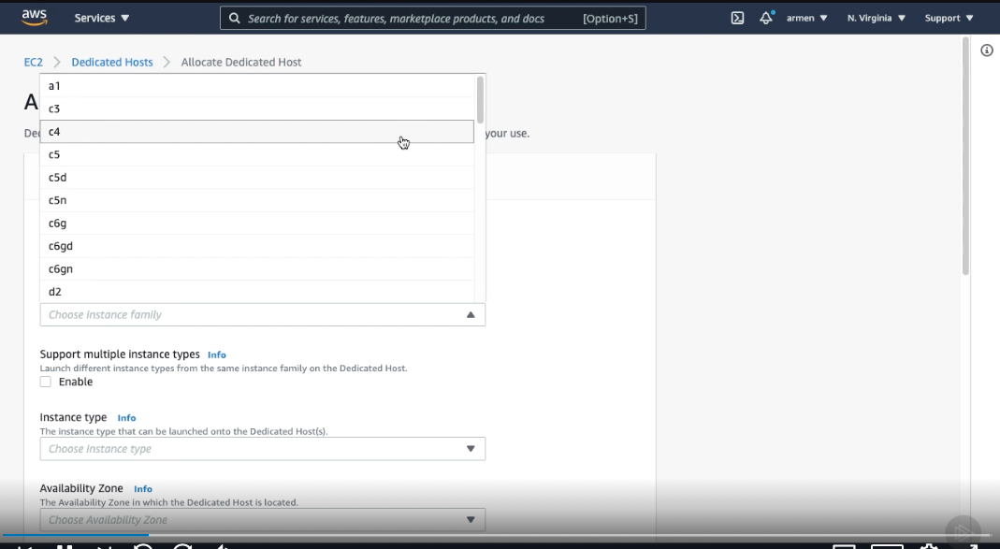
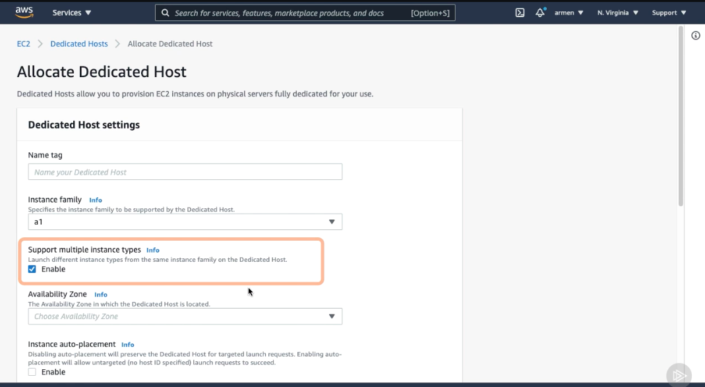
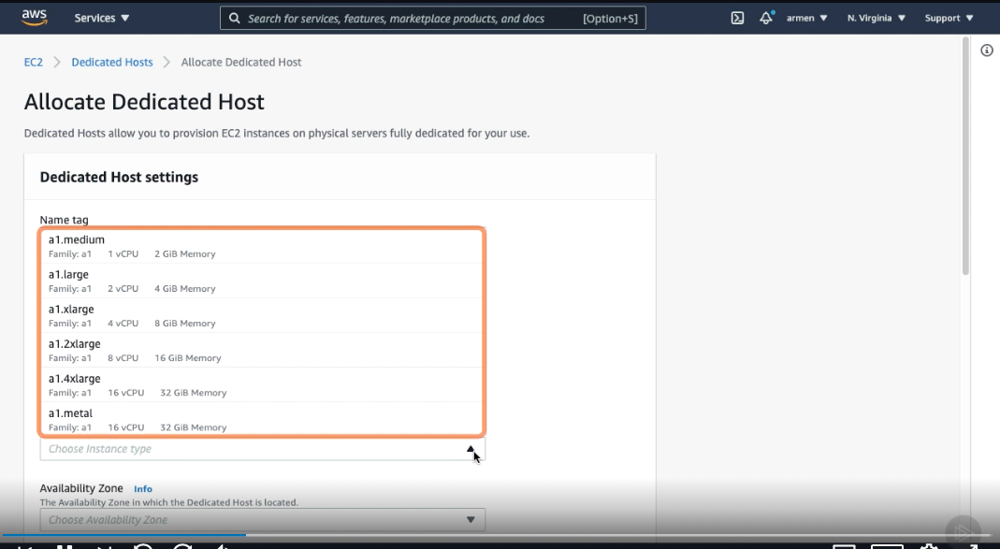
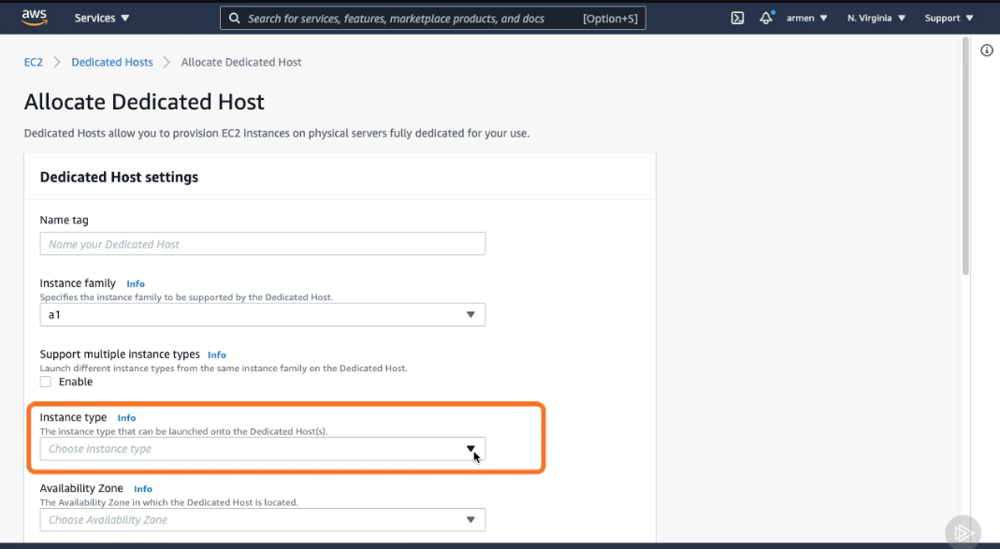
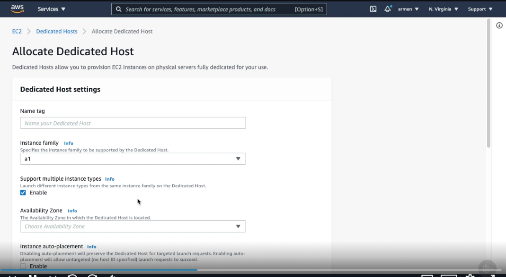
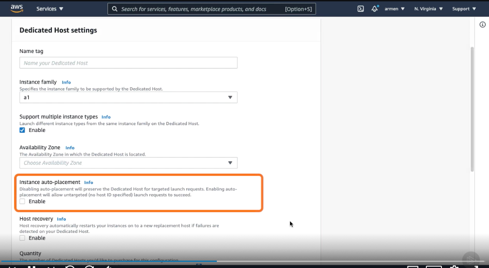
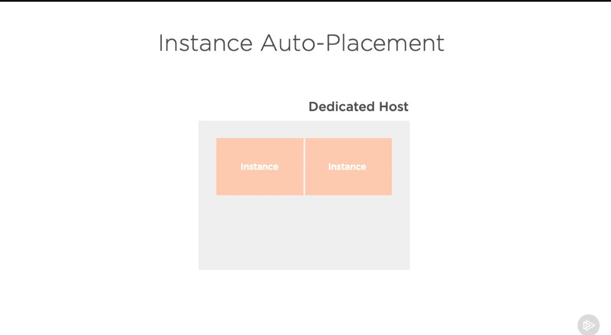
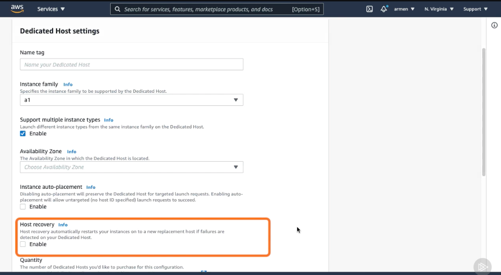
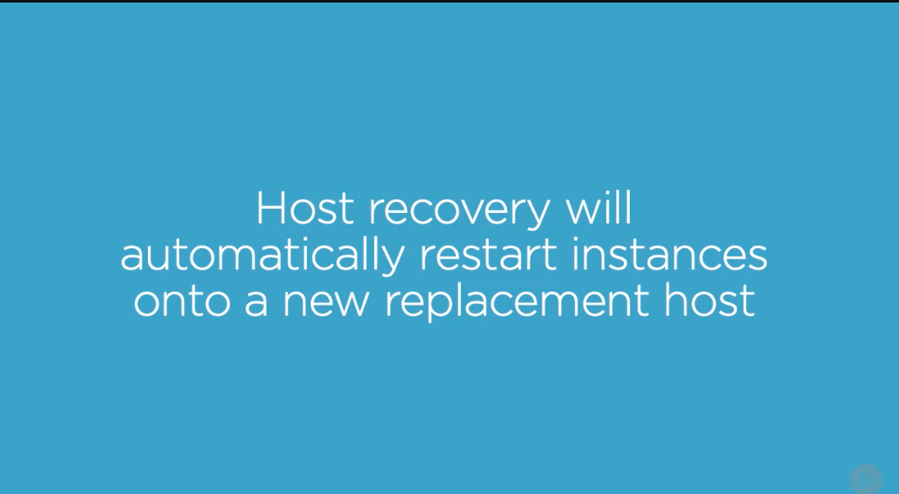
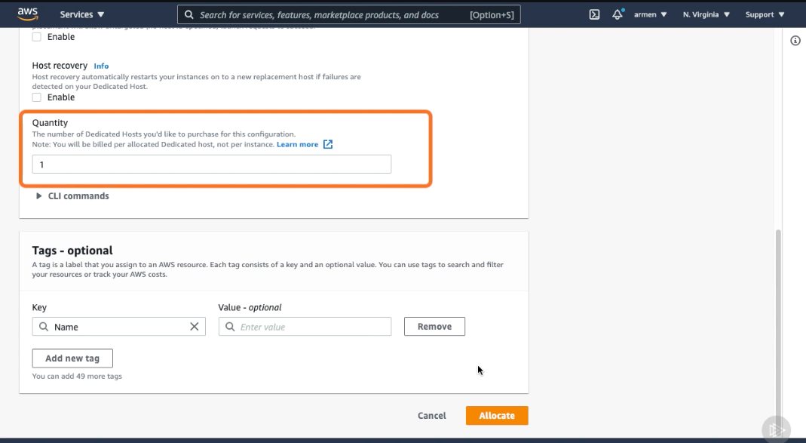
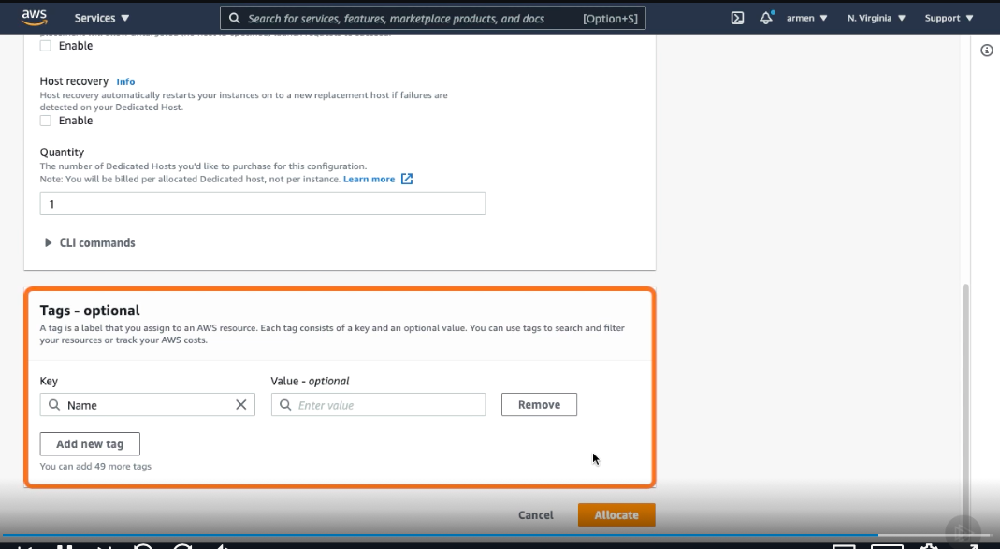