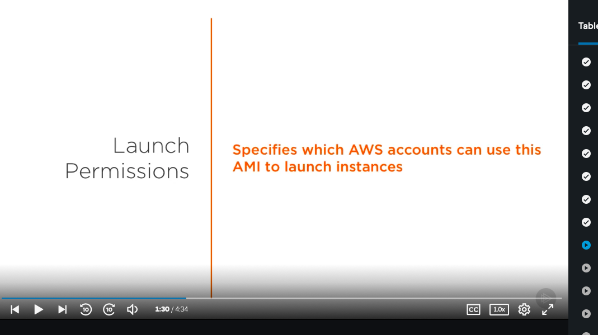

# 5. Amazon Machine Images (AMIs) # 

- Let's talk about Amazon Machine Images, or AMIs, for short. AMIs are essentially templates that you can launch an instance from, which bundle up a bunch functionality and software so that you don't have to spend time recovering your instances from the ground up every time you launch one. 

- Knowing how to use AMIs will allow you to say things like spin up five on-demand instances using the template I created last month, containing all of the source code to my web application and software needed to support it. 

- If you're starting to see how invaluable AMIs are, you're right. They allow you to be more efficient and help your application scale with ease. So what exactly is bundled within an AMI? Arguably, one of the most important components of an AMI is the root volume template. 

- There's a whole section dedicated to storage volumes, so for now, let's think of volumes as devices, much like hard drives. 

- The root volume is just one of these devices, containing the image used to boot the instance, comparable to a system partition on a personal computer where the operating system resides. 

- When we create a template from it, we save just about everything, from the operating system, the software that you've installed, for example, NGINX or a MySQL database driver, and the files, in most cases this will be the source code needed to run your application. 

- The next thing that gets saved are the launch permissions, which specify who can use this AMI. 

- AMIs are private by default, but can be shared across AWS accounts, and launch permissions allow you to control this access list, making granting and revoking a breeze. EC2 instances are not limited to one storage device. For example, alongside your root volume that contains the operating system, you could also create other volumes that are in charge of storing other things like logs from your application.

- The block device mapping specifies which of these volumes to attach to the instance upon launch. This makes AMIs even more flexible. You can not only launch an instance that is preconfigured with software, but one that is connected to the exact storage devices you've specified. 

- Let's talk about managing AMIs and the lifecycle of one. When you create an AMI, it's known as registering one. After it's registered, you can launch an instance from it, copy it to other regions within AWS, and share with other users. 

- If you wanted to customize an AMI, you can launch an instance from it, make some changes to the instance, for example, pulling the latest version of your application from a repository, and then create yet another AMI.

- This a good practice, and it's what's known as creating a golden copy, essentially the most up-to-date representation of your system. In order to keep things organized, you are able to assign AMIs custom tags. A tag is just a key value pair that will help you identify it. 

- So it could be something like version = 1.0, which would allow you to differentiate between an AMI that was for version 1.1. You could also assign a tag that identified its environment, for example, stack is equal to development versus stack is equal to production. 

- Once you are done with an AMI, to keep things organized, you can also deregister it if it's no longer needed. Note that AMIs are a service provided by AWS for free, so deregistering your AMIs would mainly serve as a way to clean up old, unused ones. When you're just getting started with AWS, you won't have any of your own AMIs to launch one. 

- There are many free AMIs out there, including the Amazon Linux AMI and Amazon Linux 2 AMI. These are worth pointing out because they make for a great starting point for most systems. They are Linux images that are created, supported, and maintained by Amazon. 

- They include a great set of tools and are updated regularly and are tuned to provided a stable, high performance environment. Best of all, these images are offered free of charge. If you didn't want to use these AMIs, you could also use a paid AMI, purchased from a third party through the AWS Marketplace. 

- Oftentimes these come with service contracts from organizations like Microsoft or Red Hat. On the flip side, there's nothing stopping you from putting together an AMI and selling it yourself.

# Snapshots #

