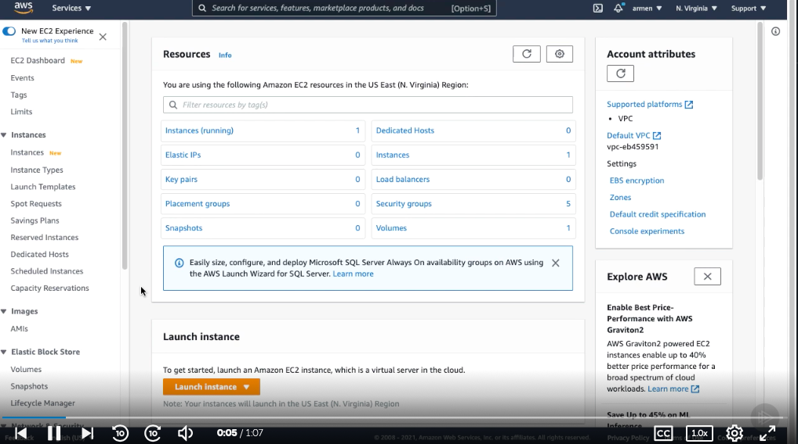
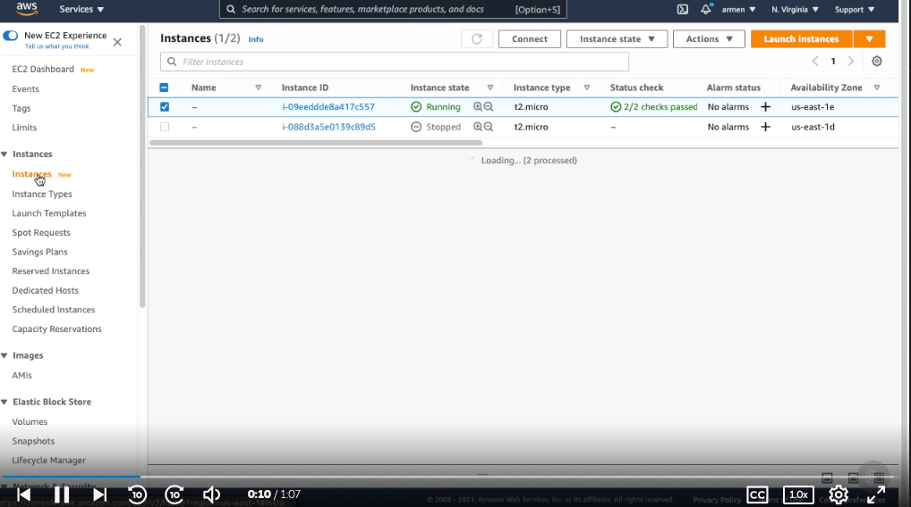
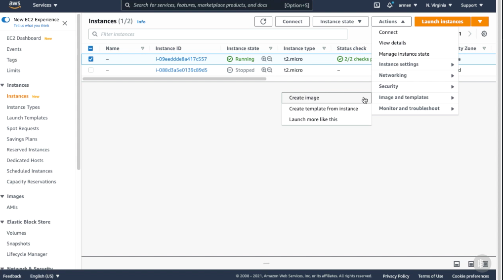
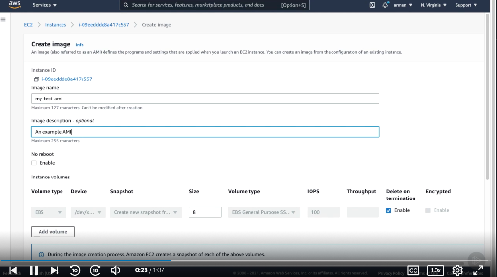
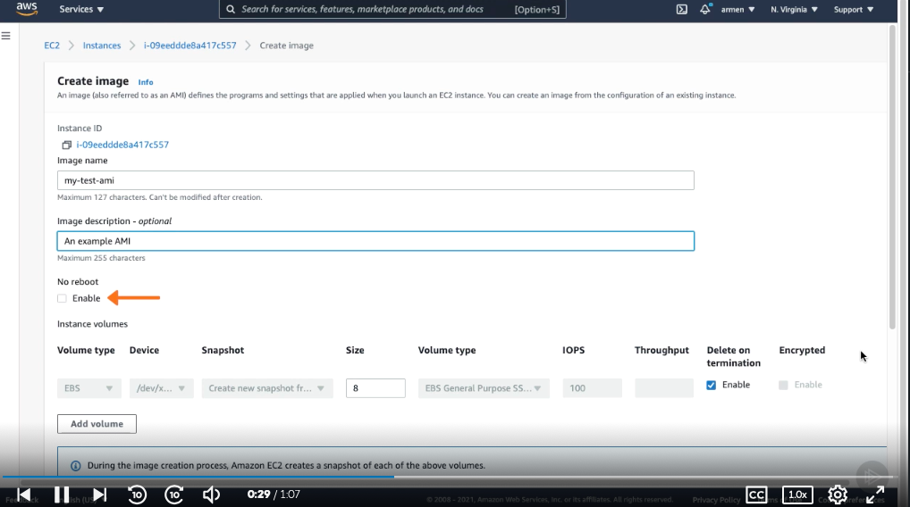
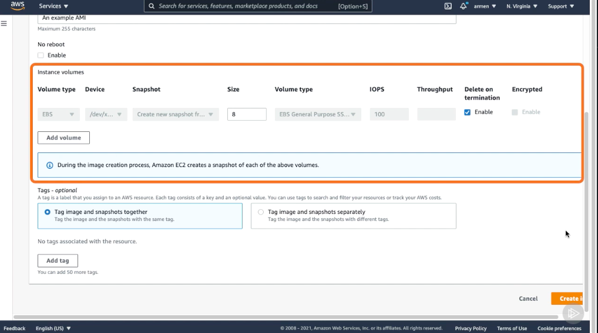
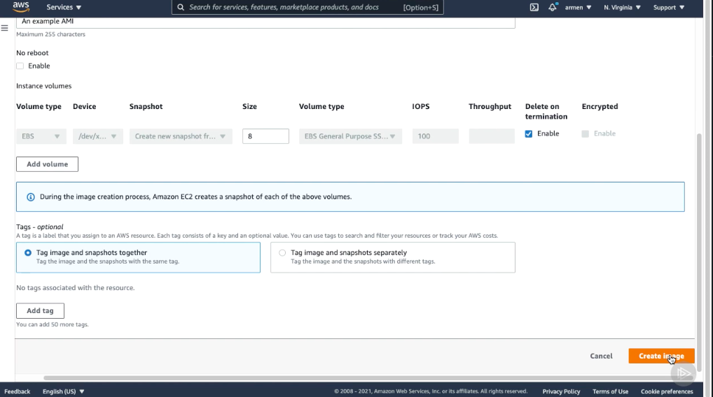
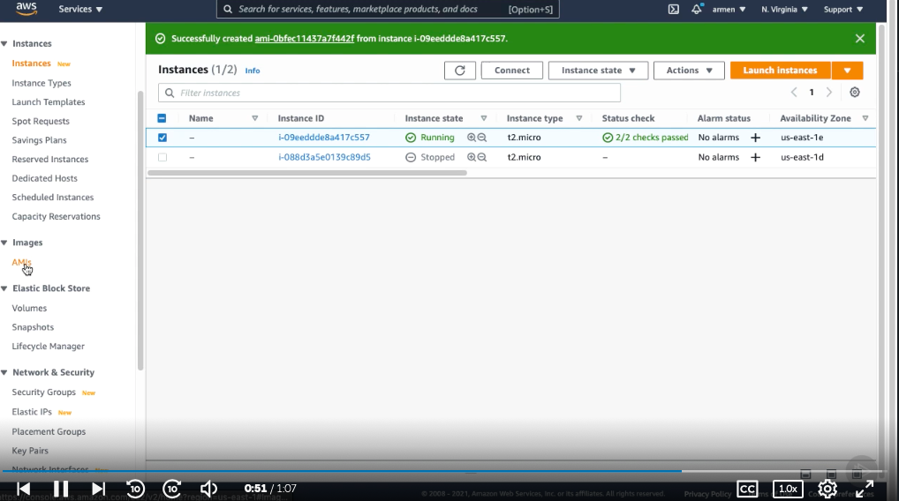
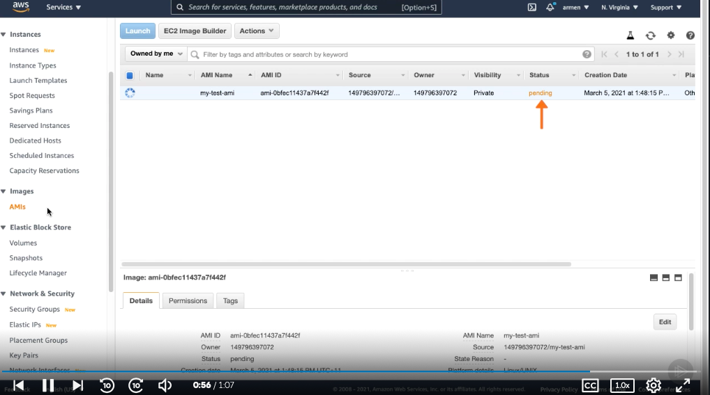

# Creating an Amazon Machine Image #

- Let's see how we can create an AMI. We're going to create an AMI from a running instance of ours, so let's hit Instances from the left‑hand menu. 

- Next off, I'm going to select an instance that I want to take an AMI from. From the Actions menu, hit Create image. This is where we're going to configure our AMI. 

- Let's give it a name and description. We also have an option of no reboot, which, when selected, won't turn off our instance when creating this AMI. 

- If we choose to select this option, file system integrity cannot be guaranteed. We can also choose to include volumes in this AMI. We'll cover volumes shortly, so don't worry about this section too much for now. We can now hit Create image to start processing our AMI. 

- Now, if we hit the AMI section from the left‑hand menu, you'll notice one in the pending state. This is the one that we just created. When it is ready to use, it will transition into the available state. As you can tell, creating AMIs is a simple task.

## Snapshot collections ##

