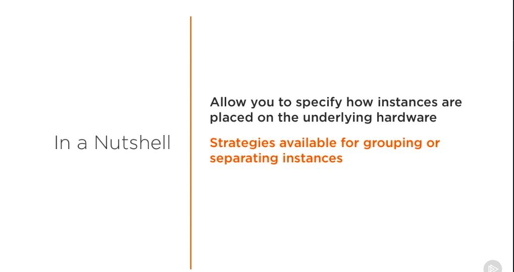
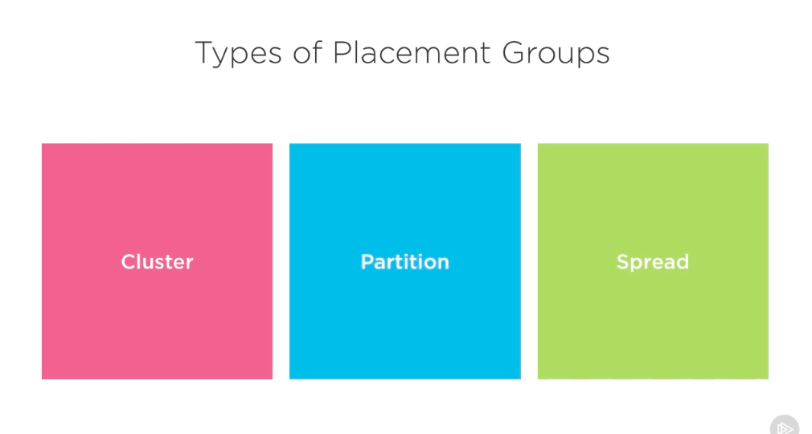
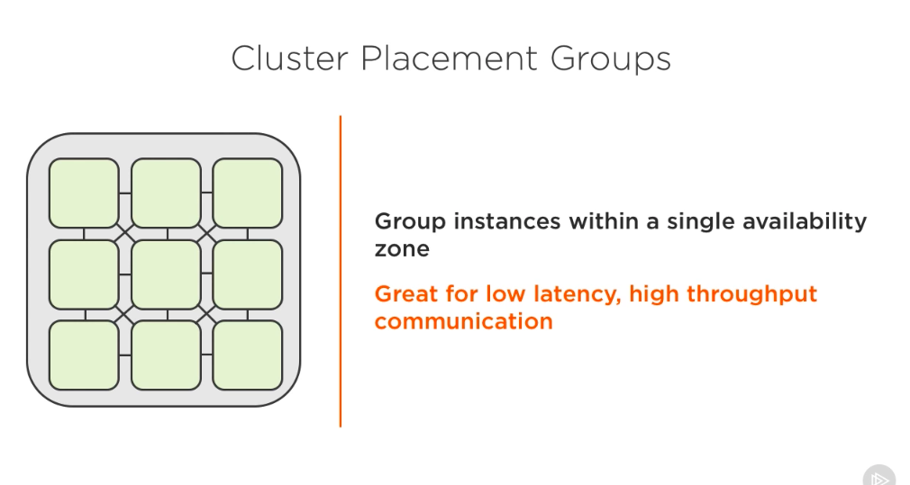
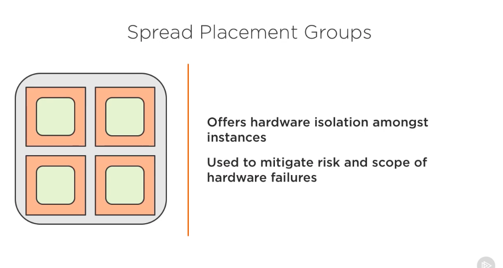
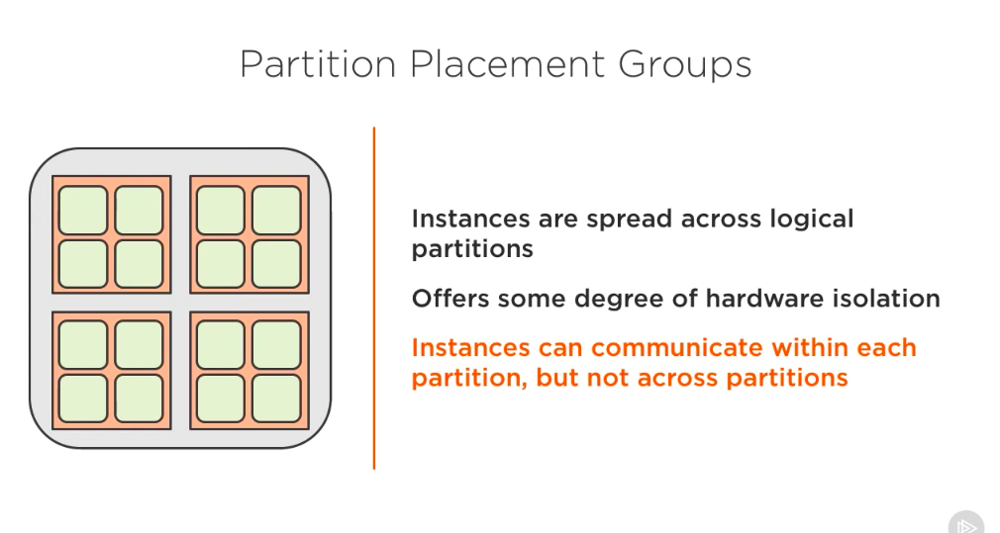

## Placement Groups ##

- Let's talk about EC2 placement groups. Placement groups allow you to specify how instances are placed on the underlying hardware that they run on. For example, depending on your needs, you might group instances together if you wanted them to communicate with each other in the most efficient way possible. Or you can make them run on separate hardware, so that if one instance fails, it wouldn't have an effect on the other instances in your system. 

- Placement groups grant a certain degree of control and can help you build a more reliable or performant infrastructure. Best of all, this feature is offered free of chart. Let's get started and talk about the different types of placement groups available. There are three different types of placement groups to choose from, cluster, spread, and partition. Some applications require low latency, high throughput communication, but between the instances, not with the outside world. Cluster placement groups allow you to group your instances within a single availability zone. 

- This is valuable for specific use cases, such as high-performance computing or data application, but definitely not the case for something like web servers. A web server might have multiple instances to handle large amounts of traffic, but they generally don't need to communicate with each other. The primary benefit of using this type of placement group is the connection that it grants between each of your instances, or nodes. 

- By creating a grouping and placing the instances together, you are able to be as efficient as possible. If you didn't create a placement group and just launched them in the same region or even availability zone, it could mean that they were grouped relatively close together, but with large data centers there will still likely be a significant amount of distance between them. This is where cluster groups shine. 

- Now let's talk about the spread placement group. When deploying instances on EC2, there is always the possibility that by coincidence that it might end up running on the same hardware. Spread placement groups offer hardware isolation between each instance. That is, if you had four instances, there'd be a guarantee that none of them would be ran on the same hardware. 

- The benefit of this is that in the very rare case that there is a hardware failure on the EC2 side, only one of your instances will be affected. Using this type of placement group is great if you are running critical services and want to minimize the risk of a complete system outage. 

- A partition placement group can be used to spread out instances across logical partitions. What this means is that you can have multiple partitions, each with a set of instances, allowing you to achieve hardware isolation across each partition, but not on an instance level. 

- This can be looked at as a hybrid of cluster and spread type placement groups. It can be the best of both worlds. Using this setup, instances can still communicate with other instances within the same partition, but not across partitions. When you launch a partition group, EC2 will try its best to evenly distribute the instances across each partition, for example, if you had 4 partitions and 16 nodes, you could expect to have 4 nodes per instance. 

- This type of placement group makes it easy to visualize each partition as a unit of compute power that you're going to use for a task. And note that the limit of instances that you can launch into each partition is seven. Alright, now let's see how we can create a placement group.

# Snapshots collections #

