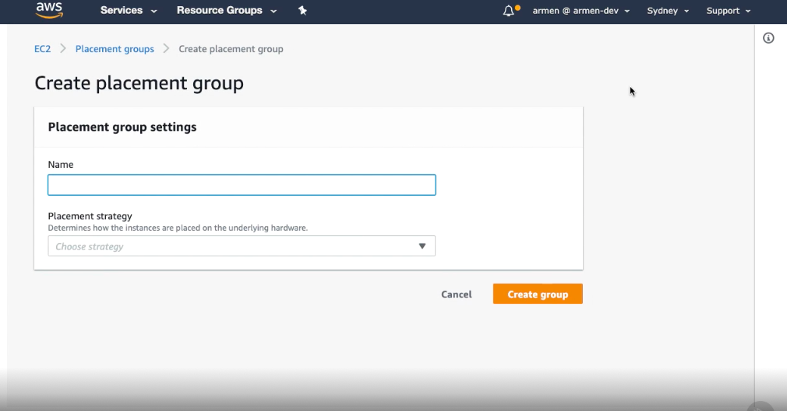
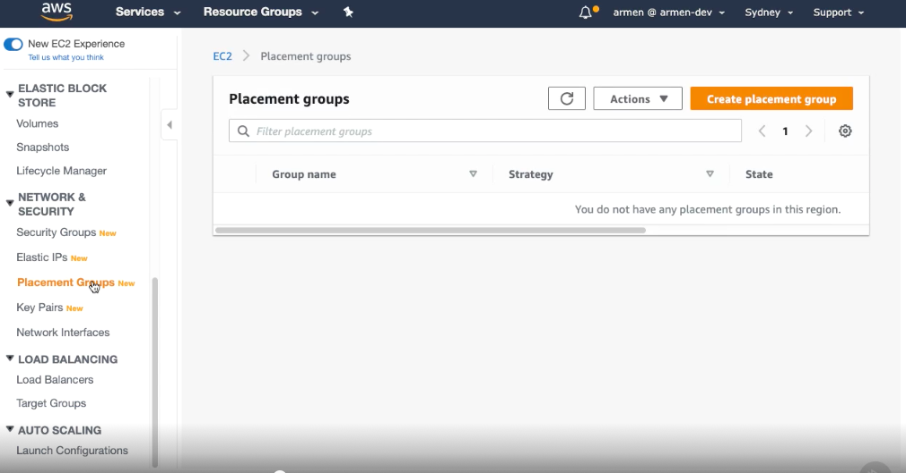
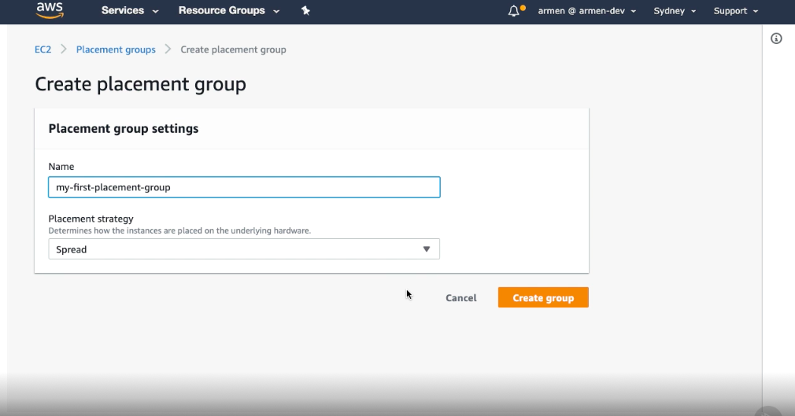

# Launching into a Placement Group #

- Creating a placement group is super simple. Let's see how we can do it. First, select Placement Groups from the left‑hand menu, and then hit Create placement group. Let's create a spread placement group. 

- We'll give it a name and then select Spread as the strategy. Hitting Create group will finalize things. As you can see, our placement group was created immediately. I was not lying when I said it was super simple.

