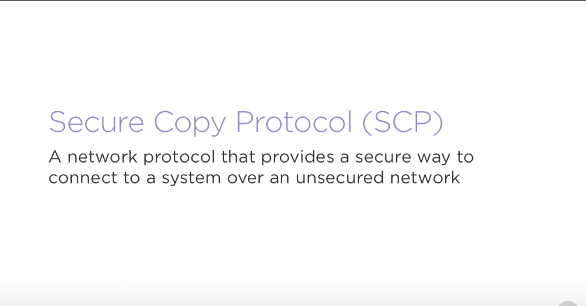
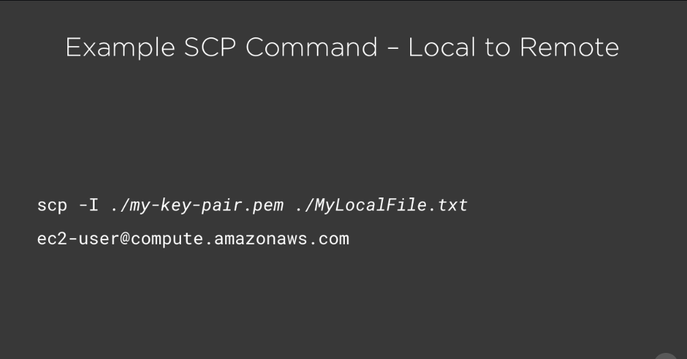

# Transferring file to EC2 using SCP #

- We know how to connect to an instance using SSH. Doing so grants us the ability to interact with it using a shell, but what if you wanted to transfer files between your local system and your instance? Using Secure Copy Protocol, or SCP for short, this task becomes a breeze. Linux and Mac systems generally have this tool installed by default and on Windows machines, you can use programs like 1 SCP that implement this protocol. Using SCP is very similar to the way that we use SSH. Let's look at how to transfer a file that we have locally to our instance. The commands that we're looking at are fairly long and are meant to be written on one line, but we've spaced them out to make things a little easier to read. First, we call scp using the I flag to specify the location of our private key. Just like in our SSH example, this file needs to have its permissions properly configured using the chmod 400 command. Next, we specify the path to our file that we'd like to transfer to our instance. In this case, it's MyLocalFile.txt in the current directory.

- After that, we specify the default username and the public DNS name, or IPv6 address of our instance. Issuing this command would copy our file to our instance over a secure connection. There are times that we want to transfer a file over in the opposite direction as well, that is from our instance onto our machine. This might be the case if you need files generated from an application, for example, a log file from your web server. This can be done as well and the command is very similar. All we need to do is swap the positions of the file name and address parameters. When called in this order, we specify where we want to connect to first and then the file that we want to copy over. In this case, we'd be connecting to our instance and then fetching MyRemoteFile.txt. Alright, let's see how we can transfer a file to and from our instance. Right now we're connected to our instance via SSH. Let's use ls to see the contents of my current directory. As you can see, it's empty. Let's transfer a file to it. We're going to stop our connection to the instance and then create a file called local-file using the touch command. Now let's SCP it over using the command we just discussed. Alright, so it looks like everything went alright. Let's connect back to it using SSH to verify that it worked. Now if we view the contents of this directory, you'll notice that we have our file on this machine.

- Now, let's create an example file called remote-logs to demonstrate how we could fetch a file that is generated by our application. Let's break this connection again to return to our local machine. Now on our local machine, if you view the contents of our current directory, you'll notice that it is empty. Let's use scp to fetch our remote logs file from our instance. Alright, now if you run the ls command again, you'll notice that our file is present.

