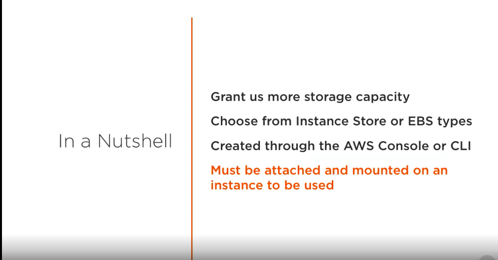
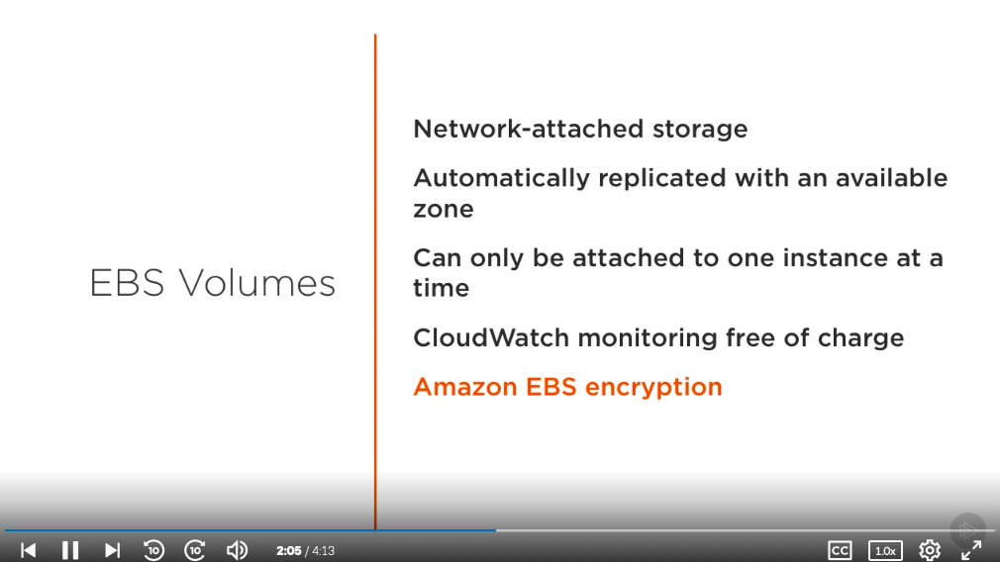
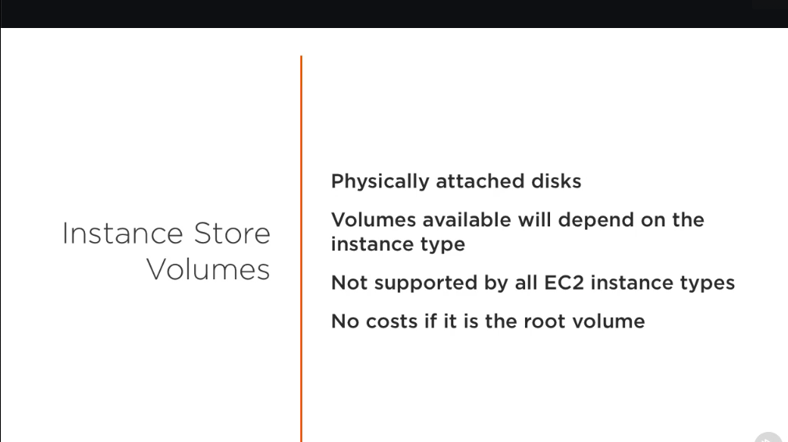
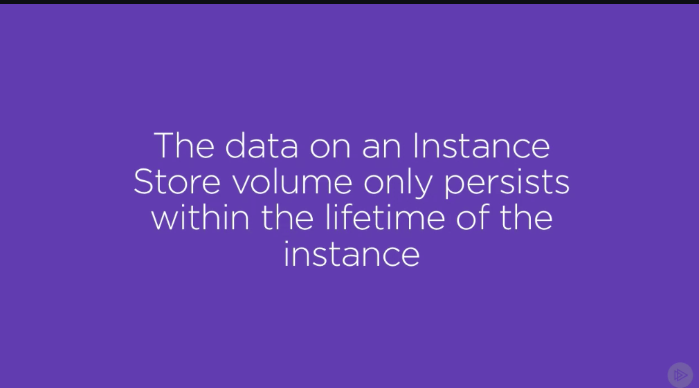
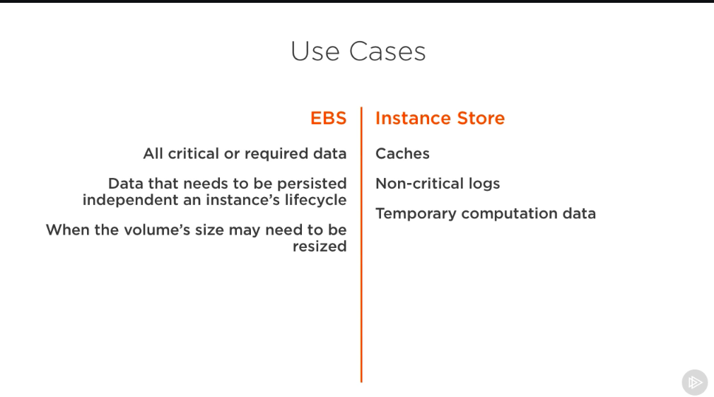

# Storage Volumes #

- So far, throughout this course we've been mentioning storage volumes. Let's discuss what they are and how we can use them. Storage volumes are devices that we can use to grant us more storage capacity. They can take on one of two forms, instance store or EBS. 

- Essentially volumes are like modular hard drives. An instance can easily use one or multiple as needed. We can create these volumes through the AWS console, which is exactly what we're going to be doing in the next demonstration, or through the command line interface. 

- After creating one, it must be attached and then mounted to an instance in order for it to be used. Knowing how to use storage volumes will allow you to scale your applications and make them more flexible as they grow. First off, let's discuss the features that EBS volumes offer. EBS volumes are flexible, performant, and durable. 

- They are classified as network-attached storage devices and make a great candidate for the primary storage method of your data. Whether it's the root volume of your instance or, for example, the storage of a database application. When you create an EBS volume, it is automatically replicated within the instances availability zone to prevent data loss. 

- This means that you can easily recover in the event of a hardware failure and your data will still be safe. They can be attached to one instance at a time, but a single instance can have multiple volumes attached to it at once. The one constraint on this is that the volume must be in the same availability zone as the instance that it is attaching to. 

- Another useful feature is the ability to monitor your volumes with AWS CloudWatch, free of charge. Doing so will allow you to get useful insights into the health and performance of your volume. EBS volumes can also be encrypted using the Amazon EBS encryption feature. 

- This means that EBS volumes will be sufficient for data at rest encryption requirements if you need to meet regulatory standards. Lastly, EBS volumes support live configuration changes. You can change things like the volume type and size in a production environment without any data loss or interruptions. The pricing model for this type of instance is simple, you only pay for the storage that you use. 

- As you can tell, EBS volumes are an extremely beneficial offering from AWS. So why would you want to use an instance store volume? First, let's discuss what they are and how they work. Unlike EBS volumes, instance store volumes are disks that are physically attached to an instance. What this means is that the size and number of storage devices that are available to you will depend on the instance type that you're using. 

- For example, a c4.large instance might have four physically attached drives, while another instance might only have one. Further to this point, these drives may be solid state drives or hard disk drives, depending on what instance type you are using, and not all instance types on EC2 support instance stores. Lastly, there are no costs associated with using an instance storage volume if it is your instance's root volume. 

- You will only be charged for the additional volumes that you'd like to use. So far, these differences may see subtle. Here's the biggest difference between them though, the data on an instance store volume only persists within the lifetime of the instance. Yep, you heard me right, if the instance stops, terminates, or the disk drive fails, all of your data will be lost. 

- This is significantly different than the behavior of an EBS volume where if an instance gets terminated, you can just launch a new one and attach the volume again. As you can imagine, this limits the use cases of instance store volumes a lot. They should generally only be used for temporary storage. 

- Temporary storage entails things such as caches, noncritical logs, or temporary computation data, for example, if you need to temporarily store some data as you process it and then write it back onto EBS volumes.

## Snapshots ##

