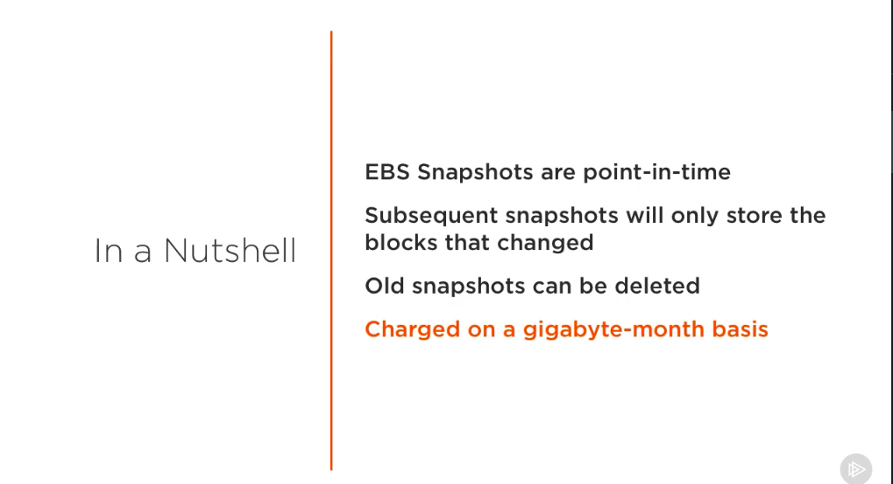
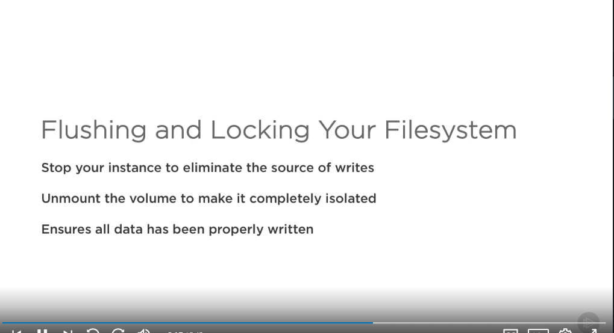
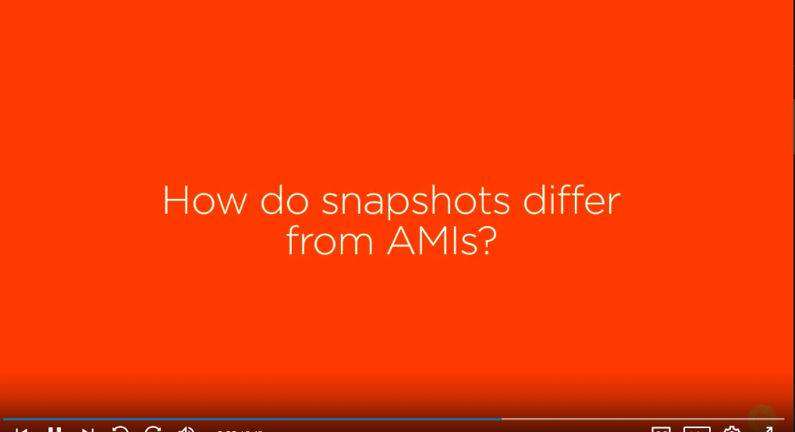
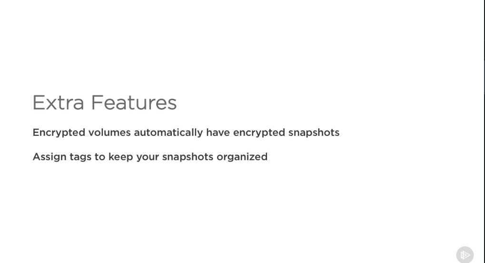

# EBS Snapshots #

- As you create, attach, and use storage volumes, you're likely going to want to back them up. Whether it's for long term log storage or disaster recovery purposes, you're going to need a place to securely house your data. EBS snapshots are great for this. They are point-in-time, meaning you'll get an exact representation of how the volume was at a given point in time.

- If you take snapshots periodically, you won't be taking an entire copy again each time. Luckily enough, only the blocks on the device that have changed will be saved in the new one. Despite this fact, if you have multiple snapshots of the same volume, you can delete the older ones. You'll only need the latest snapshot to restore the entire volume. 

- These features will allow you to clean up excess snapshots and pay less for storage space used. When you are billed for snapshots, you are billed on a gigabyte-month basis, meaning you pay for the size of snapshot and how long you've had it for. When creating a snapshot, the process is done asynchronously as the device is still being used.

- The snapshot will go into a pending state until it is transferred to AWS S3. However, it is still point-in-time. Just because the volume is still being used, any ongoing reads or writes, after you initiated the process, won't be included in the snapshot. 

- For this reason, it is best practice to flush and lock your file system. What do I mean by this? Your application and databases communicate with your operating system and write data to your local file system. Before the snapshot command is issued and the cutoff point is created, you're going to want to make sure that all of the data has been properly written so it's included in the backup. Flushing and locking your file system is the way to achieve this. Let's talk about how we can go about getting this done. 

- First, by stopping your instance, you can eliminate the source of writes and let your applications know that they are going to be shut down, allowing them to do a proper clean up. To be safe, you can then unmount the drive to make it fully isolated. One question that I get asked a lot is how do snapshots differ from AMIs? Remember, AMIs can also be used for backups. But they act as a template for instances that contain things, such as their operating systems and applications, essentially the whole instance. 

- AMI backups include the root volume and all of the drives you specify. Most importantly, you can actually launch instances from AMIs. When you create an EBS snapshot, you're only backing up a single volume. This might be a root volume, which contains an operating system and applications, but you can't actually launch an instance from it. 

- You would have to create the instance and then attach the volume to it. For this reason, I like to think of EBS snapshots as being slightly more general purpose and AMIs as a feature that is tightly coupled to EC2 instances. Let's talk about some additional and useful features while we're talking about EBS snapshots. 

- If you create a volume using and encrypted snapshot as a base, the new volume will be encrypted automatically, keeping things consistent. As with many services of the EC2 suite, you can also add tags to snapshots. These key value pairs will help keep your snapshots organized and easily identifiable. Lastly, snapshots can be shared with other AWS accounts.

