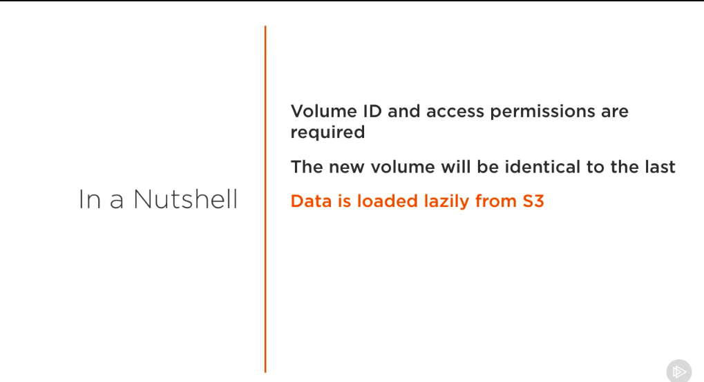
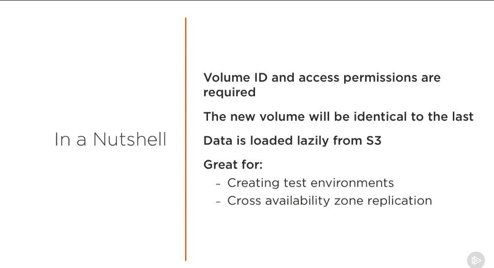
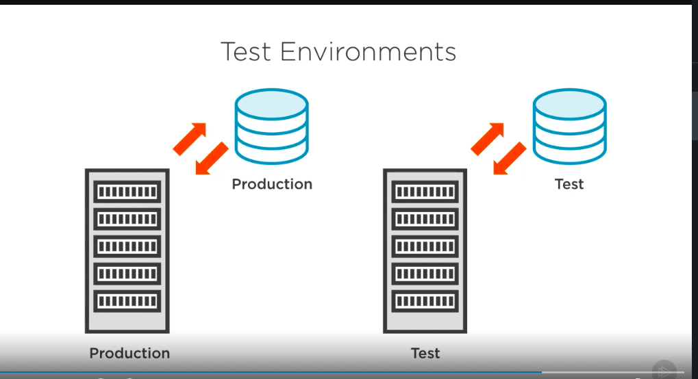

# Restoring volume from a snapshot #
- At this point in time, we have talked about how to create EBS snapshots. Now let's talk about how to use them. 

- First things first, in order to restore the volume from a snapshot, we'll need the snapshot's ID and permission to access it. When we restore a volume from a snapshot, the snapshot's data gets transferred from S3, making our new volume identical to the state of the volume we took the snapshot from. 

- There is no need to wait around for this entire process to complete because the data is loaded lazily. What this means is that the volume is instantly made available for use and if we attempt to access a piece of data that has not yet been downloaded, the volume will immediately download that piece of data so that we can use it, and then continue downloading the rest. 

- There are a number of reasons why it's useful to know how to restore a volume, including the creation of test environments and cross availability zone replication. Let me elaborate on our test environment example. When creating a test environment, we would want to replicate our production environment as closely as possible, then when testing, we wouldn't want to tamper with their production, therefore we could use a separate volume dedicated for our test data and constantly restore it with a snapshot as you made changes. 

# Snapshots #

