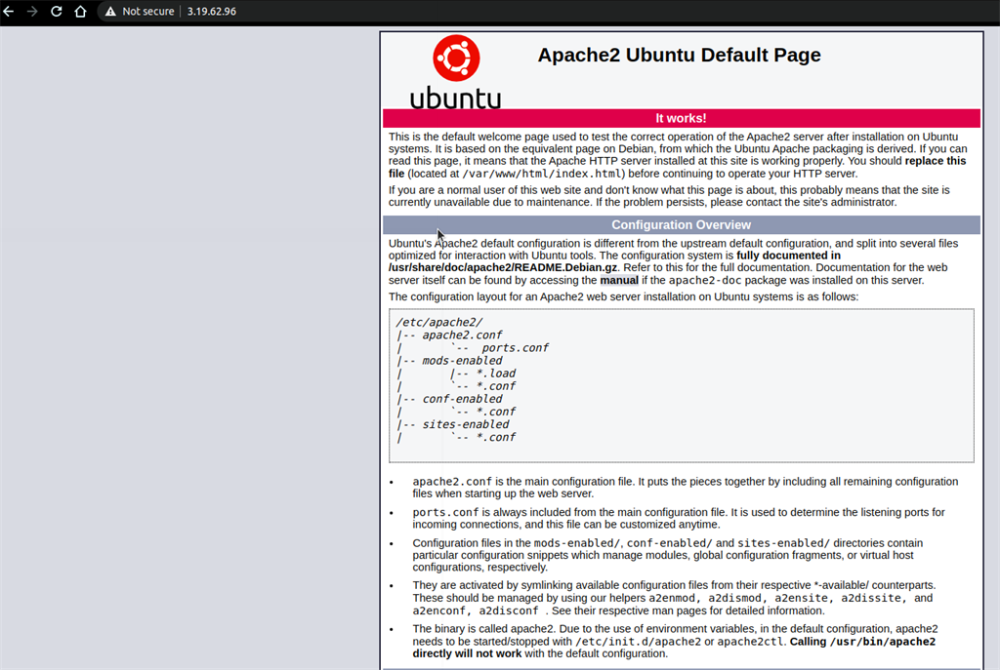

# Installing Apache server in Ubuntu inside EC2 #
```js
sudo apt update
sudo apt install apache2
```
- Now open your web browser and type your public IP address


# Configuring file loading #
- whenever a user goes to your web app the Apache server will return HTML files; that means index.html. 

- So we are going to change the configuration and make it look for index.php first and then index.html if index.php is not available. So for doing that below are the commands.
 
```js
sudo vim /etc/apache2/mods-enabled/dir.conf
 ```

- You will see something like this:
```js
<IfModule mod_dir.c>  
   DirectoryIndex index.html index.cgi index.pl index.php index.xhtml index.htm  
</IfModule>  
```

- Presse i to go into insertmode
- Type the text
- Press ECS
- Type :wq to save and exit

```js
<IfModule mod_dir.c>  
   DirectoryIndex index.php index.html index.cgi index.pl index.xhtml index.htm  
</IfModule> 
```


Now restart the apache server and check the status of the server. You must see active(running).

```js
sudo systemctl restart apache2
sudo systemctl status apache2
```

# How to create Virtual Host in Apache2 #
## Step 1 — Create the Directory Structure ##
- We’ll first make a directory structure that will hold the site data that we will be serving to visitors in our top-level Apache directory.

-  We’ll be using example domain names, highlighted below. You should replace these with your actual domain names.

```js
sudo mkdir -p /var/www/example.com/public_html
```

## Step 2 — Grant Permissions ##
- We should now change the permissions to our current non-root user to be able to modify the files.
```js
sudo chown -R $USER:$USER /var/www/example.com/public_html 
```

- Additionally, we’ll ensure that read access is permitted to the general web directory and all of the files and folders it contains so that pages can be served correctly.
```js
sudo chmod -R 755 /var/www
```

## Step 3 — Create Demo Pages for Each Virtual Host ##
- Let’s create some content to serve, we’ll make a demonstration index.html page for each site. We can open up an index.html file in a text editor for our first site, using nano for example.

```js
 nano /var/www/example.com/public_html/index.html

```
Within this file, create a domain-specific HTML document, like the following:

```js

/var/www/example.com/public_html/index.html

<html>
   <head>
      <title>Welcome to Example.com!</title>
   </head>
   <body>
      <h1>Success! The example.com virtual host is working!</h1>
   </body>
</html>
```

## Step 4 — Create New Virtual Host Files ##
- Apache comes with a default virtual host file called000-default.confthat we’ll use as a template.
- We’ll copy it over to create a virtual host file for eachof our domains.
- Create the First Virtual Host FileStart by copying the file for the first domain:
```js
sudo cp /etc/apache2/sites-available/000-default.conf /etc/apache2/sites-available/example.com.conf
```

- Open the new file in your editor (we’re using nano below) with root privileges:
```js
sudo nano /etc/apache2/sites-available/example.com.conf
```

- We will customize this file for our own domain. Modify the highlighted text below for your own circumstances.

```js
/etc/apache2/sites-available/example.com.conf

<VirtualHost *:80>    
   ServerAdmin admin@example.com    
   ServerName example.com    
   ServerAlias www.example.com    
   DocumentRoot /var/www/example.com/public_html    
   ErrorLog ${APACHE_LOG_DIR}/error.log    
   CustomLog ${APACHE_LOG_DIR}/access.log combined
</VirtualHost>
```

- At this point, save and close the file.

## Step 5 — Enable the New Virtual Host Files ##
- With our virtual host files created, we must enable them. We’ll be using thea2ensitetool to achieve this goal.

```js
sudo a2ensite example.com.conf
```

- Next, disable the default site defined in 000-default.conf:

```js
sudo a2dissite 000-default.conf
```

- When you are finished, you need to restart Apache to make these changes take effect and usesystemctl statusto verify the success of the restart.

```js
sudo systemctl restart apache2
```

## HOW TO KILL SERVER PROCESS USING PROCESSID ##
```java
sudo kill -9 `sudo lsof -t -i:6543`
```

## Step 6 — Set Up Local Hosts File (Optional) ##
- If you haven’t been using actual domain names that you own to test this procedure and have been using some example domains instead, you can test your work by temporarily modifying thehostsfile on your local computer.

- On a local Mac or Linux machine, type the following:

```js
sudo nano /etc/hosts
```

- Using the domains used in this guide, and replacing your server IP for the your_server_IP text, your file should look like this:

```js
/etc/hosts
127.0.0.1   localhost
127.0.1.1   guest-desktop
your_server_IP example.com
```
