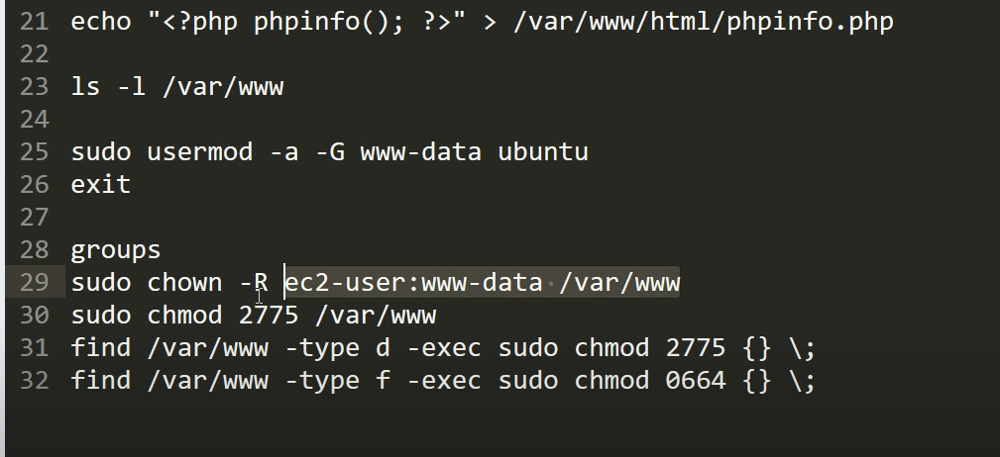

# How to change the permission to upload file inside /var/www/html #
- By default we won't be able to upload file to /var/www/html

## 1. First step ##
```js

sudo usermod -a -G www-data ubuntu
exit 

```

### 1.2 What is usermod -a -G www-data ubuntu ###
- sudo means: Run this command as root. This is required for usermod since usually only root can modify which groups a user belongs to
- usermod is a command that modifies the system configuration for a specific user.
- -a is a shortcut for --append: It means append the group to the list of groups the user belongs to!
- -G is a shortcut for --groups: It tells usermod that the next argument is a group. Note that you need to use a 
- www-data is the user that web servers on Ubuntu (Apache, nginx, for example) use by default for normal operation.
- ubuntu is default EC2 username for Ubuntu


# 2. Second step #
```js
sudo chown -R ubuntu:www-data /var/www
sudo chmod 2775 /var/www
find /var/www -type d -exec sudo chmod 2775 {} \;
find /var/www -type f -exec sudo chmod 0664 {} \;

```

## 2.1 Details of sudo chown -R ubuntu:www-data /var/www ##
- chown performs change ownership in Linux
- Grant a user permissions on www-data owned /var/www: sudo chown -R ubuntu:www-data /var/www
- sudo chmod 2775 /var/www means change the permission.

### Reference image ###
