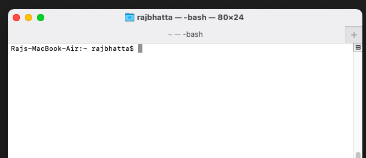
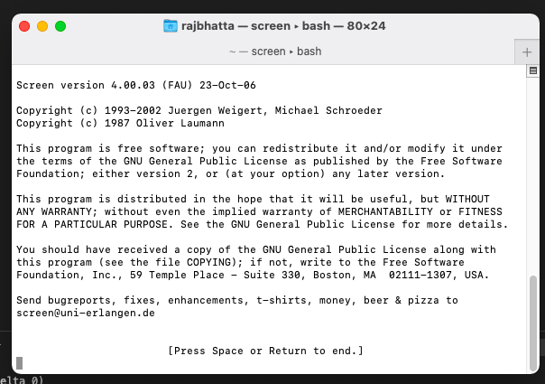
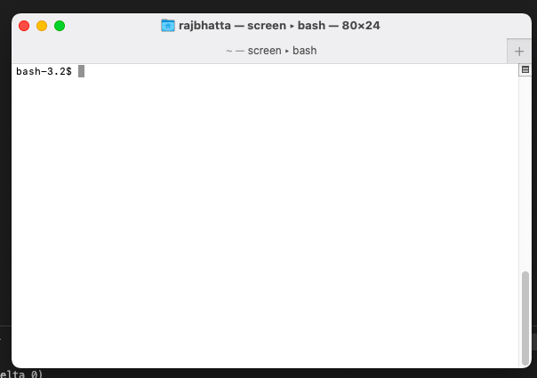

# How to keep running processes running after ending ssh session? ##
- goto EC2 instance. Right now, I am capturing it using my mac terminal.
- Type screen
- Press enter or space to accept agreeement
- Run screen using the terminal regularly 





- Check list of application running using
```js
screen -ls

output
There are screens on:
    10835.pts-0.linuxize-desktop   (Detached)
    10366.pts-0.linuxize-desktop   (Detached)
2 Sockets in /run/screens/S-linuxize.
```

- Attach to restore screen 10835.pts-0, 
```js
screen -r 10835
```
