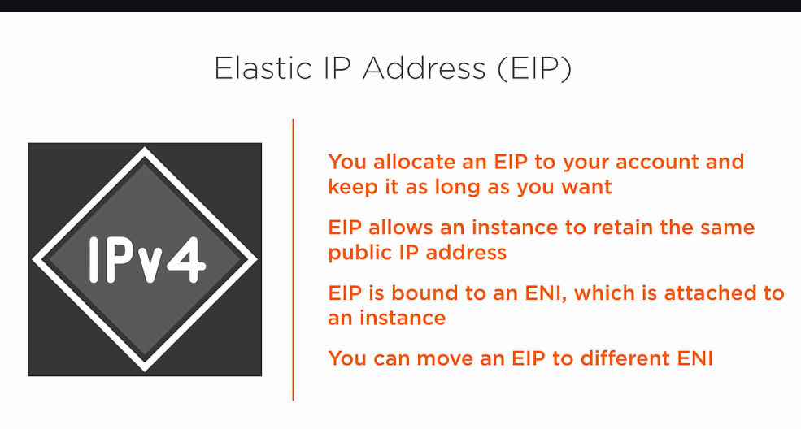
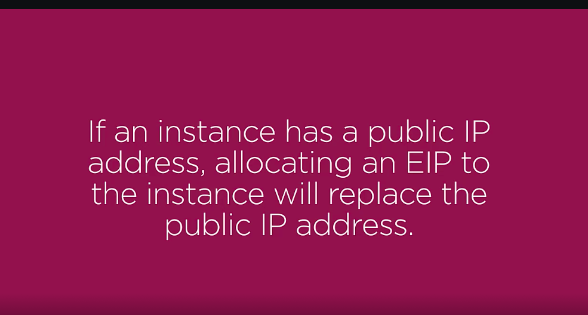
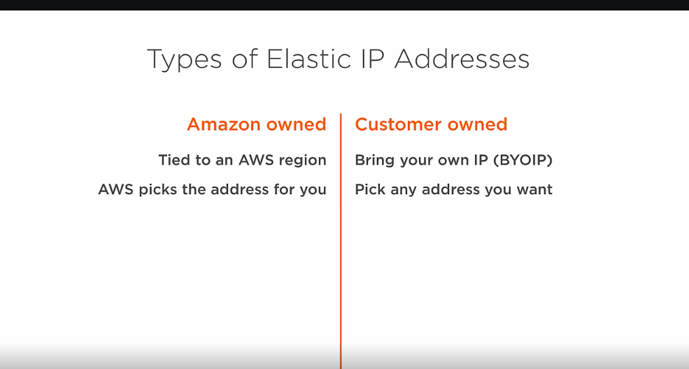
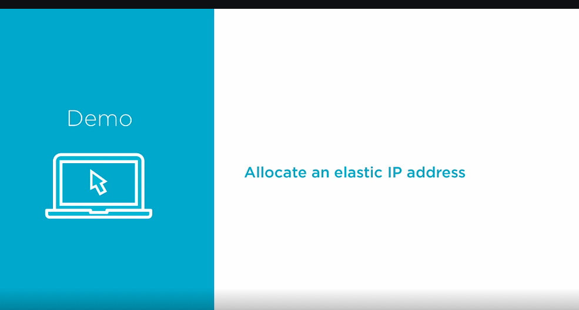
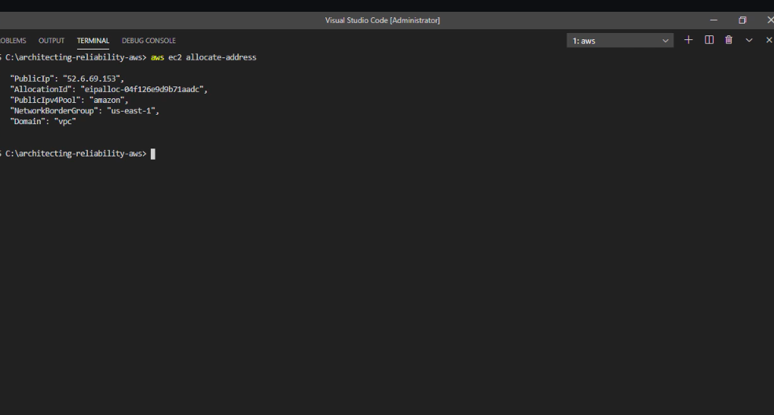
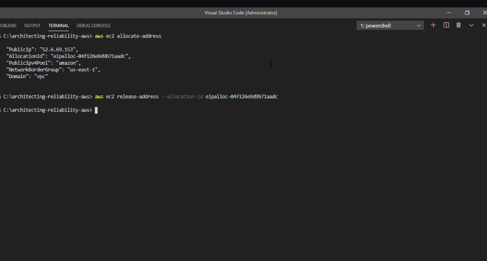
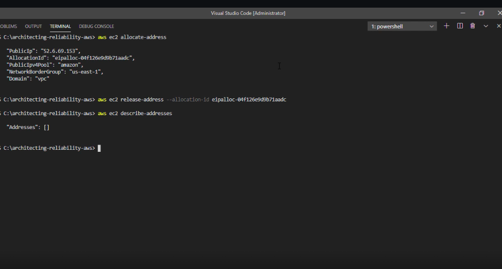

# 1. What is elastic IP address ? #
- I want to have a public IP address for my EC2 instance that will persist even if my instance is stopped and restarted. How do I do that?

- An Elastic IP address is a reserved public IP address that you can assign to any EC2 instance in a particular region, until you choose to release it.

- ENI (Elastic Network Interface)

