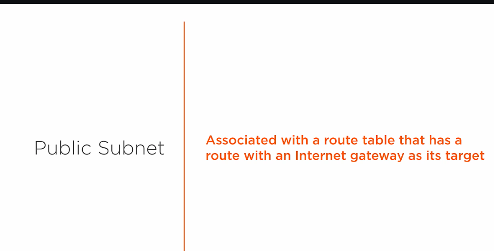
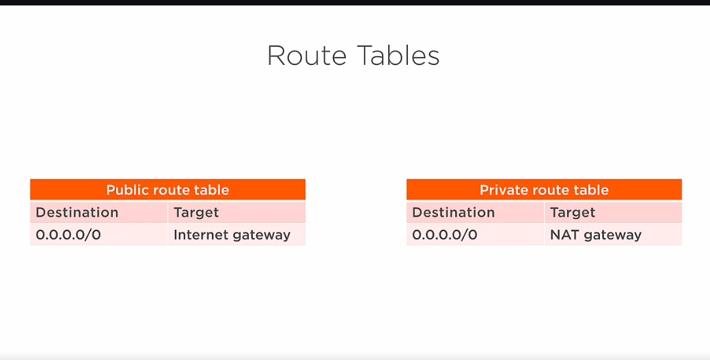

# 1. What is Internet Gateway? #
- Internet gateway provides inbound/outbound traffic  for the resource inside public subnet. 

- The inbound and outbound rule is defined inside route table.

# Where should we attach internet gateway ? #
- Internet gateway is always Attached to VPC so that VPC an talk with internet

# Procedure to be followed #
- Create VPC first
- Create internet gateway and attach VPC to it.