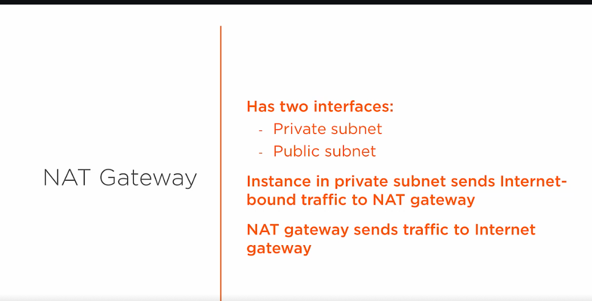

# 1. What is NAT Gateway? #
- NAT gateway provides outbound traffic only for the resource inside private subnet. So there is no incoming request for it.
- Outbound traffic is applicable if we want to apply patch or upgrade our database.

- NAT gateway has two interfaces one in public and another one in private subnet
- The private interface redirects to internet gateway in public subnet and makes communication

