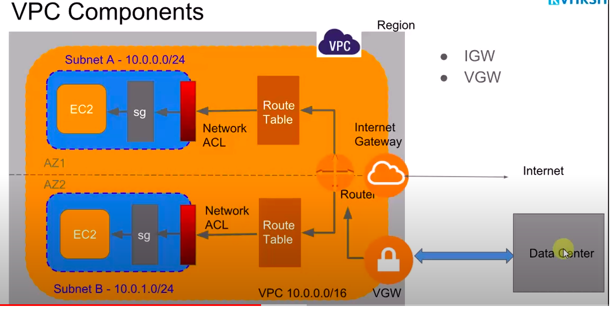

# What is CIDR in VPC #
```js
10.0.0.0/16 - 
is the most commonly used CIDR used for VPC. 

- This give you 65535 private IP addresses to work with in your VPC.

- You commonly divide it to subnets of size /24, each with 255 private addresses. 

- For example:

10.0.1.0/24
10.0.2.0/24
10.0.3.0/24
10.0.4.0/24

- If you use the above pattern for VPC and subnets, you don't have to do any calculations or memorize any formals.
```

