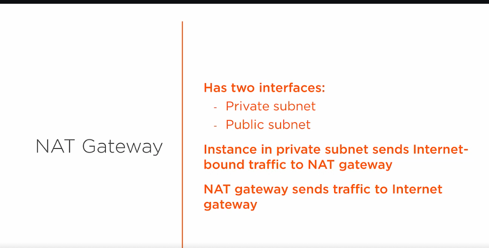
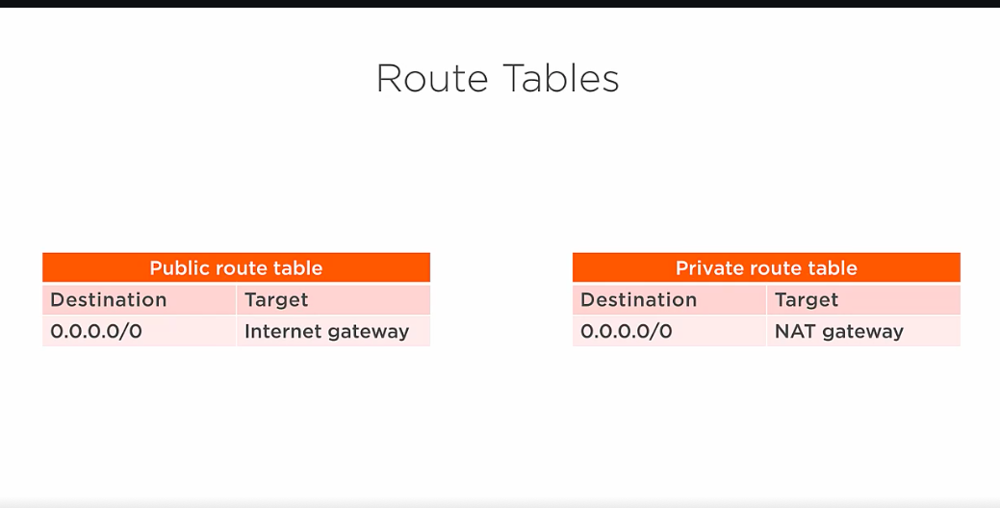

# 1. What is NAT Gateway? #
- A NAT (Network Address Translation) instance is, like a bastion host, an EC2 instance that lives in your public subnet. A NAT instance, however, allows your private instances outgoing connectivity to the internet while at the same time blocking inbound traffic from the internet.

- NAT gateway provides outbound traffic only for the resource inside private subnet. So there is no incoming request for it.

- Outbound traffic is applicable if we want to apply patch or upgrade our database.

- NAT gateway has two interfaces one in public and another one in private subnet
- The private interface redirects to internet gateway in public subnet and makes communication

