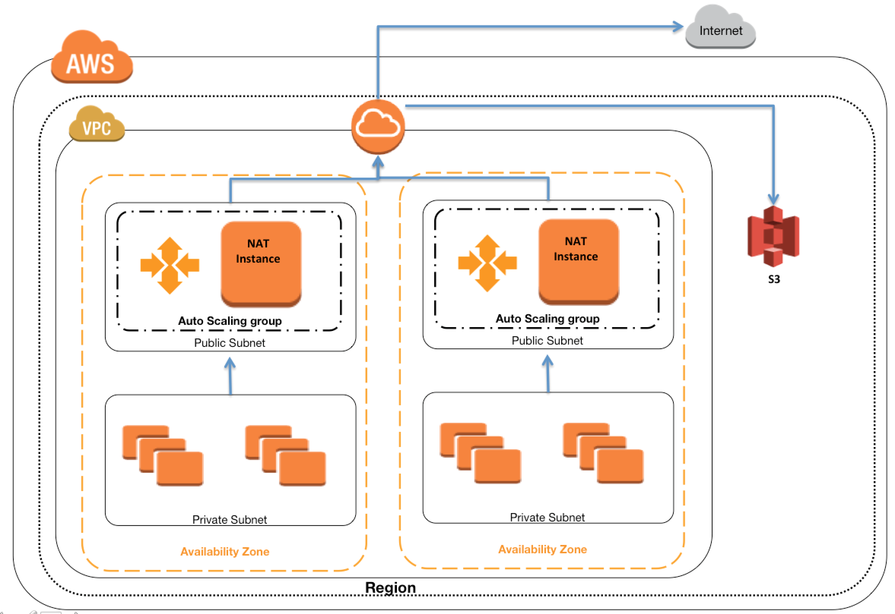

# 1. What is NAT Instance? #
- A NAT (Network Address Translation) instance is, like a bastion host, an EC2 instance that lives in your public subnet. A NAT instance, however, allows your private instances outgoing connectivity to the internet while at the same time blocking inbound traffic from the internet.

- Outbound traffic is applicable if we want to apply patch or upgrade our database.

- NAT instance can be created by using Amazon Linux AMIs configured to route traffic to Internet.

- They do not provide the same availability and bandwidth and need to configured as per the application needs.

- NAT instances must have security groups associated with Inbound traffic enabled from private subnets and Outbound traffic enabled to the Internet.

- NAT instances should have the Source Destination Check attribute disabled, as it is neither the source nor the destination for the traffic and merely acts as a gateway.

## 1.1 Overview ##

