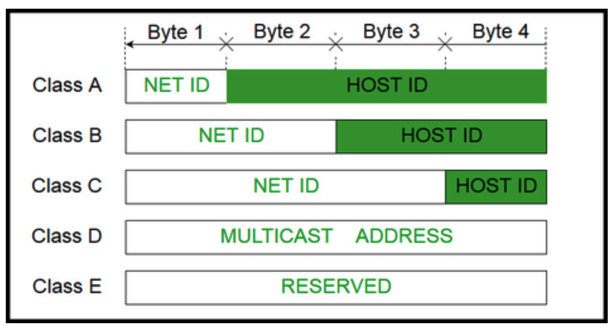
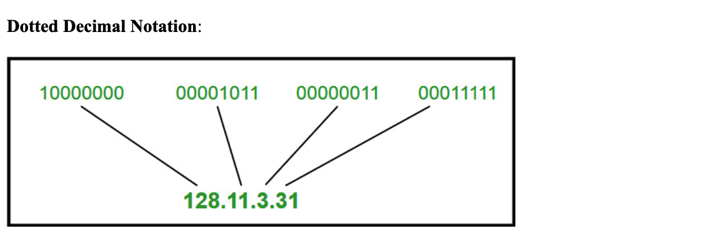

# 1. What is CIDR and where it is used? #
• All VPCs are created and exist in one—and only one—AWS region.
• The advantage of regionalization is that a regional VPC provides network services
originating from that geographical area. If you need to provide closer access for
customers in another region, you can set up another VPC in that region.
• Limiting VPC configurations to specific regions allows you to selectively provide
network services where they are needed, as they are needed.

# 2. How IPV4 works? #

- Generally, there are two notations in which IP address is written, dotted decimal notation and hexadecimal notation.
