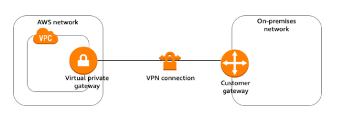
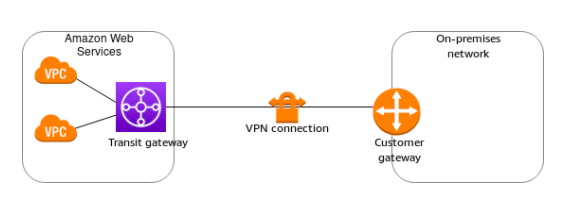

# How Site to Site VPN works in AWS? #
## 1. Customer Gateway ##
- A customer gateway is a resource that you create in AWS that represents the customer gateway device in your on-premises network. When you create a customer gateway, you provide information about your device to AWS. 

## 3. Virtual private gateway ##
- A virtual private gateway is the VPN concentrator on the Amazon side of the Site-to-Site VPN connection. You create a virtual private gateway and attach it to the VPC from which you want to create the Site-to-Site VPN connection.

## 2. Transit gateway ##
- A transit gateway is a transit hub that you can use to interconnect your virtual private clouds (VPC) and on-premises networks.

