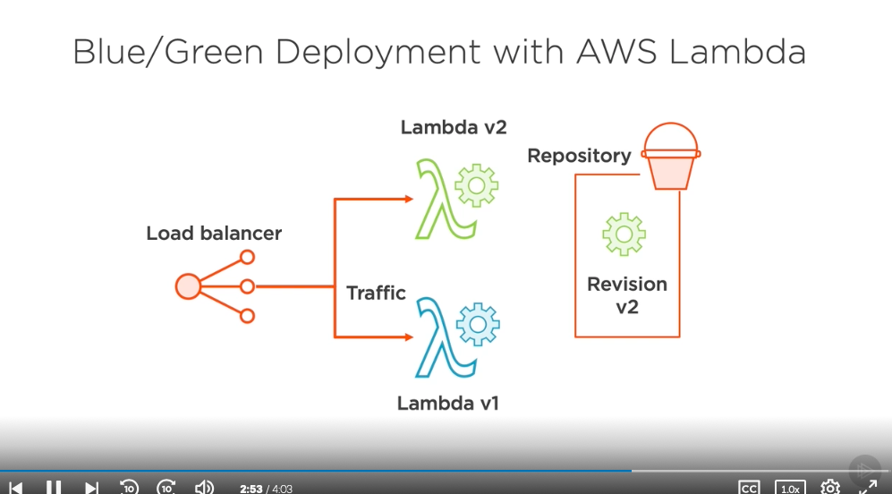

# Deployment Types: Blue/Green Deployments #

- The next type of deployment we'll look at is a blue/green deployment. Now, with blue/green deployments, there's a few different ways we can control how we shift traffic between versions of our application. The first is called a canary deployment where we deploy just a little bit of traffic to test it out before we deploy everything else. Then there's a linear deployment type, which allows us to slowly scale up the amount of traffic we send to our new application version, and we do this piece by piece over a little bit of time. And finally, there's an all‑at‑once blue/green deployment where we instantly shift all the traffic from our version 1 to our version 2 of our application or the subsequent versions as we continue development. All of these different blue/green deployment traffic shifting models can be deployed in different scenarios with different AWS services that CodeDeploy will deploy to. So let's look at some specific examples, starting with blue/green deployments and EC2. 

- Pretty similar to what we were looking at within place deployments, we'd start with a load balancer shifting traffic between 1 version of our application, in this case, the version 1 being called the blue version, and the second version of our application that we'll eventually want to put version 2 of our software on. What will happen is we'll take revisions for the second version of our application, and we'll move those over to our second set of instances, or autoscaling group, and then we'll do some optional testing against this newer green version. When we run these tests and they are proved successful, then we could move on to the next step, which is to shift traffic from version 1 to version 2 of our application, and this is where those different deployment strategies come in where we can choose either linear, canary, or all at once, and that would just determine the speed of this transition. Eventually, when we're done with version 1 the application and all traffic has been switched to version 2, version 2 then becomes considered the blue version of our application, or the one will eventually change from into a new green version. 

- So how do we deal with this same sort of strategy using a different service, like ECS. With ECS, instead of instances, we'll have task sets that we'll switch between. We'll still have the same repository, and we'll also have a new task set that we send version 2 of our application. From there, we'll have the option of doing the same sort of optional testing and validation that we could do against EC2 services, and eventually, when we're ready, we'll change the traffic from test traffic to actual production traffic, and eventually, remove the first version of our application. Again, once we've fully transitioned into this new deployment, this version of the application would be considered the blue version, and we continue this process over again. The same thing would happen with blue/green deployments in AWS Lambda. We send traffic to the first version of our Lambda function, the blue version, we get a revision, and then we create a new Lambda function version with that revision. From there, we then start switching over traffic to the green version of the application, the version 2, and eventually phase out version 1 and remove the Lambda function. Now, this is a lot simpler because we don't have as many moving parts as with EC2 or with ECS, but it works basically the same way as we then consider this version the application the new blue version. So what are some of the benefits of these different kinds of deployments when you're working with blue/green deployments? Well, they can really help because there's no interruptions between the traffic shifting. The traffic gets shifted from the load balancer, and you move from 1 version of the application in 1 Lambda function, or ECS task set, or set a EC2 instances directly to the next. 

- And also, because you maintain two separate versions of your application, you'll have easy rollbacks to switch to the previous version if you have something happen like errors or flaws in your application that weren't caught through testing. Additionally, this model of deployment makes it a lot easier to set up tests and alarms on the versions of your application that can help trigger these rollbacks if they're required. So now that we know more about deployment types, let's see how we can actually use these deployments with CodeDeploy.

