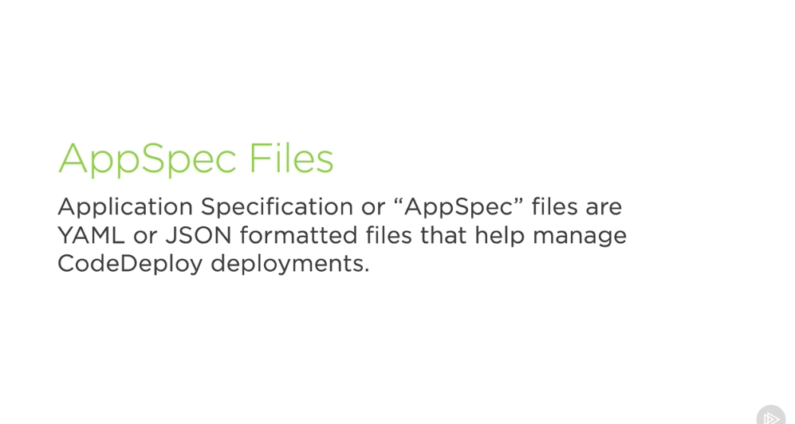
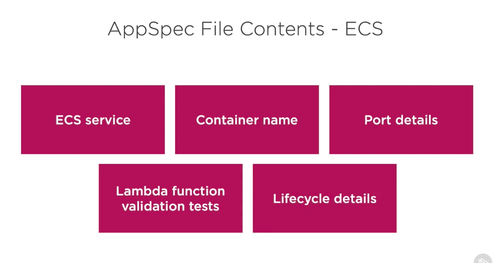
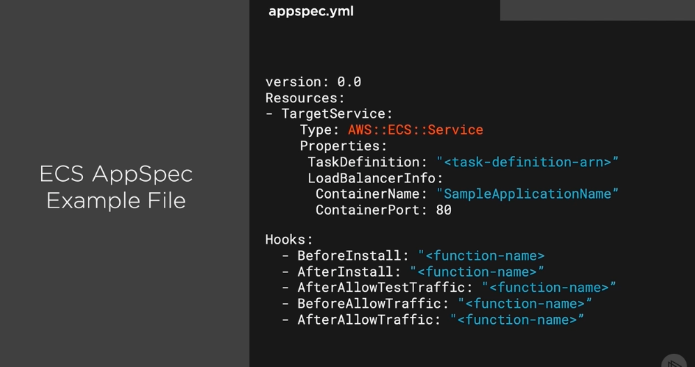
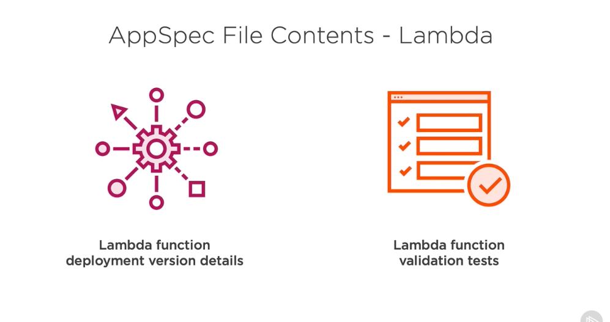
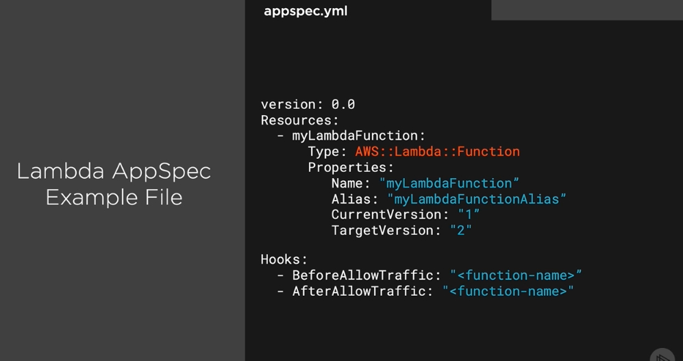
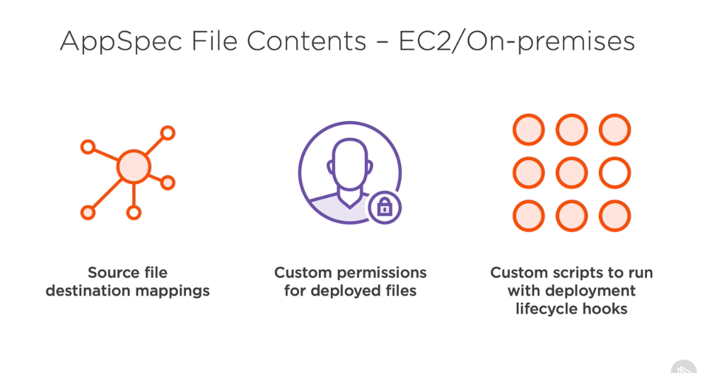
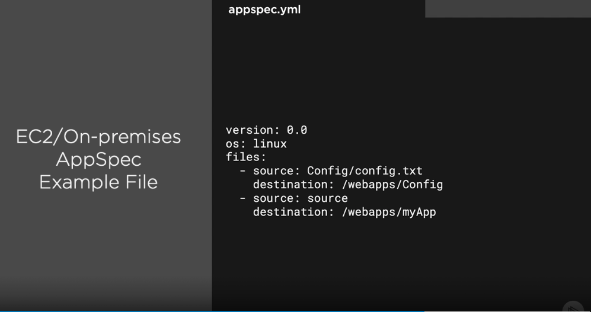
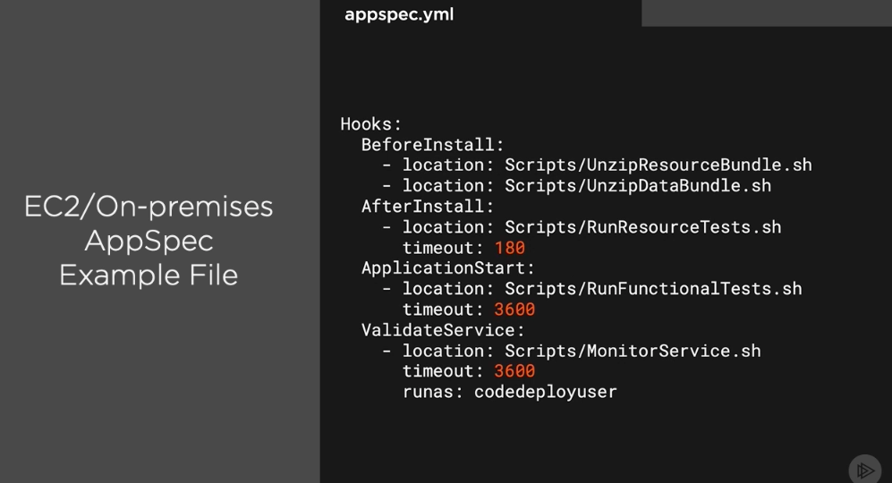

## AppSec Files #

- So now that we understand how these different deployment types work, let's look at how we actually configure them inside of AppSpec files. AppSpec files or application specification files are YAML file or JSON‑formatted files that will help us manage our CodeDeploy deployments. Let's look at some of the different contents of these files, depending on the different services that we're working with. With ECS, we'll have to determine what the ECS services, the container name that we're working with, port details if we're allowing traffic on particular ports, Lambda function validation tests if we want to run these after our ECS has deployed, and also lifecycle details of the entire process. So let's look at how this would actually come into a YAML file as an example. So in this AppSpec file here, we're defining resources like our ECS service, and giving the details around the task definition, the load balancer information, and the port that it's operating on. 

- And we also have a hook section, which we'll talk about in a moment, that will allow us to run our Lambda functions at particular points in this installation. With AppSpec files for AWS Lambda, we're really going to only have two parts, details about the Lambda function's deployment version and other details about it, and the Lambda function's validation tests that we might want to run after it's been deployed. An example of this file would look like this, where we have the definition of our Lambda function, the name and the alias and the versions that we're working with, as well as a hook section for the tests that I mentioned that we can run with other Lambda functions. AppSpec files also look a little different when working with EC2 or on‑premises environments. We'll have a source file and destination mappings. So all the files we're copying into EC2 instances, we'll need to map from wherever they are inside of our deployment package to wherever they should go on the EC2 instance. 

- For example, in different directories, we might have different contents of those directories that we want on the instance that will be different from what's in the file. We'll also have custom permissions for the deployed files. So if one file should be more accessible than another or have executable permissions or other things like that. And finally, we'll also define custom scripts that we want to run during different deployment lifecycle hook sections. Again, we'll talk about hooks in just a moment, but here's an example of EC2 instances and what the AppSpec file might look like for them. The first part would look like the file section saying the source where the file exists inside of our deployment artifact and the destination where we want it to go on the machine that we're deploying to. So, for example, our config file might start in config.txt inside of a config folder in our artifact, but then we deploy it to a /webapps/config directory and file location. Now also in the same AppSpec file, we might have hooks that look like this, where we have different scripts to run at particular parts of the installation step; before installation, after installation, and so forth, and these would do things like install or unzip different pieces of our application artifacts or go get additional dependencies we might need. So now that we know what some of these files look like, in the next section, let's take a closer look at how AppSpec hooks help us tie together the installation process.

