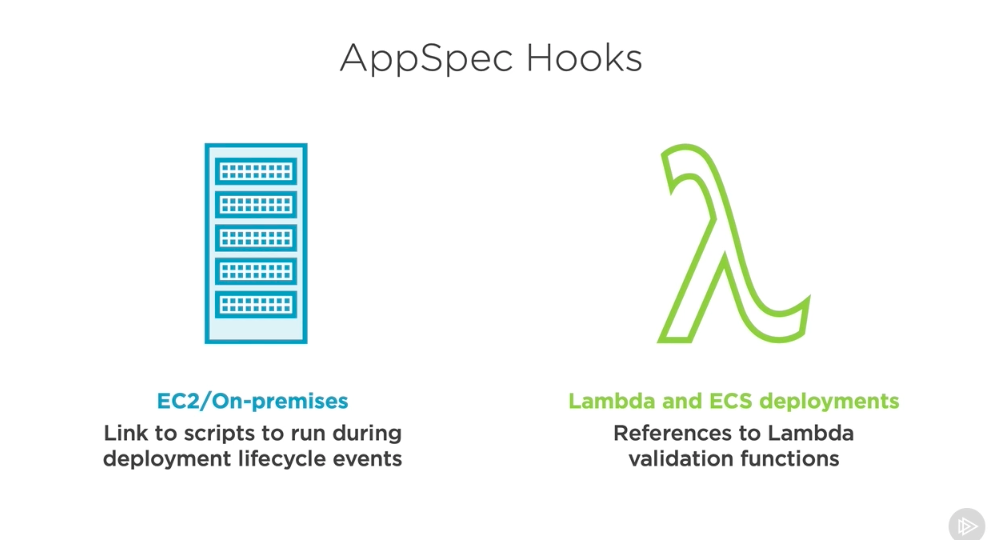
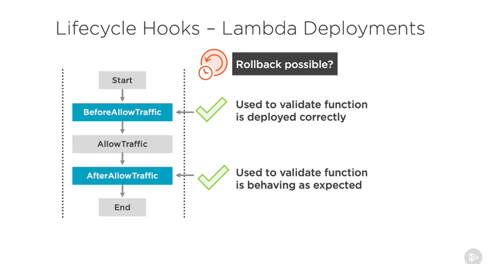
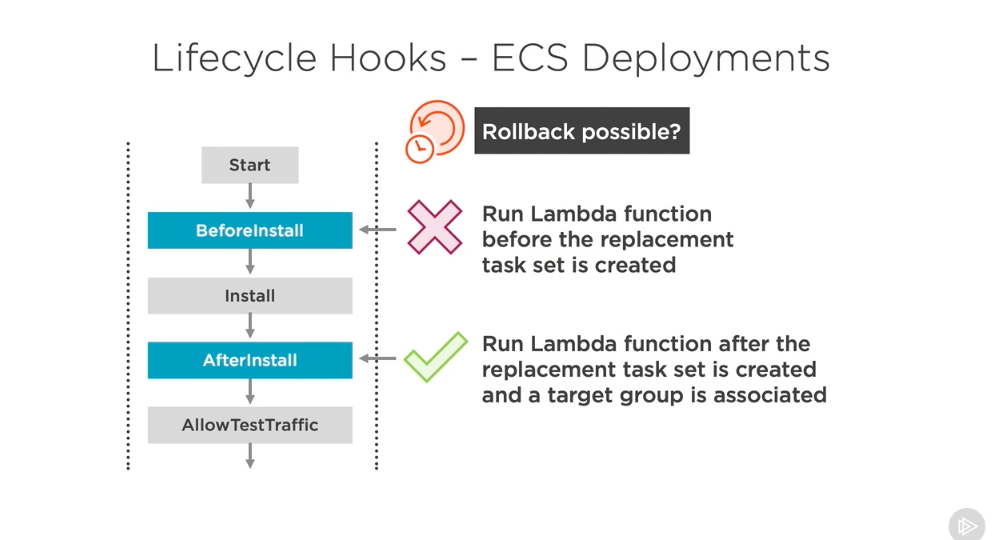
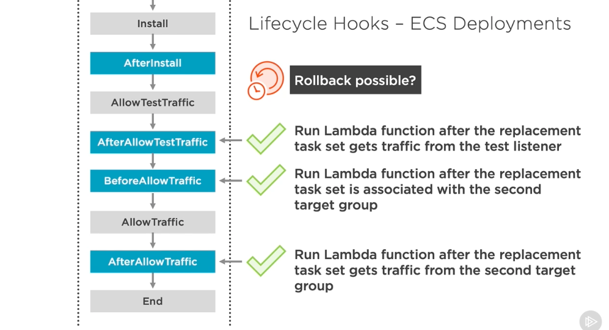
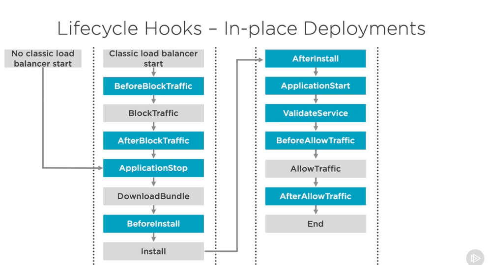
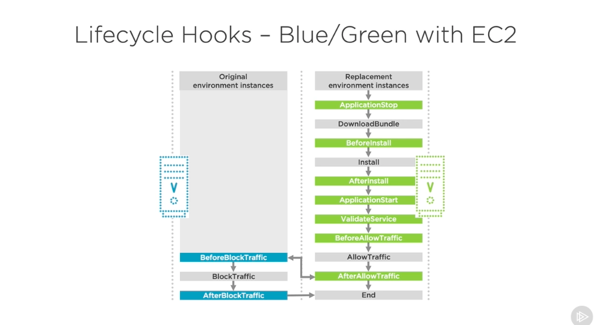

# AppSpec Hooks #

- AppSpec hooks are something that allow us to customize the deployment of our applications at different stages in their deployment. So when we're working with AppSpec hooks, there's two kinds of things we might call hooks in our deployment process. The first applies when we're working with EC2 or on‑premises deployments. These are going to be links to scripts that we run during different deployment lifecycle events, so, for example, an installation script or a post deployment script, whereas when we're working with Lambda or ECS deployments, we're going to reference Lambda functions that will validate our deployments in different ways, not have custom scripts running against our deployments are doing any setup. 

- So let's look at some example hooks when we're working with Lambda deployments. Then we'll look at particular things that are allowed at those steps, for example, at particular steps, we might have a rollback be allowed or not allowed. With the BeforeAllowTraffic section of Lambda deployments, we can validate the function has been deployed correctly, and if it hasn't, we can roll it back. In the AfterAllowTraffic section, we can validate that the function is behaving as expected and it's continuing to serve traffic as normal. And both of these could be used to roll back our deployment if there's something that's going wrong. In the ECS deployment scenario, we have a before installation step, which would allow us to run Lambda functions before the replacement task that is created. But this won't allow us to do any rollbacks. 

- We can do rollbacks in the after installation step, which would run a Lambda function after the replacement task set is created and a target group is associated there. And if you're not very familiar with ECS, don't worry, these are just different steps and different pieces of ECS that we could work with during this process. There's additional steps after the AfterInstall step, though. There's also an AfterAllowTestTraffic and a BeforeAllowTraffic step, and both of these allow us to run Lambda functions at different points of the deployment process. 

- With AfterAllowTestTraffic, after the replacement task set starts getting traffic from a test listener and the BeforeAllowTraffic step is after the replacement task set is associated with the second target group, and it's about to start getting real traffic. And finally, there's a last step here in the AfterAllowTraffic section, which will run a Lambda function after the replacement task set starts getting real traffic from the second target group, basically, when you start setting it live in production. In any of these three steps, you can roll back to an earlier version if you test and see that something is going wrong. There's also lifecycle hooks for in‑place deployments. When we're working with classic load balancers, they start at the BeforeBlockTraffic section and then go through a BlockTraffic and an AfterBlockTraffic step. 

- Now, when we're not using a classic load balancer, we actually start at the ApplicationStop step, and then we go through several other steps throughout this deployment process. At any of these blue sections, we can write our own custom scripts to do things that'll help us with this deployment process. Now, when we're not working with in‑place deployments and we're working with blue/green deployments in EC2, there's a few different steps that happen on the original set of instances and on the replacement set of instances. And if you see how we start at the top right here with the ApplicationStop step, this will start the process on our replacement environment instances. And then it will go through the process of downloading information, doing a PreInstall step, an AfterInstall step, and several other steps to start the service, validate it, and allow traffic. 

- Eventually, once we get to the AfterAllowTraffic section, so our green application, version 2 of our application starts getting traffic. We can then start a BeforeBlockTraffic section on our original instance, so something right before we stop allowing traffic to our original, or are blue version of our application. Then we block the traffic from that instance, and we have an AfterBlockTraffic step before we finish this blue/green deployment. And in many of these steps we have the chance to roll back into the earlier version of the application or to run our own custom scripts to help assist with this process of installing the application and switching over. So I know this is a bit of a mouthful for each of these different lifecycle hooks. 

- What I would say for these different hooks is that when you're working in a production environment you'll probably be only working with one, maybe two of these platforms, and if you're working with CodeDeploy, you'll have time to learn them in a bit more detail. But if you're studying for an AWS exam, I definitely recommend peeking over these workflow diagrams and making sure that you understand, at least generally, how you work through these different steps to get to the ending of the deployment process, and what some of the possibilities are within each of these.

