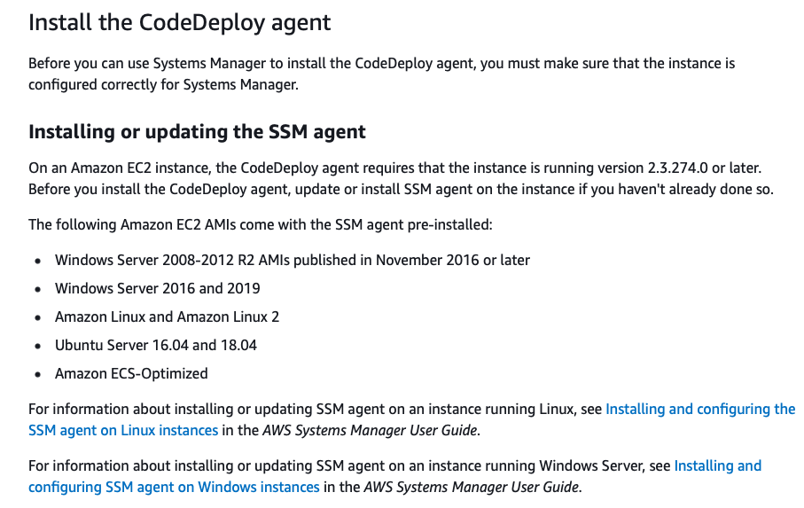

# What is CodeDeploy agent ? #
- To use CodeDeploy on EC2 instances or on-premises servers, the CodeDeploy agent must be installed first. 

# Reference #
- https://docs.aws.amazon.com/systems-manager/latest/userguide/distributor-working-with-packages-deploy.html