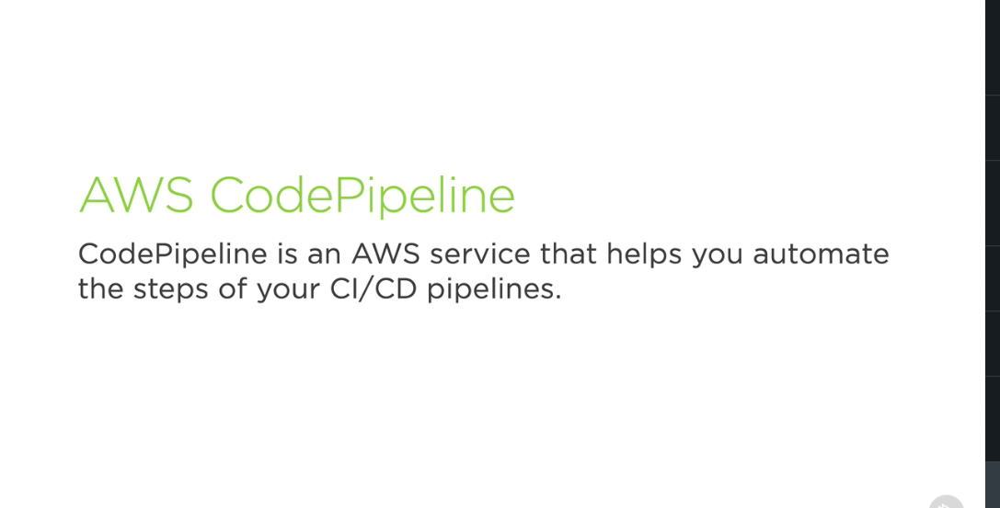
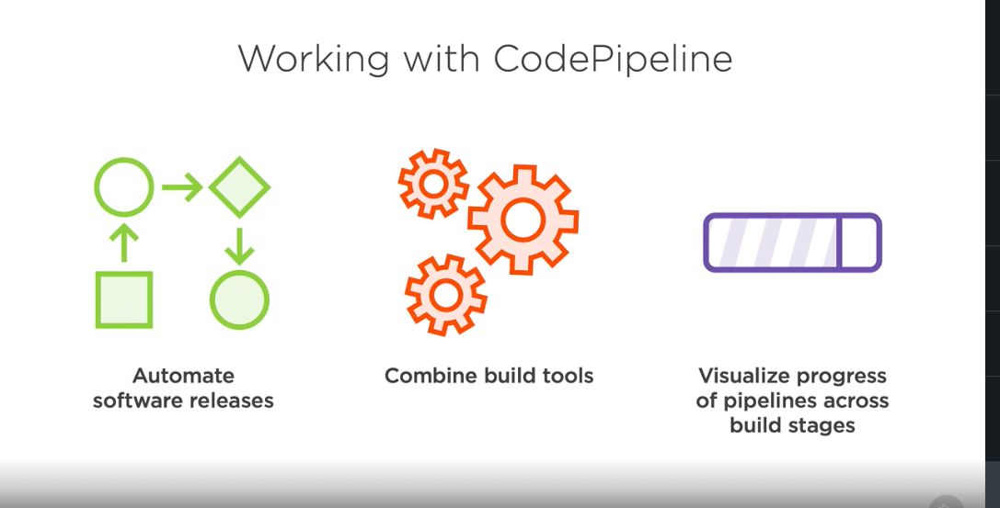
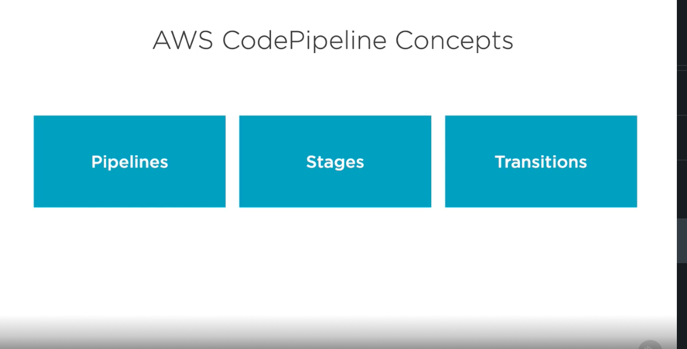
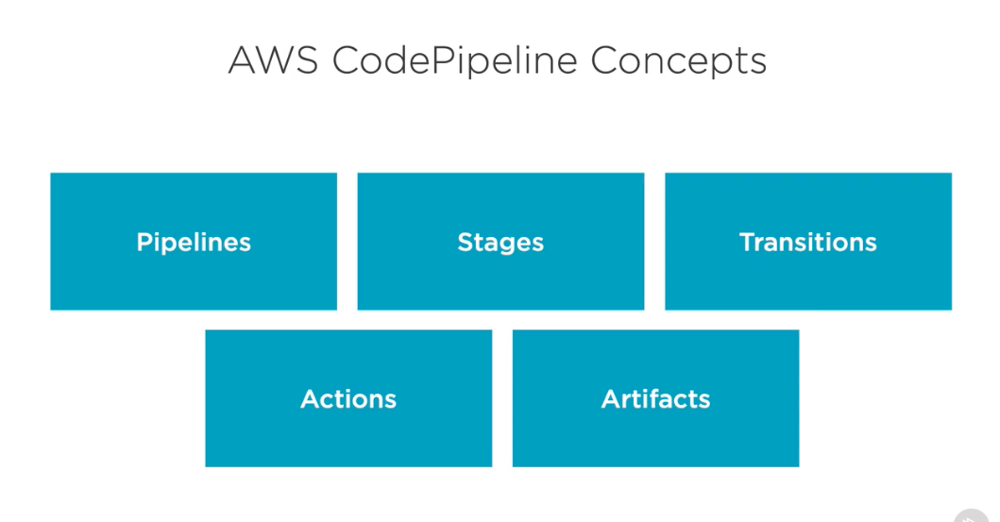
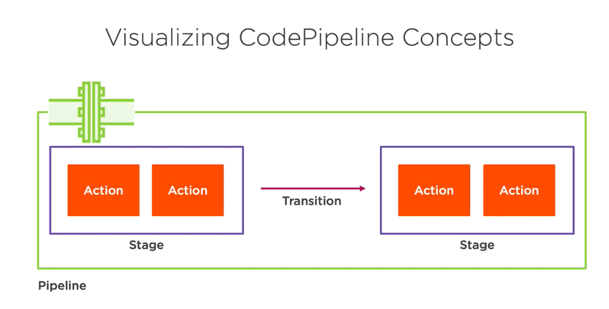

# 1. What is CodePipeline ? #
- CodePipeline is an AWS service that helps you automate all the steps of your CI/CD pipelines. 

- You can use this service in order to automate software releases and have processes that have more than one step, using more than one tool to do it. 

- This will help you to combine different build tools and other tools throughout the entire process, so you can use things like AWS CodeCommit, in combination with AWS CodeBuild, in combination with something like AWS CodeDeploy, or even third‑party tools in many of these areas. And it'll help you to visualize the progress of pipelines across all of these different stages. So if you want to see what the current stage is of the build process or the deployment process, it'll help you bring all these visualizations into one tool. 

- So what are some of the concepts we need to understand when we're working with CodePipeline? One of the first ones is just pipelines themselves. 

- Pipelines will have several different stages inside of them, and those stages will have different transitions between the stages. Additionally, inside of the stages, you're going to have different actions, and those actions might produce something called artifacts. 

- Now this is a pretty high level example of what the different concepts are. So let's try and visualize it to get a little bit more specific. When we have a CodePipeline pipeline, we might have a stage inside of it that has an action, and we could have more than one inside of each stage. 

- Then, when the stage completes, it would have a transition to the next stage, which also would have at least one other action, but potentially more than one. Now we can have many different types of stages and kinds of actions inside those stages. So in the next section, let's look at what these options are.

