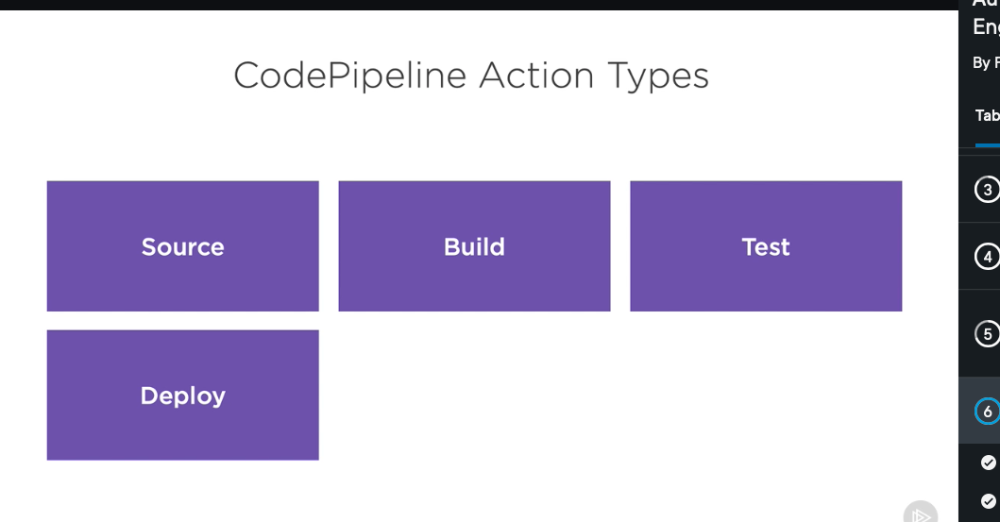
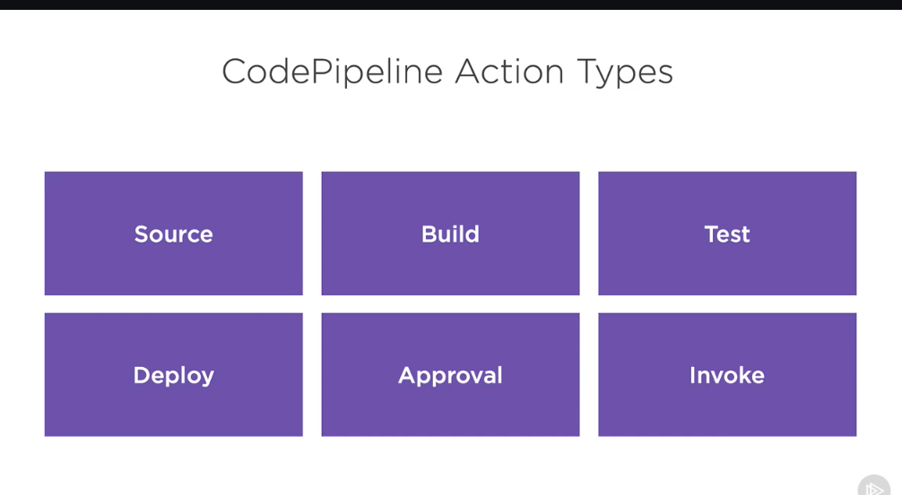
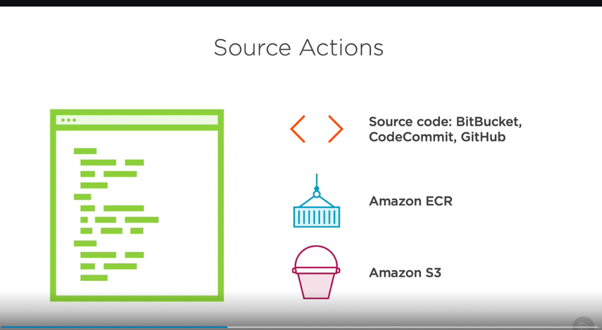
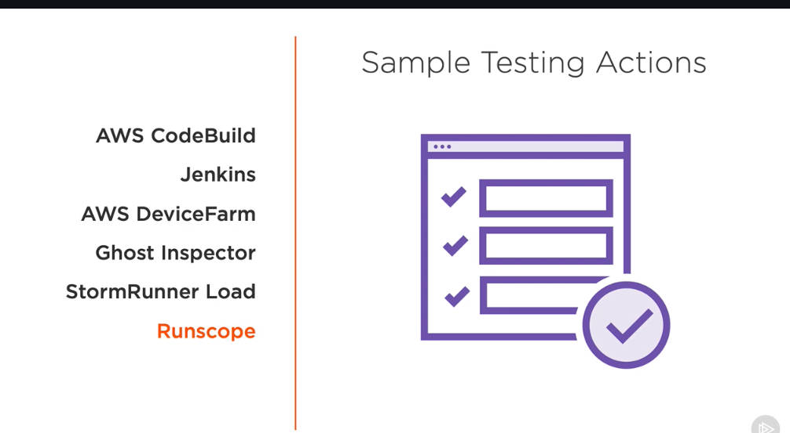
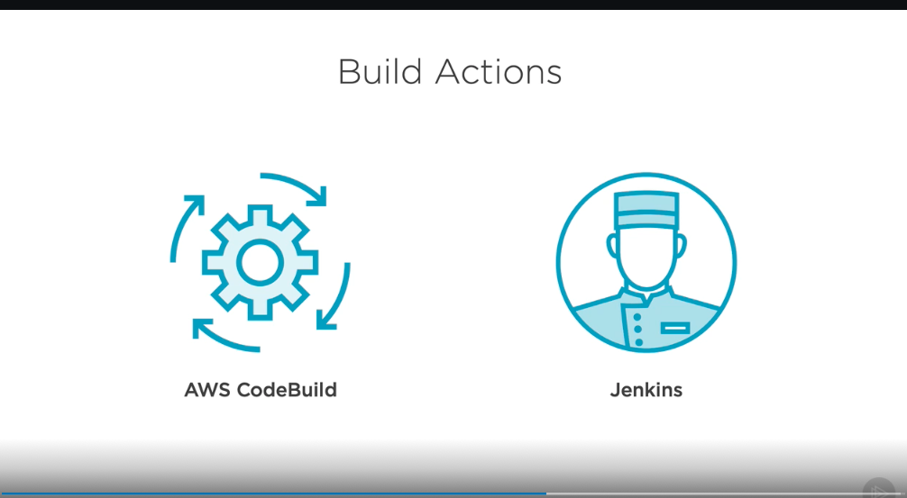
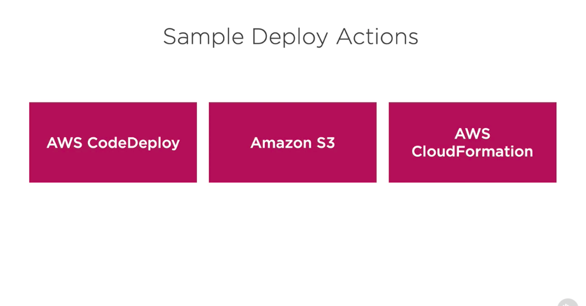
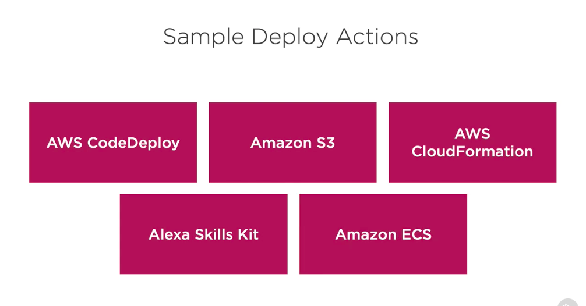
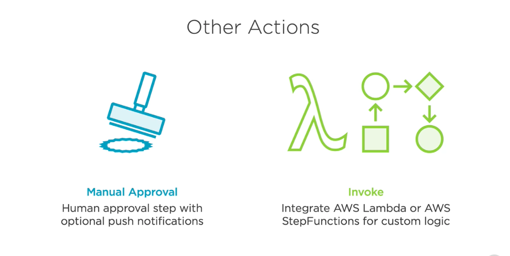

# 1. What is action and artifact? #
- There's several different action types that you might have when you're working with CodePipeline. 

- The first one is a source action. This could be something like CodeCommit or other source providers that CodePipeline supports. 

- But there's also other actions, like a build action, a test action, and a deploy action. And these all do about what you'd expect and can work with many of the services we've already discussed in this course, as well as other third‑party services. 

- But there's also two other options, an approval action, which allows you to require an approval of a deployment or other part of your pipeline before it goes forward, and an invoke action, which allows you to customize your pipelines a little bit further. 

- Now for source actions, we have several different options. There's a source code option for either BitBucket, CodeCommit, or GitHub. And there's also an option to use containers using Amazon's Elastic Container Registry. But you can also use Amazon's S3 service to host your files inside of an S3 bucket. 

- In addition to source actions, we also have all the testing options that we could use. We could use AWS CodeBuild in a pretty similar way to how we used it in earlier modules. But there's also options for other tools like Jenkins, if you want an open source option. Or other AWS services like AWS DeviceFarm to go out and test your code against a bunch of different device types. And there's third‑party tools like Ghost Inspector, StormRunner Load, and Runscope. 

- In addition to these testing actions, we also have the build actions. Now there's two main options for build actions. The first is AWS CodeBuild, and the second is Jenkins. Though in the future, who knows? AWS might decide to add a lot more to build actions or to any of the other action types. 

- For deployment actions, we have the option to use AWS CodeDeploy, Amazon S3 if we want to store information inside of S3 that we're going to make available, such as in the case of static websites on S3, or AWS CloudFormation, if we're deploying using the infrastructure as code style of deployment There's even the option to deploy to the Alexa Skills Kit if we're creating an Alexa skill that we want to integrate with CodePipeline. 

- Finally, there's the option to deploy to Amazon ECS, and there's also two other actions that we might end up working with. The manual approval stage, like I mentioned, requires human approval steps with optional push notifications configured through the Simple Notification Service, SNS. With the invoke stage, we actually have two different options.

-  We can either use AWS Lambda to do a bunch of custom logic on our own, or we can have a slightly more customized workflow using AWS Step Functions, which could integrate Lambda functions inside of that or even other tasks outside of Lambda functions. So now that we know how all these actions come together into our pipelines, let's try and create a pipeline of our own.

