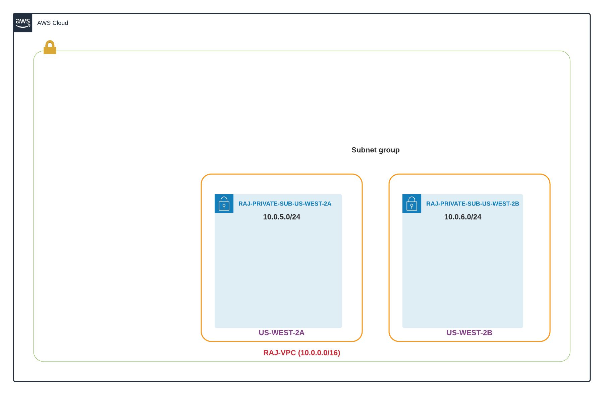
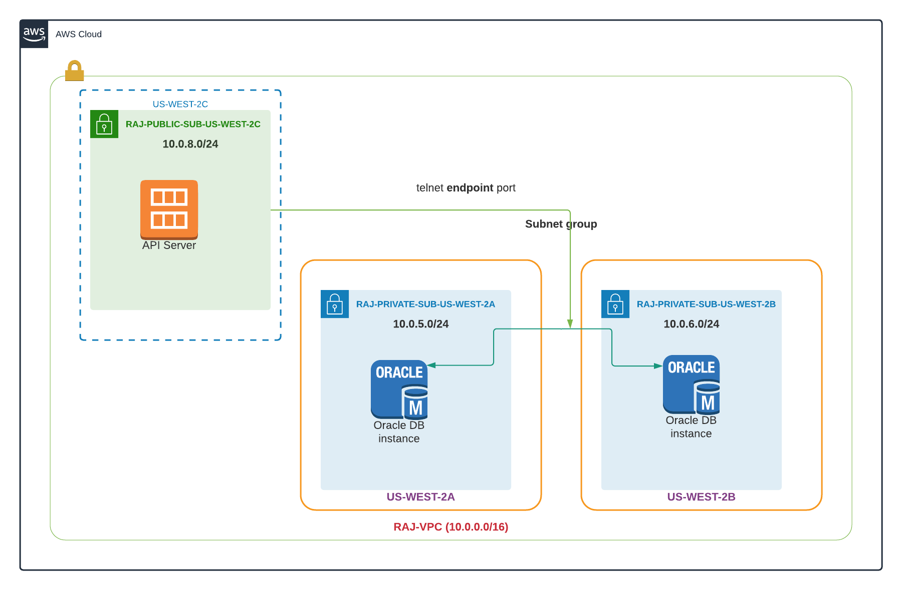

# What is subnet group in RDS #
- An RDS Subnet Group is a collection of subnets that you can use to designate for your RDS database instance in a VPC.
- When we launch RDS, Amazon creates replication of RDS instance in at least two availability zones. Thus, two subnets with two different availability zones must be created.
- Normally, we must have two private subnets in two different availability zones for subnet group.

# Design reference #

# Design reference with EC2 #
