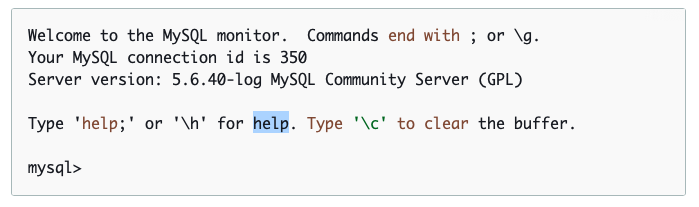

# Restoring RDS from SQL dump #
# login to RDS #
 ```js
 mysql -h mysql–instance1.123456789012.us-east-1.rds.amazonaws.com -P 3306 -u admin -p
 ```



#  Load .sql file located inside /home/ubuntu/test.SQL #
```js
sudo mysqldump \
    --databases rdsdb \
    --master-data=2  \
    --single-transaction \
    --order-by-primary \
    -r /home/ubunt/test.sql \
    -u admin \
    -p admin 
```