# 1. What is CodeDeploy ? #
- So what is AWS CodeDeploy? CodeDeploy is a managed to AWS service that automates application deployment to different AWS compute services. With CodeDeploy, you can have multiple different deployment destinations. You can deploy your code to things like Amazon EC2 virtual machines. You can also send it to on‑premise instances, for example, if you have your own data centers that you'd like to deploy your applications into. Additionally, you can deploy your code to AWS Lambda functions or even to Amazon ECS and Fargate. So what can you deploy throughout AWS? Well, you can deploy your code. You can deploy serverless functions, like we mentioned with Lambda. You can also deploy configuration files or different kinds of packages, even executables. And if you're deploying things that require changes to media files, you can deploy those, too. So what are some of the benefits we get from using CodeDeploy?

- Well, it can help us to automate our deployments, and we can automate these deployments to multiple different locations, like I discussed earlier, between Amazon EC2, Lambda, and to other places. We can also make customizations to each deployment, so we don't have to have a single standard type of deployment. But we can customize it based on where and when we want to deploy to, as well as some of the conditions we want to deploy under. For example, if we need to run a bunch of tests. CodeDeploy will also help us improve the speed of our deployments by minimizing or eliminating the downtime that our services have when we're deploying them, and also by allowing us to run concurrent deployments if we need to deploy multiple things at the same time. In addition to these benefits, it will help us to avoid errors in our deployment process by standardizing our deployments through a single deployment pipeline, and also allowing us to configure different tests and rollbacks. This will also help us to eliminate manual deployment errors that might happen when you have an engineer deploying something using buttons in the AWS console, or maybe making manual configuration changes inside of a configuration file. So with CodeDeploy, we can do a lot better. Now, there are a lot of other deployment tools that we could use in AWS and throughout our development process. CodeDeploy will really help us in a specific scenario when we're deploying to EC2, on‑premises locations, with AWS Lambda, or with ECS and Fargate. However, if we want to use something to deploy other pieces of infrastructure, we might rely on something like CloudFormation or the AWS Cloud Development Kit to help us deploy pieces of infrastructure that don't fall into this category. For example, particular AWS cloud resources or configuration changes to those resources. Now also, if we wanted to use other tools like AWS's CodePipeline, which we'll look at in the next module, this will help us build more complex build pipelines with discrete steps. Whereas CodeDeploy will help us in very niche use cases, deploying to particular compute services. So hopefully this helps clarify where all these different services really fit within the broader picture of infrastructure management and deployment of our code inside of AWS.

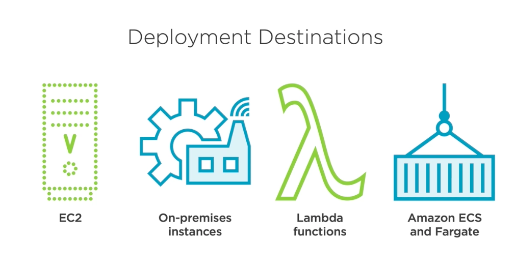
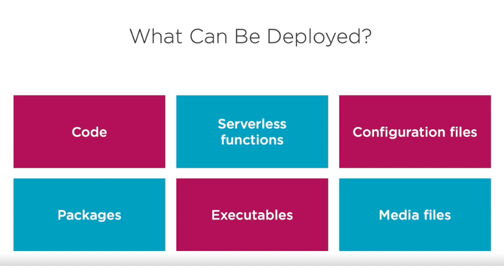
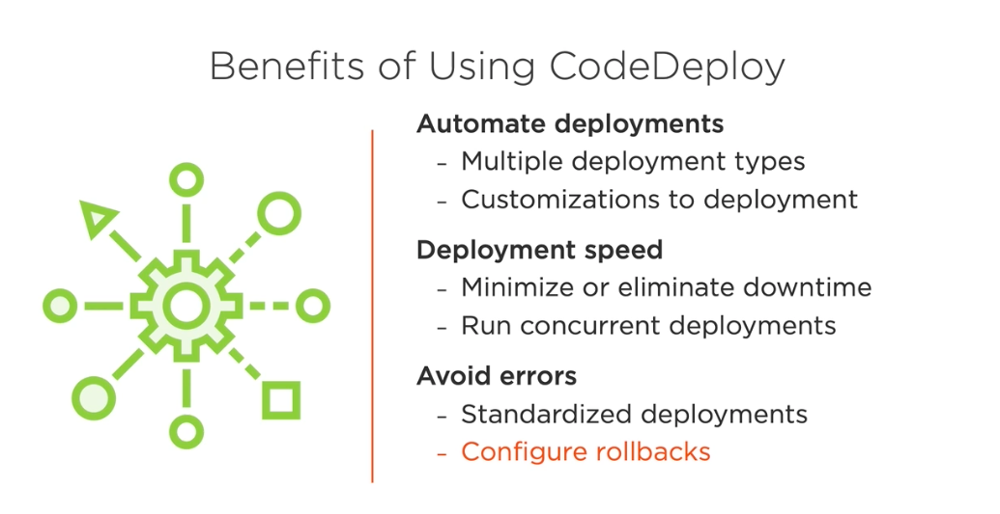
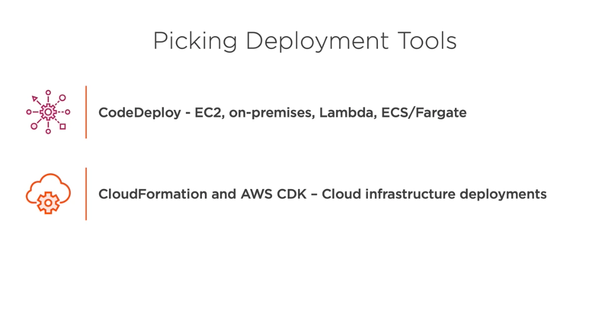
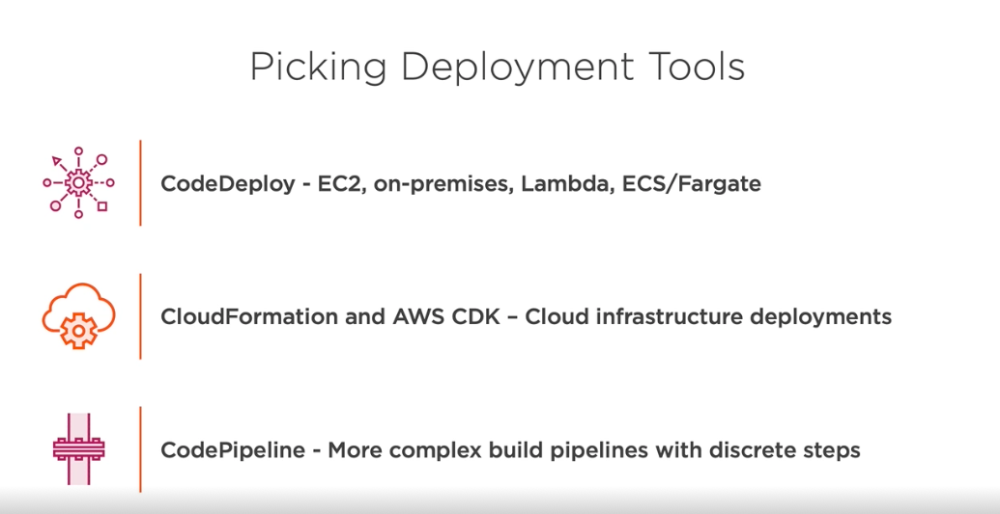

# AWS CodeDeployment Concepts #

- Let's take a closer look at some concepts related to AWS CodeDeploy. Some of the first concepts we'll need to understand are that of an application and a compute platform. The application is the larger container for all of the configuration that we use when we're working with CodeDeploy. And the compute platform, like we discussed earlier, is either something like EC2, AWS Lambda or the Amazon ECS service or even on‑premises servers that we're deploying to. Now there's some other concepts we need to understand around deployment configuration. The first one is deployment rules. These will help determine the success or failure conditions of our deployments, for example, if we run tests to determine whether or not something has successfully deployed. We also have different kinds of deployment types. 

- Now these could fall into different categories like an all at once deployment or a blue/green deployment, where all at once would simply change the traffic over on the same set of servers, immediately flipping it over to a new application, whereas a blue/green deployment would change the traffic between one set of infrastructure that's running the application to another set of infrastructure and then eventually retire the original. We also need to understand the concept of deployment groups, and these vary by the compute platform. But they could also be something like on‑premises instances, or if we're working with Lambda, different lambda function versions. Finally, they could also be things like ECS tasks, basically what we're targeting for our deployment and what's going to be running our code and eventually be switched between from one version to another. 

- In addition to the compute platform, we also need to understand there's other configuration here, too. We might configure different rollbacks, depending on if something fails in our deployment or different triggers to trigger things in our deployment, as well as alarms, where we might have a notification when something goes correctly or incorrectly and then be notified of it usually through something like an Amazon Simple Notification Service topic. In addition to deployment groups, there's also the concept of revisions, and revisions change a little bit depending on the compute platform you're working with. With AWS Lambda, revisions are really just the AppSpec file, which we'll take a closer look at in a little bit. With Amazon ECS, they're also just the AppSpec file; however, with EC2 or on‑premises deployments, they're an archive with all the code you're deploying, as well as the AppSpec file so that you know how to proceed with the deployment of the code you're shipping to that service.

- Now let's look at two more concepts related to CodeDeploy. The first is repositories, and these can be things like Amazon S3 buckets, GitHub repositories, or Bitbucket repositories. And each of these allows us to have the source for the code that we're deploying into our application. So if we're moving code from GitHub, it could go into something like EC2, ECS, or Lambda. Now, in addition to repositories, we have to think about the permissions that are applied to everything in our CodeDeploy services. We could have the service role first, which is the role that's used by the CodeDeploy service itself to deploy our applications. And this would need permissions depending on the different platforms that we're working with. So if we are deploying our code to EC2, it would need permissions to act on EC2 and related services. But if we're deploying to AWS Lambda, it might need permissions to act on AWS Lambda and its related services. In addition to the service role, there's also something called an IAM instance profile. 

- This will typically be used by EC2 instances to access where applications are stored. So if the EC2 instance needs to get information from Amazon S3, for example, it might need an instance profile to give it those permissions. But in addition to these two concepts, there are other IAM roles and policies that will come into play when deploying our applications when we're working in AWS. And these will determine how EC2 and any other services get additional AWS permissions such as to interact with the Amazon S3 service or the Simple Queue Service or Simple Notification Service or any other AWS service that our applications need to access. So be aware of these different concepts when you're permissioning things with CodeDeploy, and we'll look at some of them when we work in the demos for CodeDeploy.

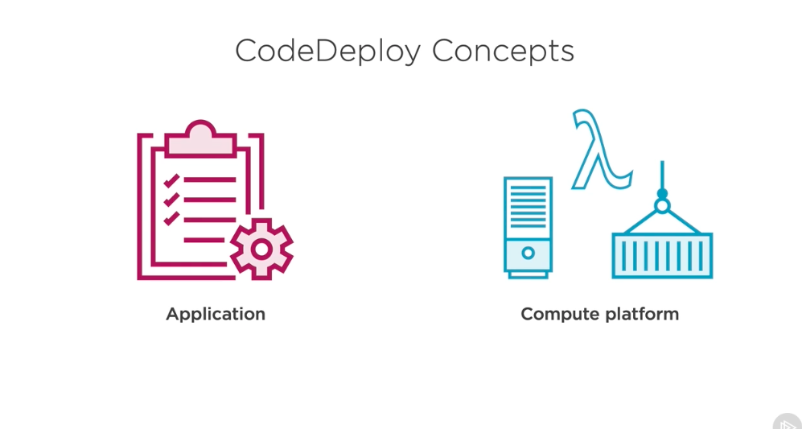
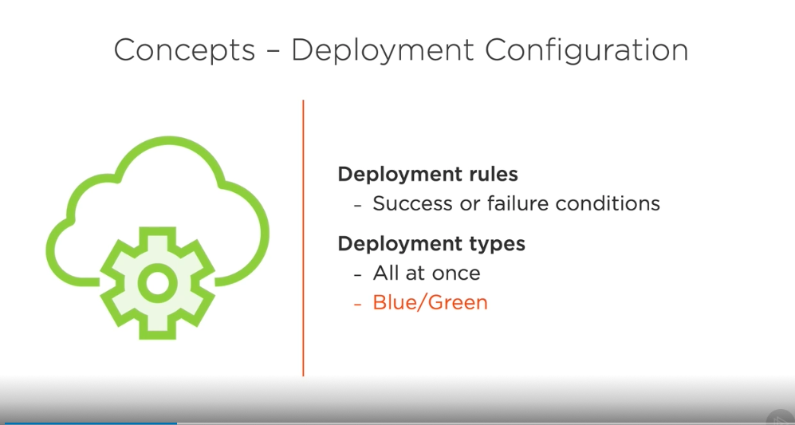
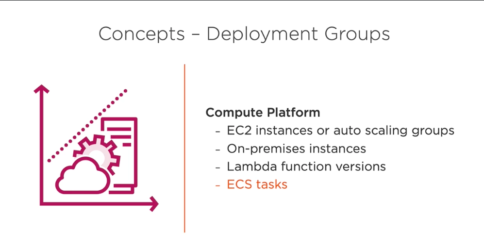
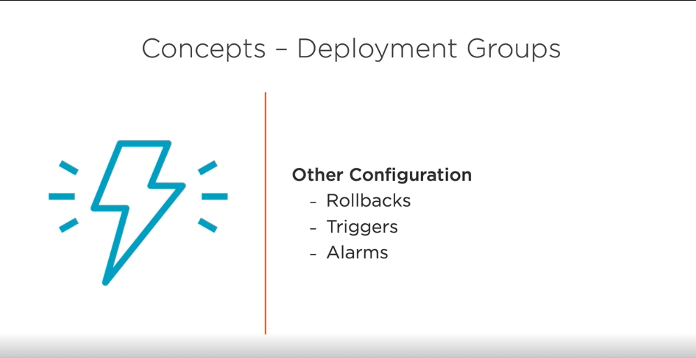
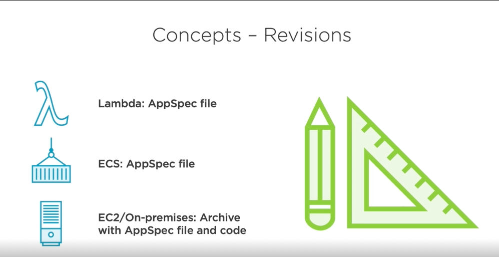
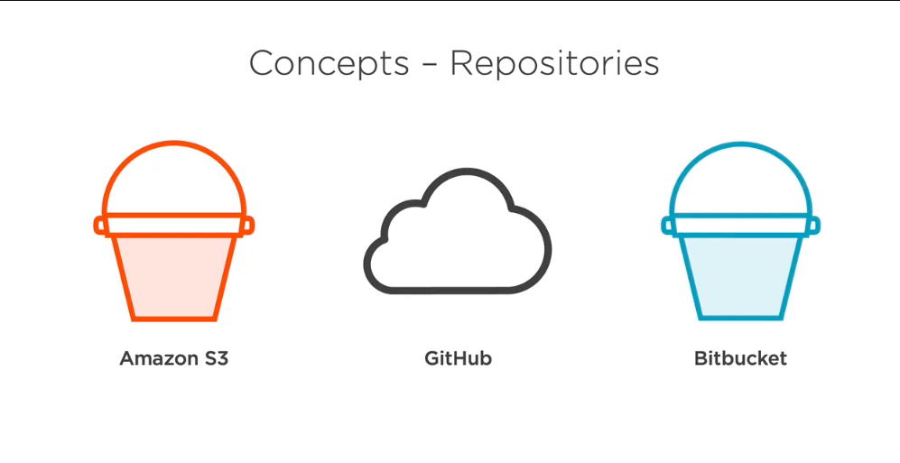
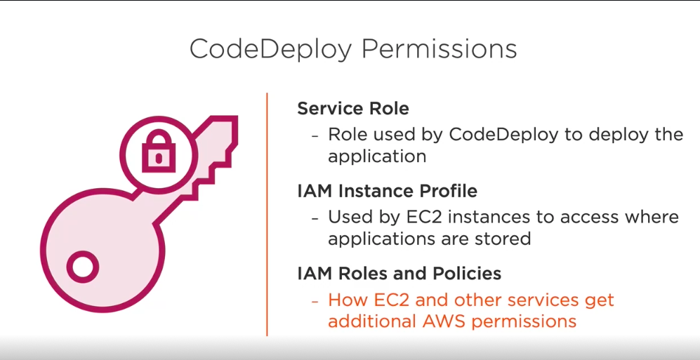