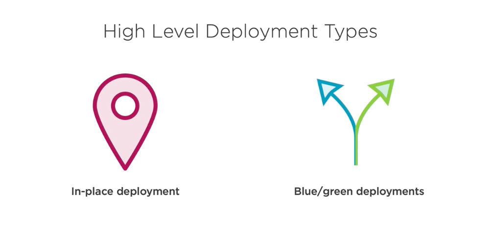
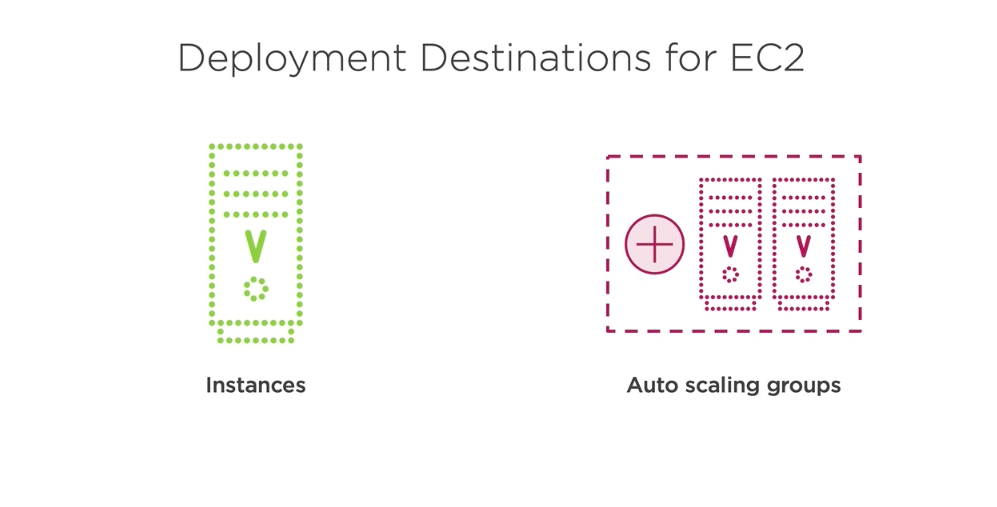
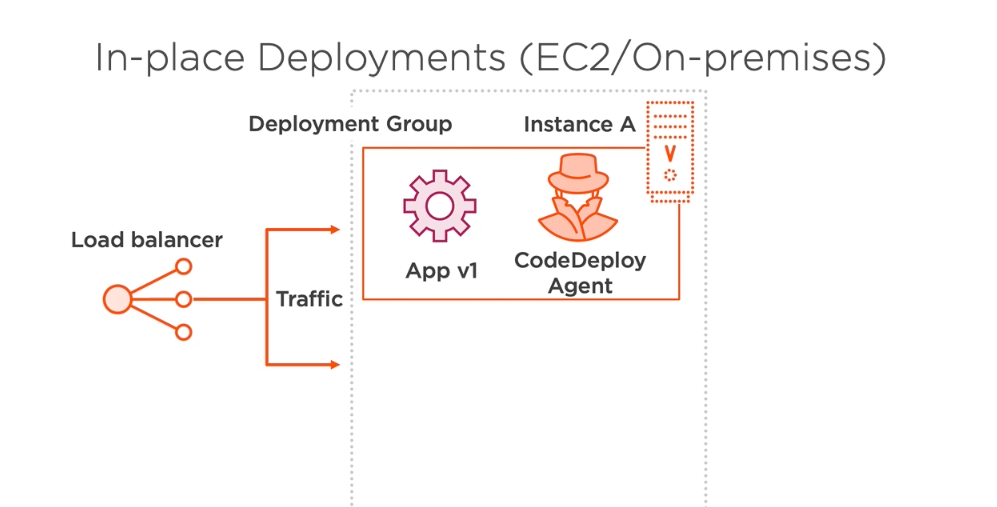
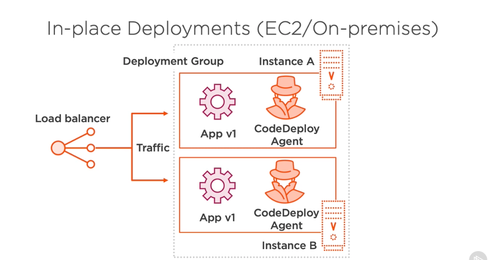
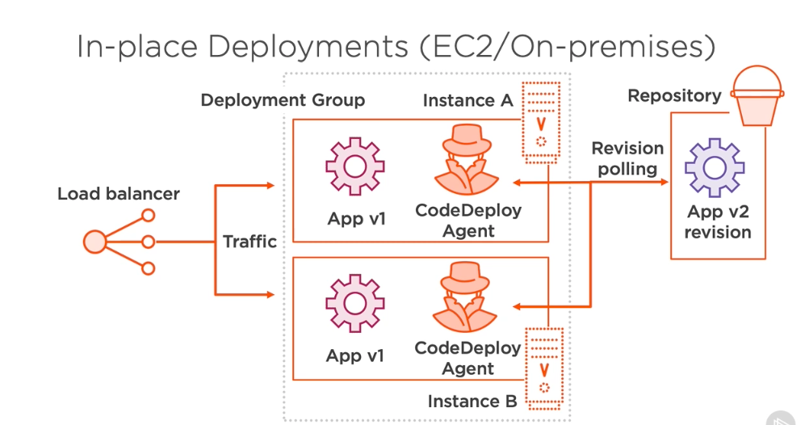

# 1. In-place Deployments #

- The first we'll look at is called in‑place deployments, but that's only one of two high‑level deployment types. The second is called blue/green deployments, which we'll look at a little bit later. Now, when we're working with these two different types of deployments and EC2, there's technically a few different destinations for where we deploy our code to. We might have specific instances in the case when we're working with particular EC2 instances and we want to update the applications on just one or two specific instances, but we might also have more complicated infrastructure that uses something like auto scaling groups to scale up and down the number of instances that we require to meet the capacity of our demand for our service. So when we have that, we might also have an auto scaling group as a deployment destination. 

- So let's take a look at a visualization of in‑place deployments when we're working with either EC2 or on‑premises applications. Either way, it'll be very similar. With in‑place deployments, we might have traffic coming in from a load balancer, and this traffic could get served to a deployment group. Inside of a deployment group, we'll have different instances or, again, auto scaling groups might also be in here with multiple instances inside of these. Now, these instances will have a CodeDeploy agent and an app version inside of them, so whatever version of our application we're currently running. And we could have multiple instances all inside of that deployment group. 

- When we're ready to update the version of this application, we then have a repository which contains new versions. Our instances would periodically pull this repository, and when they see a new application version, they'll know that they have to make an update. At this point, traffic will be de‑routed from one of the instances or more of the instances in our deployment group, and then the revision will be moved into the instance and override the previous version so it becomes the next version of our application. Once that's completed, traffic will eventually be routed back to that instance, and the same thing would happen for any of the instances in our group. Traffic is unregistered from the instance, the application version is updated to the new version, and then traffic is moved back to that instance. The same thing would happen if we were working with auto scaling groups here. So, one important distinction here is that these are the same instances that we're working with. We're not adding new instances that we install the new version of the application to. That's something we'll take a look at in blue/green deployments.

