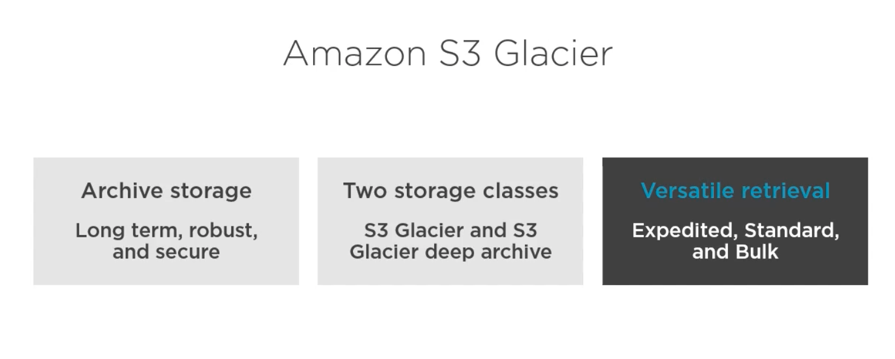
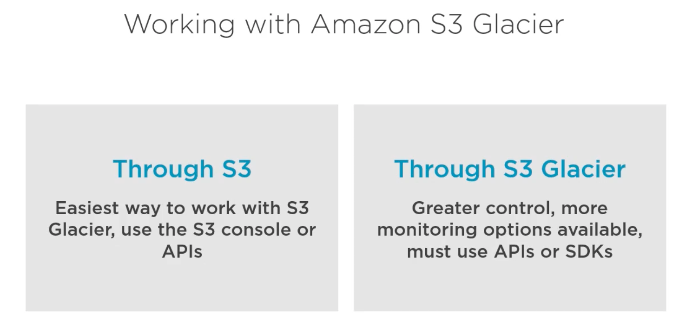
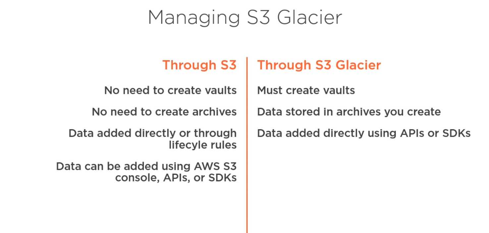

# What is Amazon Glacier ? #
- Amazon S3 Glacier and S3 Glacier Deep Archive are secure, durable, and extremely low-cost Amazon S3 cloud storage classes for data archiving and long-term backup. 

