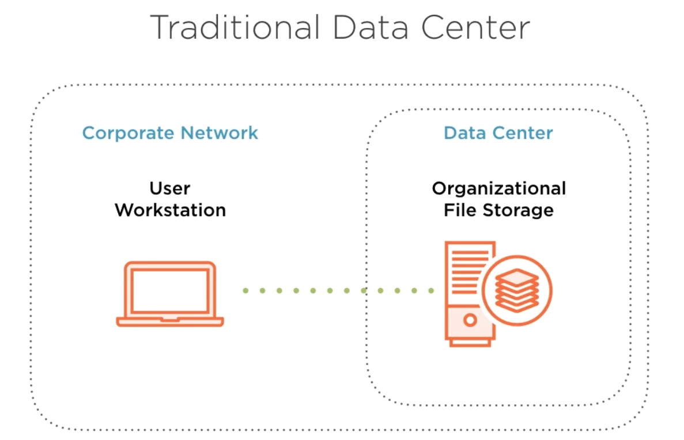
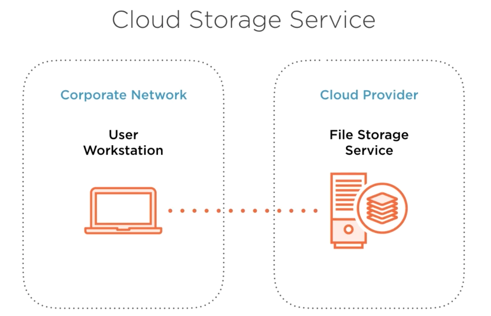
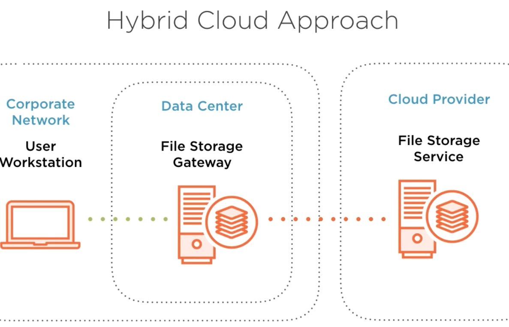

# What is storage gateway ? #
- First let's talk about the traditional data center. Let's say that within our corporate network there is a workstation on the network, and it needs to access certain files, and let's say those files are stored within the data center in some type of organizational file store. In this case, there's some advantages to this setup. In this case, first of all, there is usually a very low latency, high-speed connection that exists between that workstation and that file storage, so this is great, but there is a problem. This file storage lacks the durability and reliability that comes with the file service capabilities that many cloud platforms provide. 

- So let's talk about another approach. Let's talk about a pure cloud approach. So with this approach we still have our workstation on the corporate network, and now we have a cloud provider, and we have a file storage service, and this is great, because now we get the durability and reliability that we want, however, there is a problem. We now have a slower connection that exists between our workstation and the file storage service. So let's talk about is there a way that we can bring these two approaches together, and there is. This is what we would call a hybrid cloud approach. 

- So in this approach we still have our corporate network with the workstation, we still have our data center, but in place of having the file storage in the data center, we now have a storage gateway, and what this does is this allows a connection to the cloud provider. So through this approach we still have a super fast connection with low latency between the workstation and the file storage gateway. And what also happens is that in addition to that, the storage gateway is able to keep up a connection with the cloud provider. 

- And so while we can access files to the file storage gateway, those files can then be backed up to the cloud provider, and so through this approach we gain the benefit of a low latency connection while still maintaining the durability and reliability from a cloud provider. 