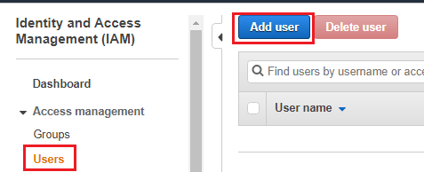
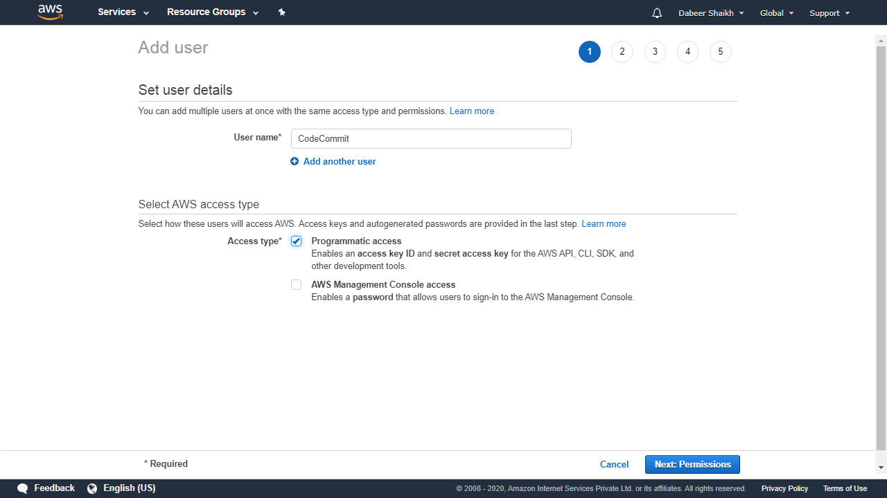
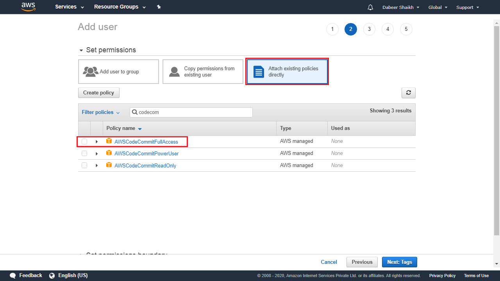
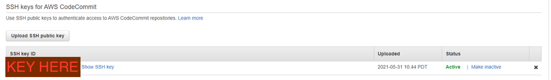

# Setting SSH key for CodeCommit to Configure CICD pipeline #

 ## Creating IAM user  ##
- go to IAM and click on add user


## Give user a name and access type as programmatic ascces ##


## Attach an existing policy or permisssion with full access to codecommit ##


## Generate ssh key ##
```js
ssh-keygen
```

## Copy value of .ssh/id_pub.rsa to IAM-user/Security-crendtials/SSH keys for AWS CodeCommit (Upload SSH public key) ##


## Inside .ssh/config add line ##
```java
Host git-codecommit.*.amazonaws.com
User <Key from ssh generated key>
IdentityFile ~/.ssh/id_rsa
```
 
# # Goto CodeCommit and click on ssh and pull project ##
```java
git clone sh://git-codecommit.us-west-2.amazonaws.com/v1/repos/(REPO_NAME_HERE)
```

# Error resolution#
- git clone ssh://Your-SSH-Key-ID@git-codecommit.us-east-2.amazonaws.com/v1/repos/MyDemoRepo my-demo-repo

# References #
https://stackoverflow.com/questions/34580665/cant-access-aws-codecommit-with-ssh
https://docs.aws.amazon.com/codecommit/latest/userguide/setting-up-ssh-unixes.html#setting-up-ssh-unixes-keys
https://docs.aws.amazon.com/codecommit/latest/userguide/troubleshooting-ssh.html
