# 1. Create S3 bucket #
- If we are going to redirect domain to s3 bucket then first then we need to do is to create s3 bucket.
- <b> Note: S3 bucket name must be created similar to the domain name </b>

# 2. Procedures for creating a S3 bucket and redirect from bucket #
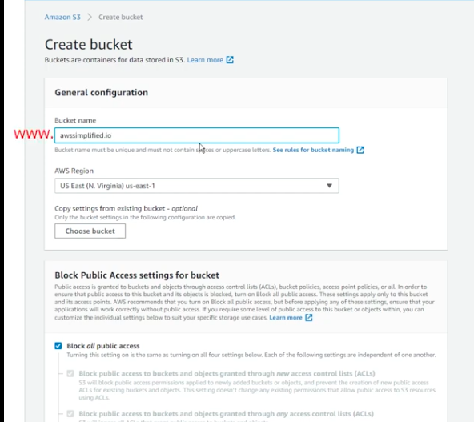
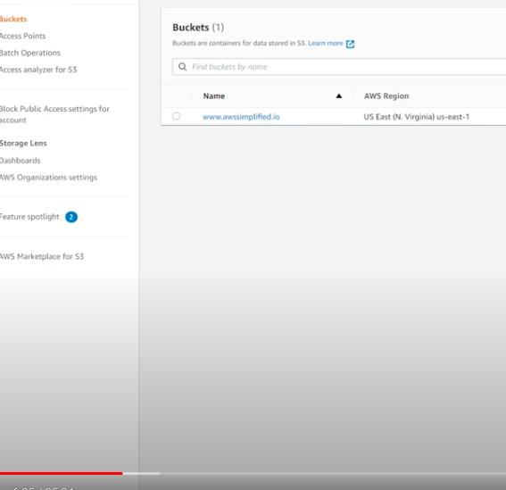
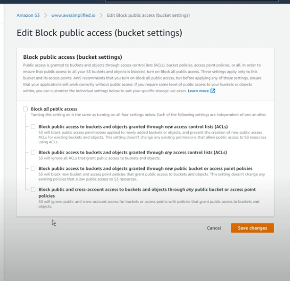
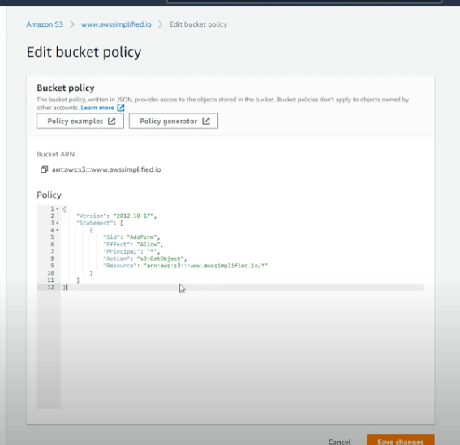
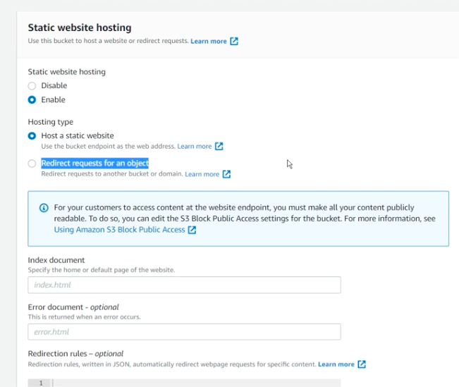

## 2.1 Redirect to another domain from bucket ##
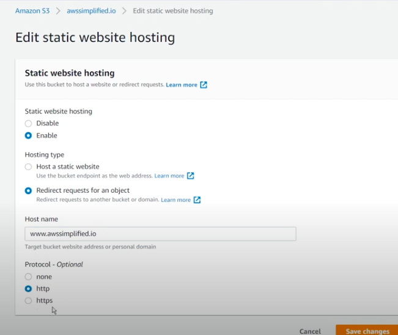

# 3. Create hosted zone #
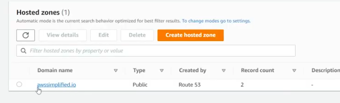
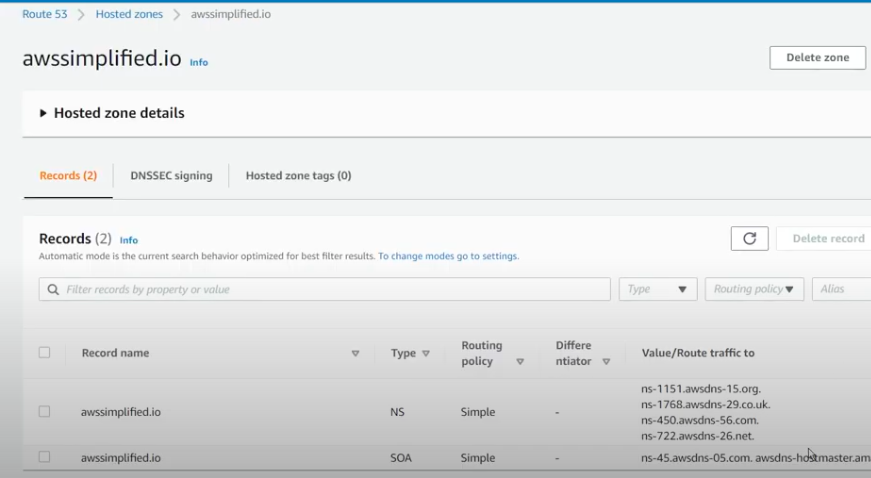

# 4. Configure NS server inside GoDaddy or domain #
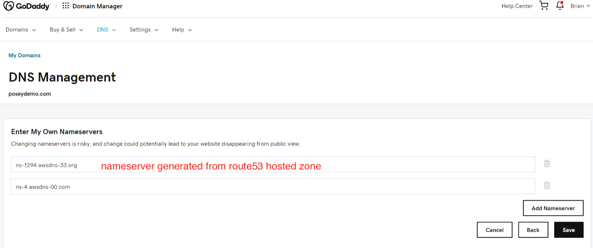

- <h3> <b>You must wait for NS server configuration from domain provider for at least 3 hours</b> </h3>

# 4. Create record and point to S3 bucket #
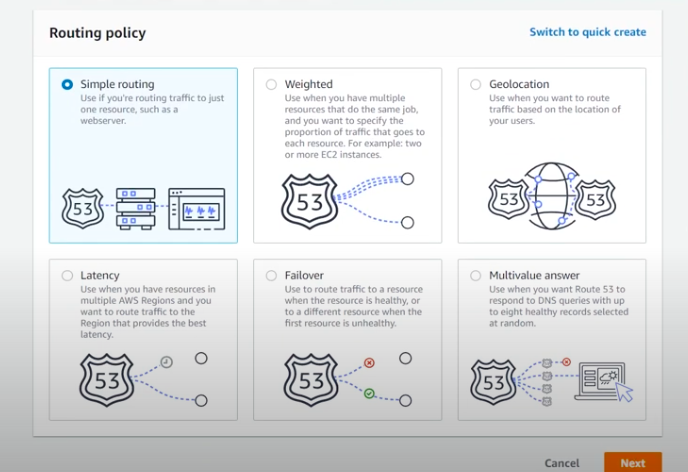
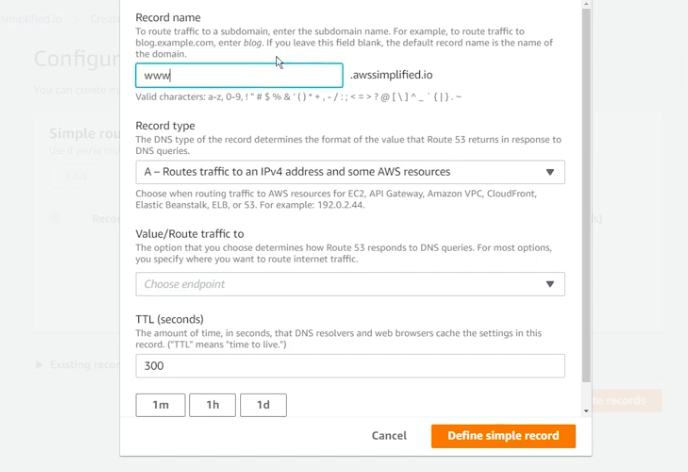
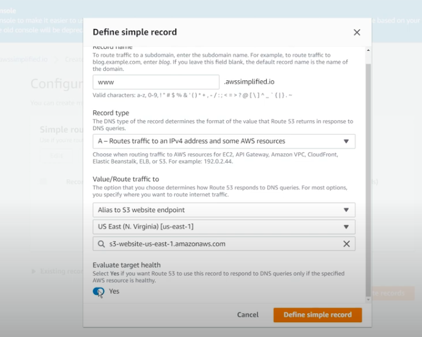
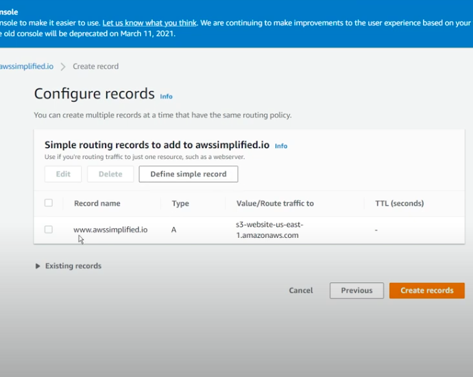
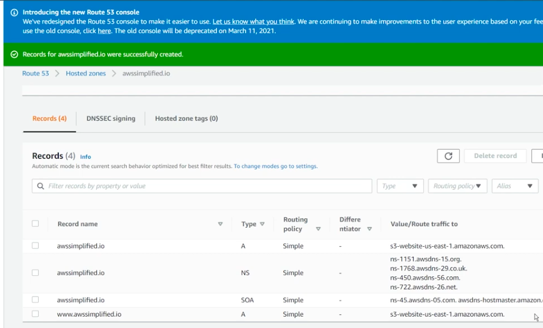
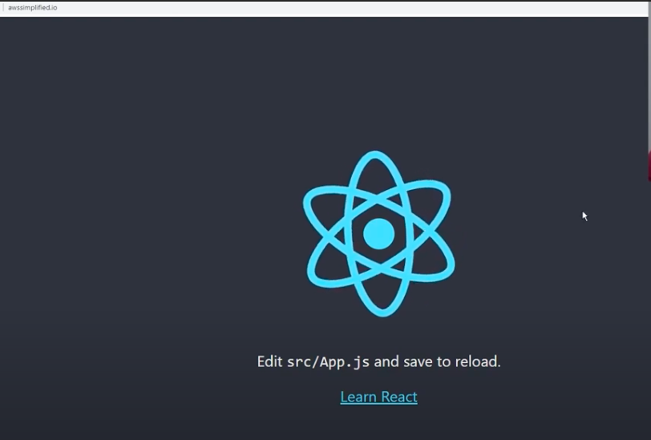
