# Creating SSL Certificate for a domain #
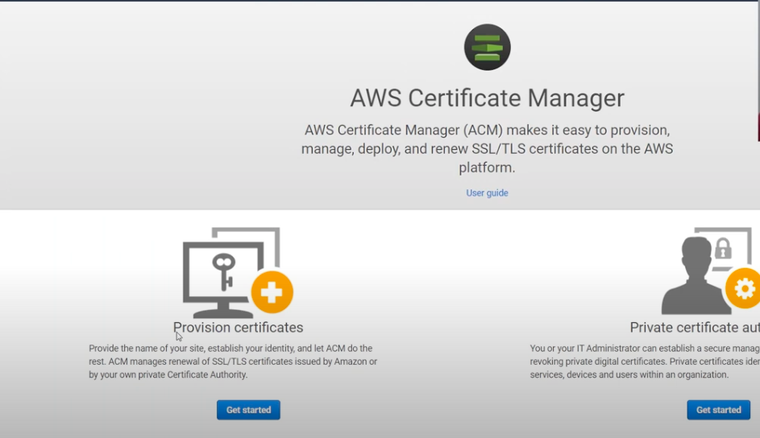
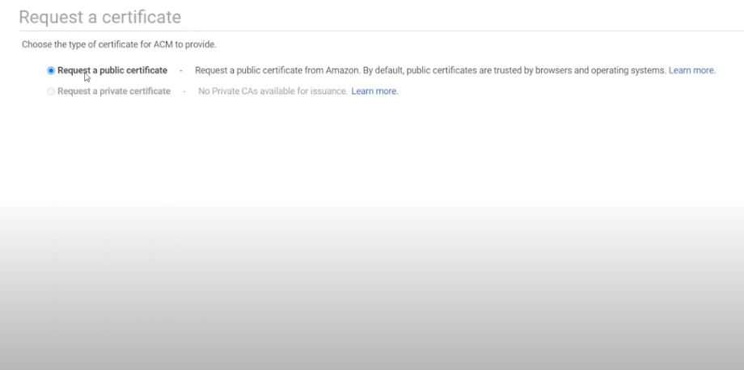
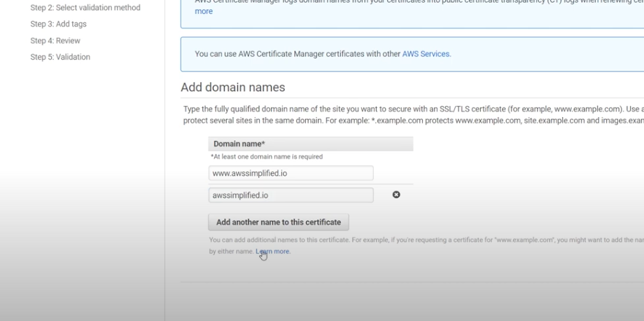
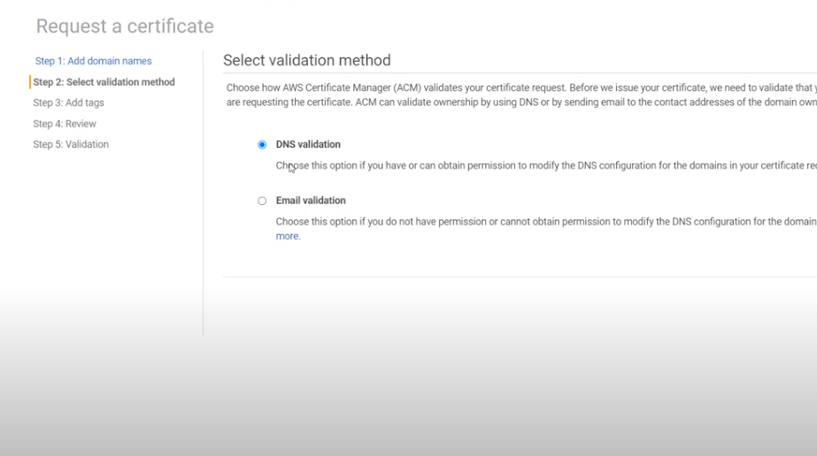
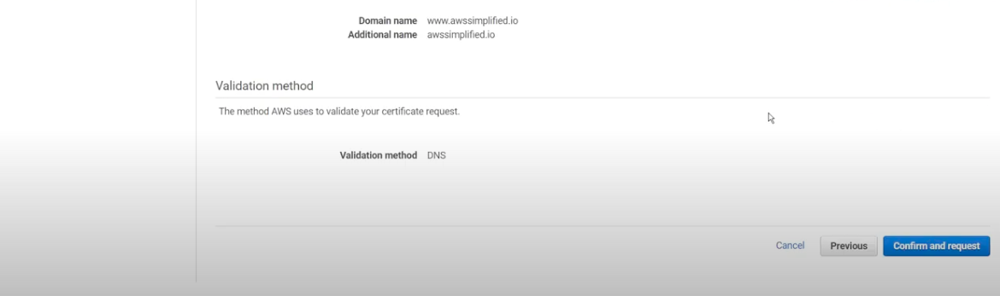
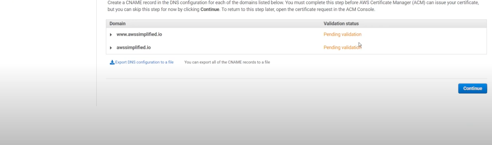
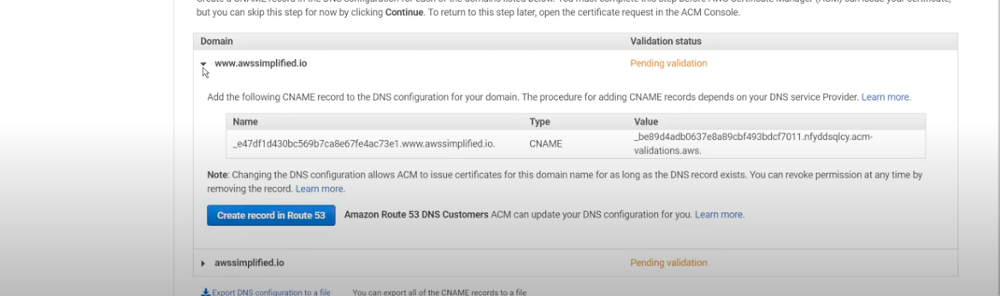
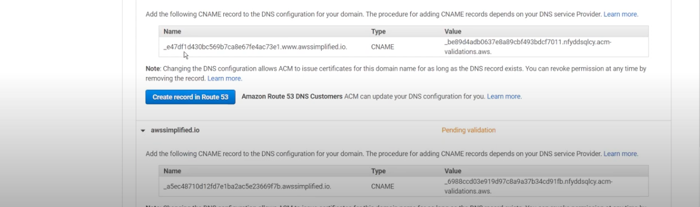

## Adding CNAME to route 53 ##
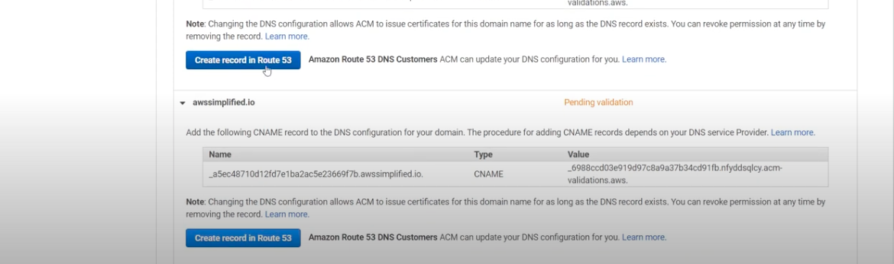
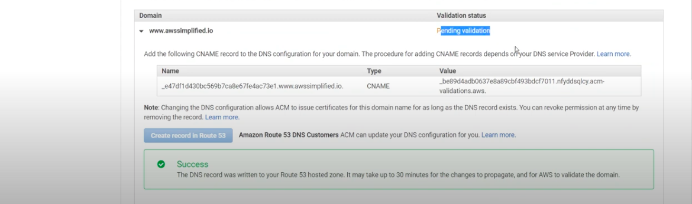
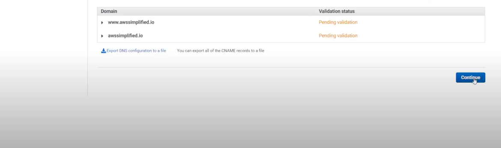
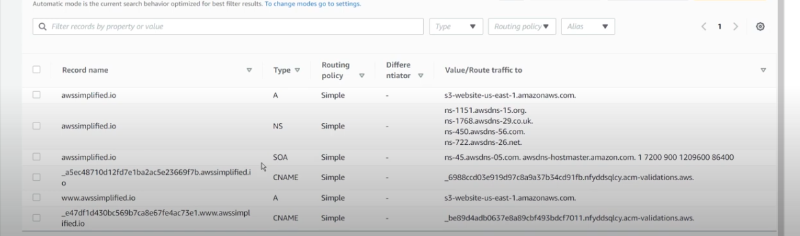
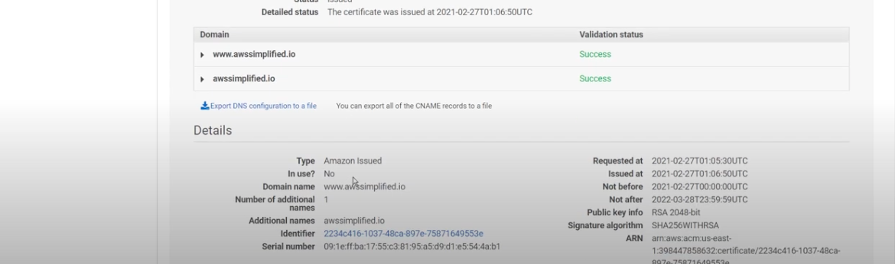

## Configuring CloudFront for https and caching ##
- Create cloud front distribution 
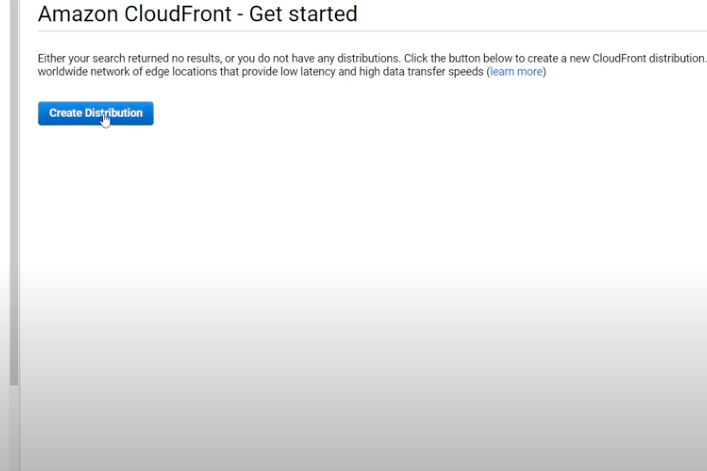

- Copy URL of S3 bucket 
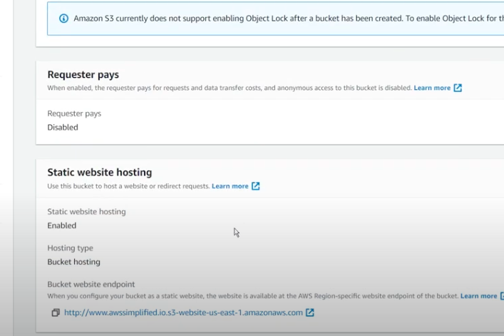

- Paste in Origin section 
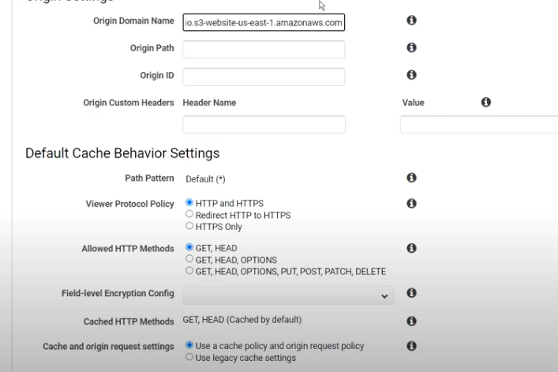

- Select redirect to Https 
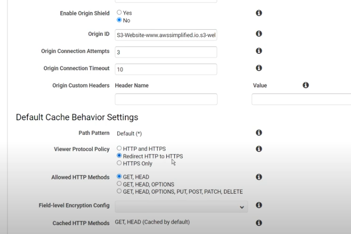

- Provide domain in alternate dname 
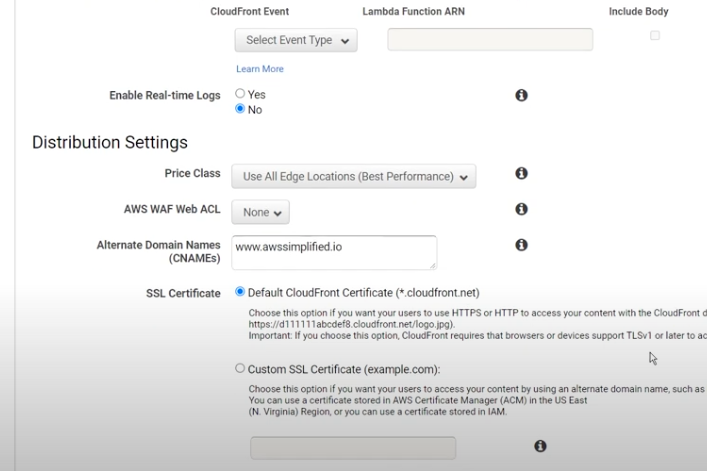

- Select certificate
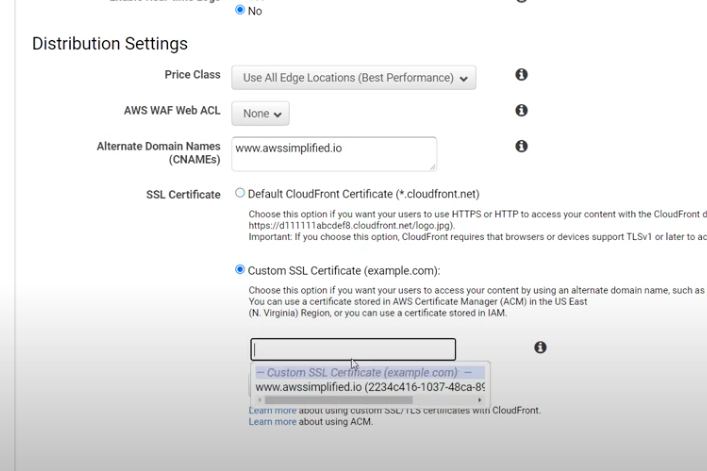

- Enable distribution
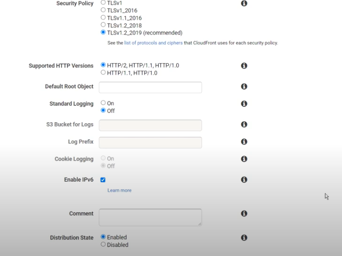

- Test 

<b>
Note: SSL certificate must be created in N. Verginia and email will be sent to email created for domain. If custom certificate is greyout, either certificate is not approved or created in another region.</b>
 
 

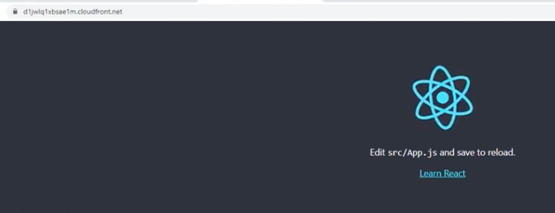

# Pointing our domain name to cloudfront https domain name #
- at this point we can access https using CloudFront domain name but still our domain name is lacking https.
- Thus, we need to point our domain name to cloudfront https domain name.

## Procedures to point domain name to HTTPSCLOUDFRONT DOMAIN NAME ##
- Goto route 53 and point record to cloudfront https domain because instead of s3 bucket url because cloudfront points to s3 bucket.

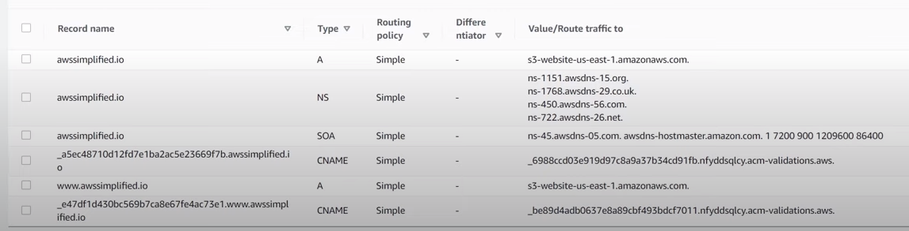
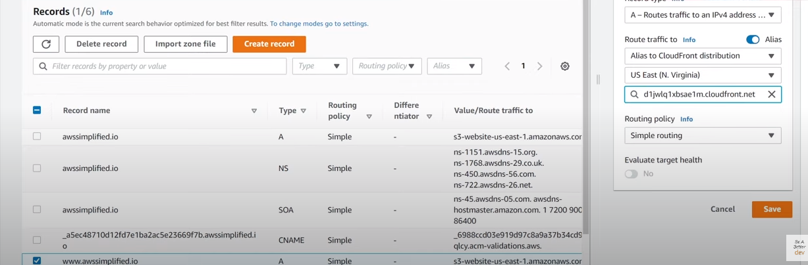
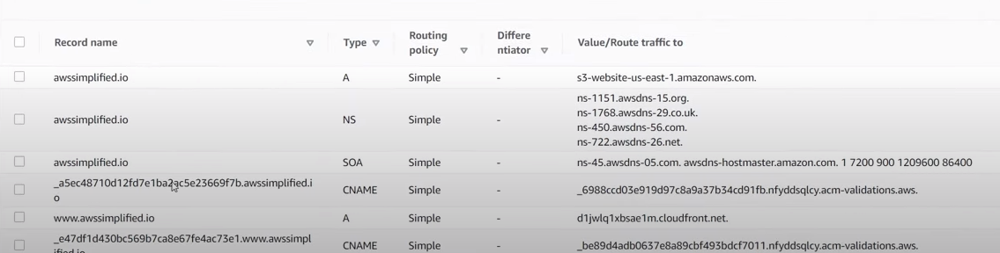
