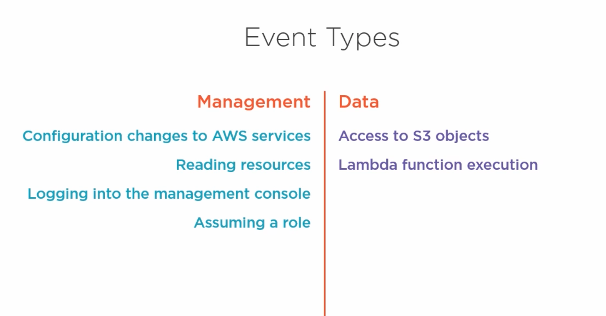
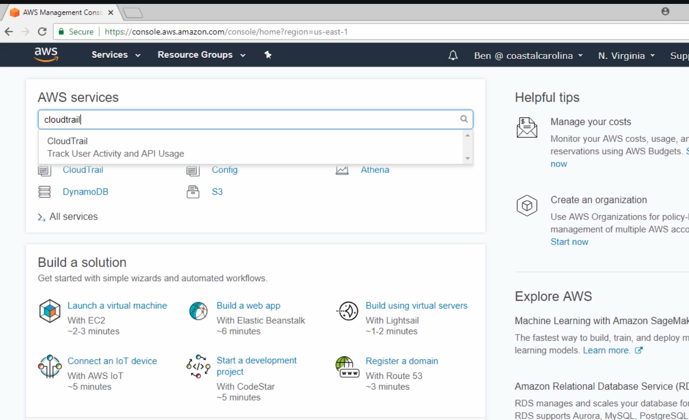
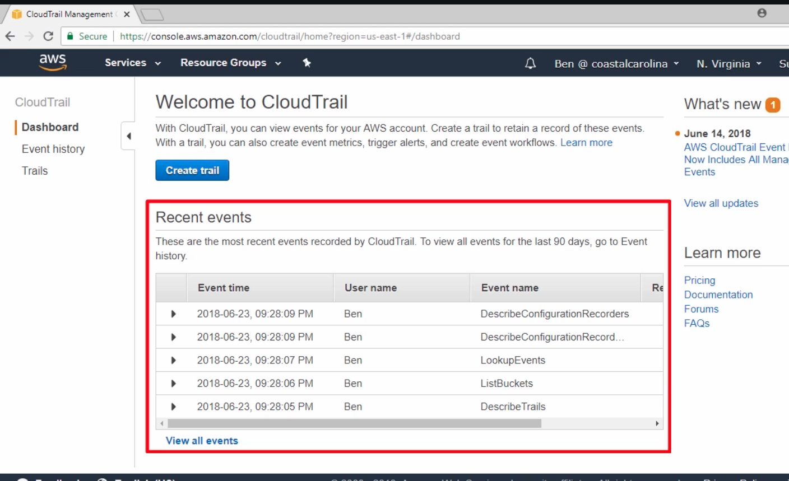
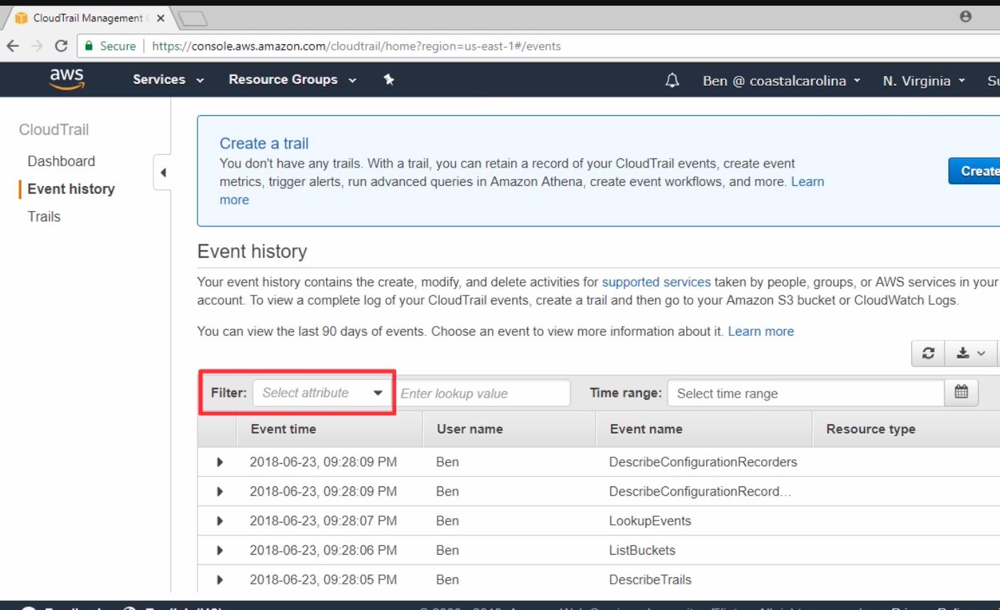
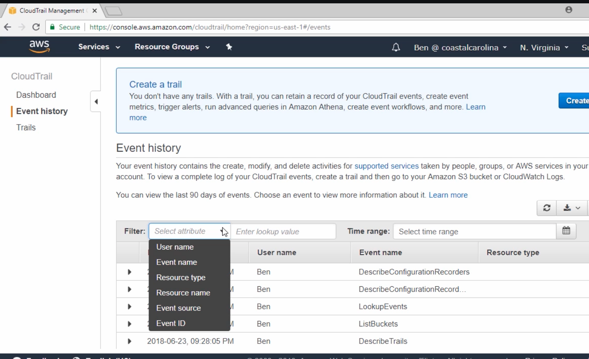
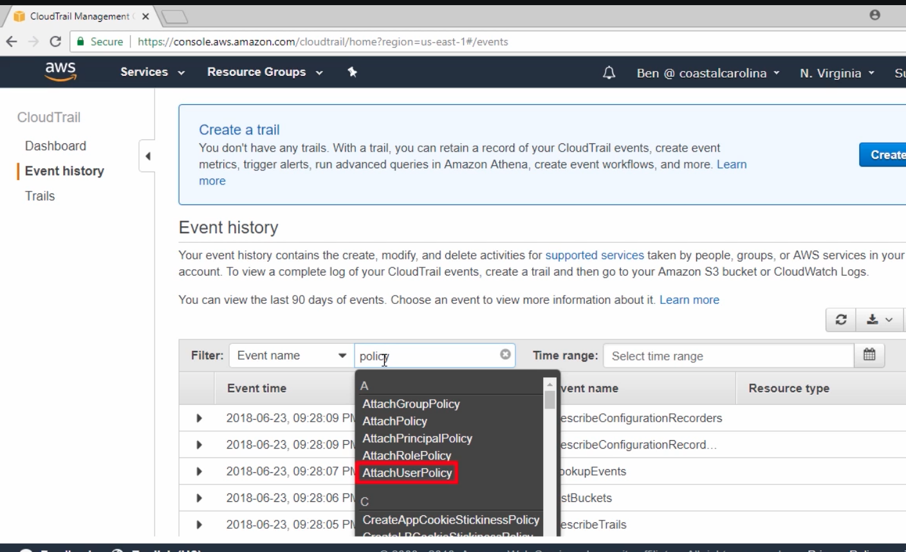
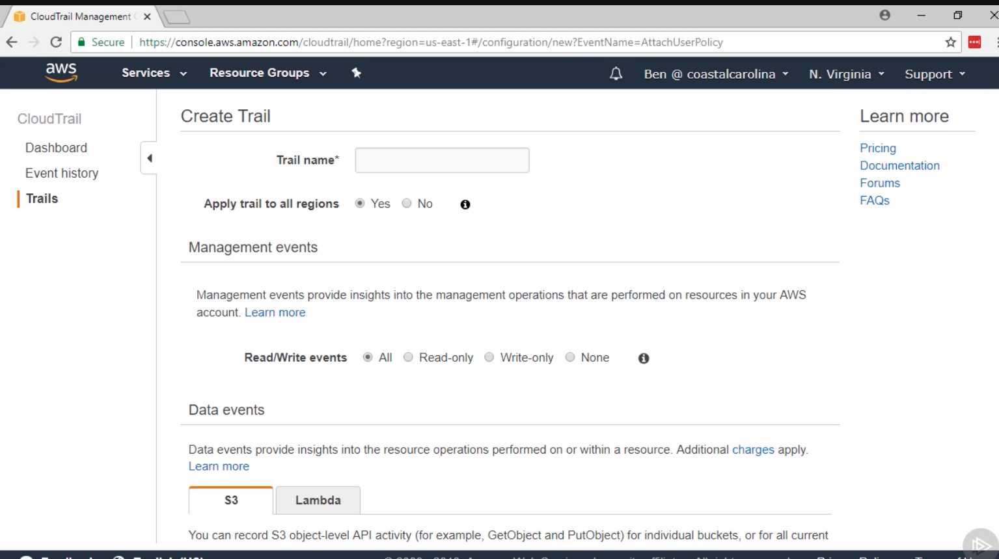
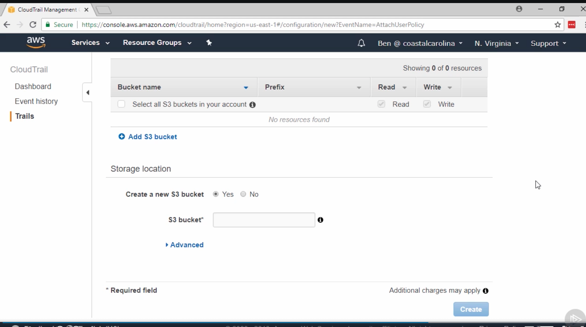
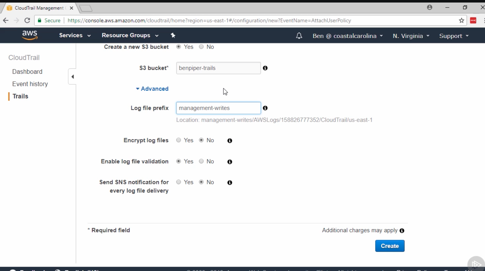

# Configuring CloudTrails to log AWS Service operations #
- API call
- Action from AWS console
- Action from AWS services

# CloudTrails logging type #

# Where CloudTrails logs are stored ? #
- CloudTrails logs are stored inside the s3 bucket.
- Thus, limiting CloudTrails logs is very important such as log related to instance creation is one time whereas log related to Lambda function is periodic. Thus, we need to limit what we are going to store inside the AWS.

# Demo for CloudTrails #

# Creating CloudTrails #
- Have clear understanding about what we are going to store using CloudTrails
- Select the region that you want to apply

##  Select the storage location that is S3 bucket ##

# Advance feature #
- We can have multiple trails going into the single bucket.
- And S3 bucket name must be globally unique
<b> Log file prefix: Prefix field is used to distinguish different trails inside the same bucket</b> 

