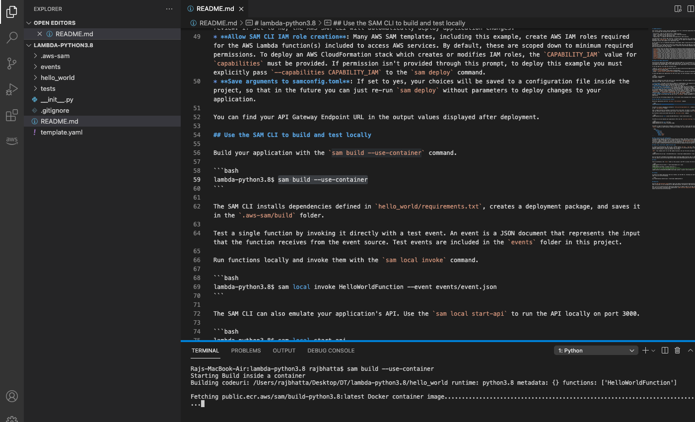
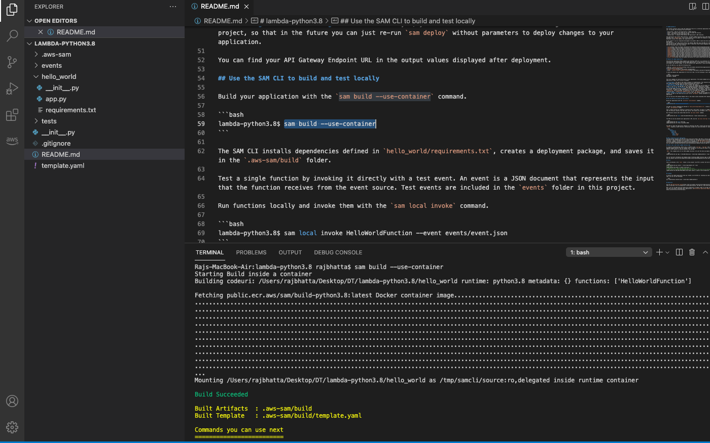
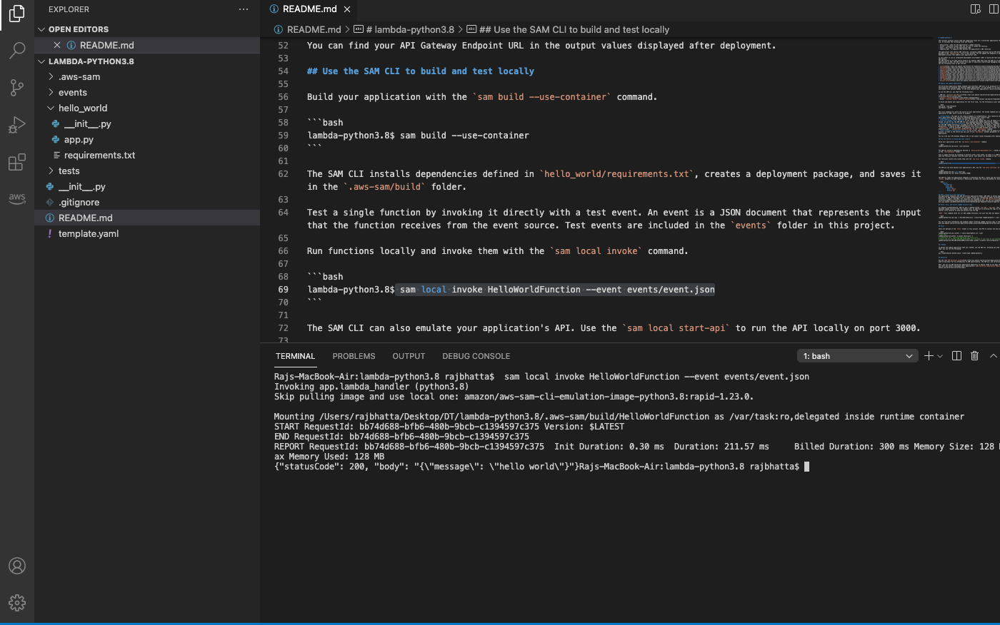

# Executing a lambda function locally #
 ## 1. Running single lambda function locally ##
 - build application with docker
 

 - Once it is successful invoke the single function to run it
  

  - Check the response
   

## Use the SAM CLI to build and test locally

Build your application with the `sam build --use-container` command.

```bash
lambda-python3.8$ sam build --use-container
```

The SAM CLI installs dependencies defined in `hello_world/requirements.txt`, creates a deployment package, and saves it in the `.aws-sam/build` folder.

Test a single function by invoking it directly with a test event. An event is a JSON document that represents the input that the function receives from the event source. Test events are included in the `events` folder in this project.

Run functions locally and invoke them with the `sam local invoke` command.

```bash
lambda-python3.8$ sam local invoke HelloWorldFunction --event events/event.json
```

The SAM CLI can also emulate your application's API. Use the `sam local start-api` to run the API locally on port 3000.

```bash
lambda-python3.8$ sam local start-api
lambda-python3.8$ curl http://localhost:3000/
```

The SAM CLI reads the application template to determine the API's routes and the functions that they invoke. The `Events` property on each function's definition includes the route and method for each path.

```yaml
      Events:
        HelloWorld:
          Type: Api
          Properties:
            Path: /hello
            Method: get
```