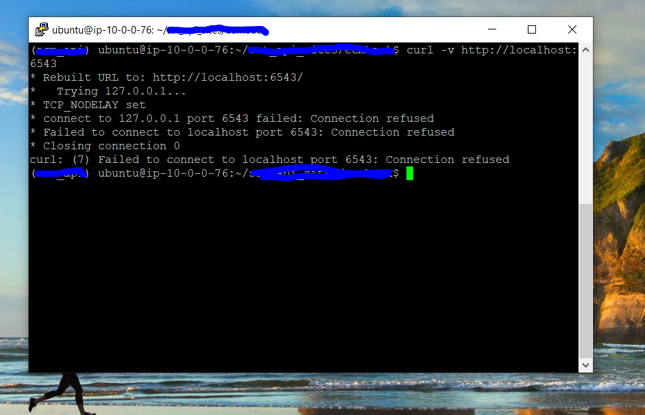
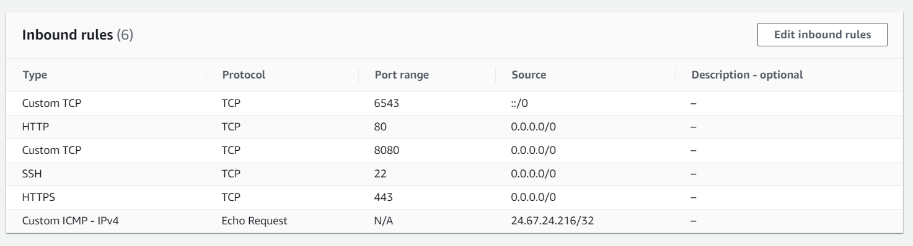
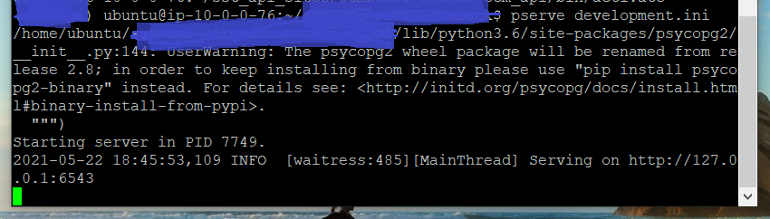
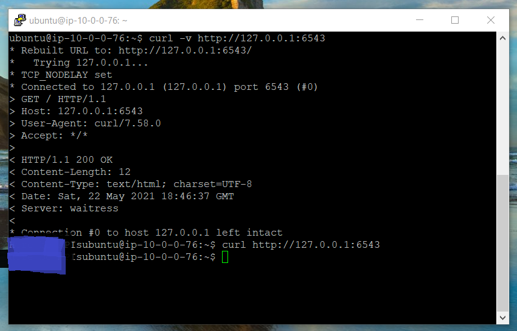
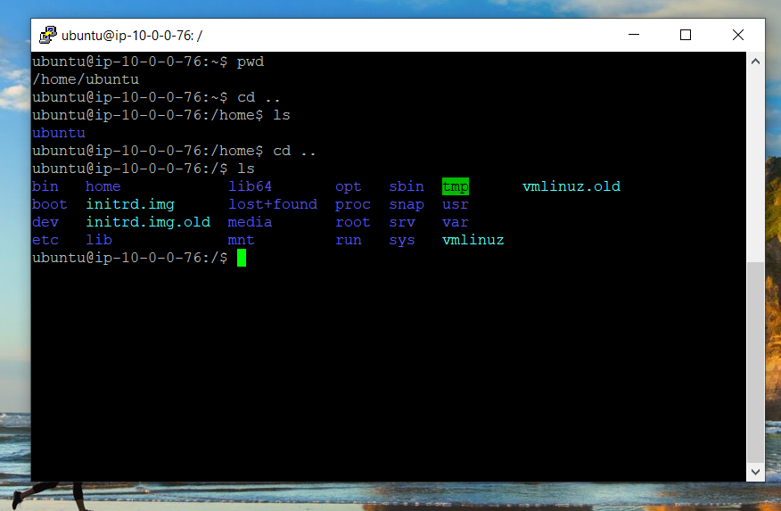
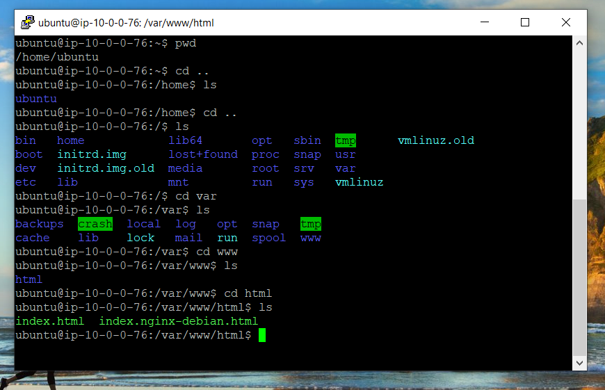
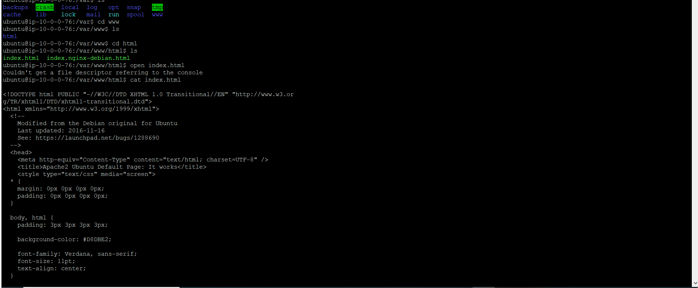

# 1. How to solve connection refused on port in EC2 ? #

# 2. Add custom TCP rule with custom port number inside EC2 inbound rule #

# 3. Run server: we are running Pyramid server on port 6534 #

# 4. Open new tab and verify server with curl -v {{URL_VALUE}} #

# 5. Ubuntu deploying source code to var/www/html folder #

## Note: After making changes to EC2 instance make sure you reboot it ##