# 1. Why should we need to use application load balancer ? #
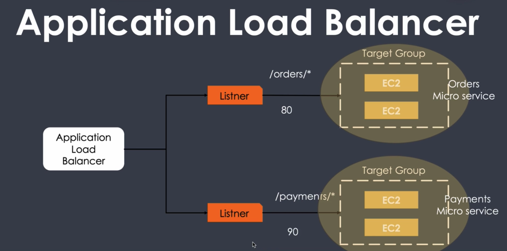

- Application load balancer are basically designed for managing load across ec2

- In the above picture we can see that loads are balanced using the URL and target groups

# 2. EC2 instances created for load balancers #
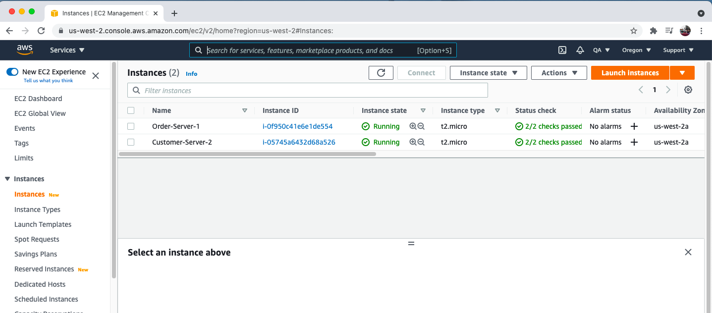

# 3. Order target group is created #
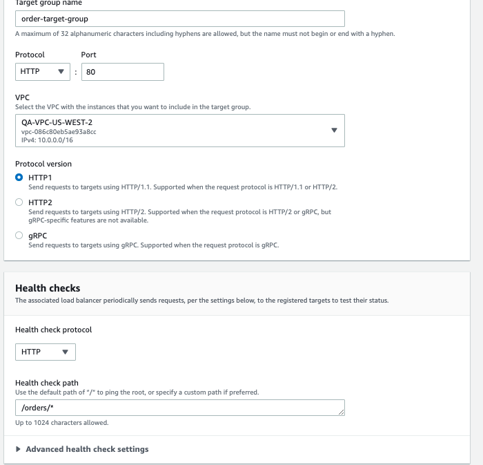

# 4. Path for order health check is provided #
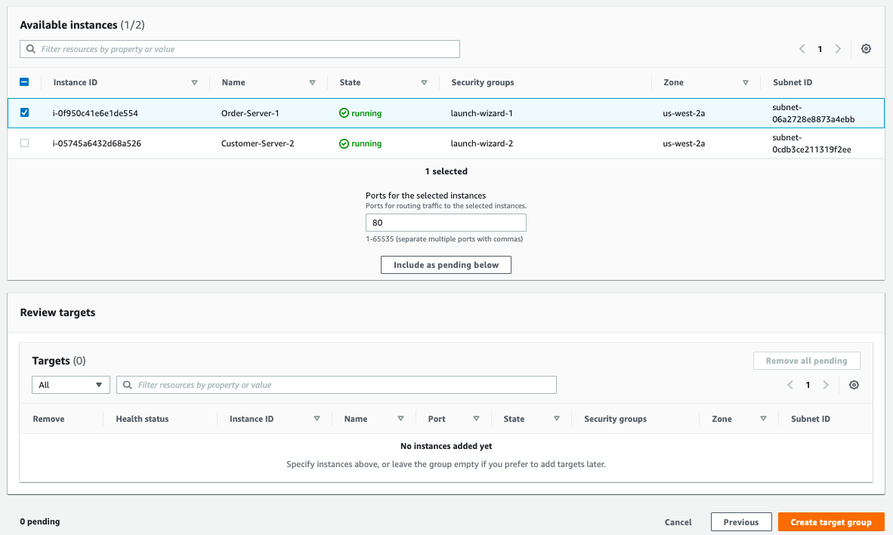

# 5. Order instance is provided to order target group #
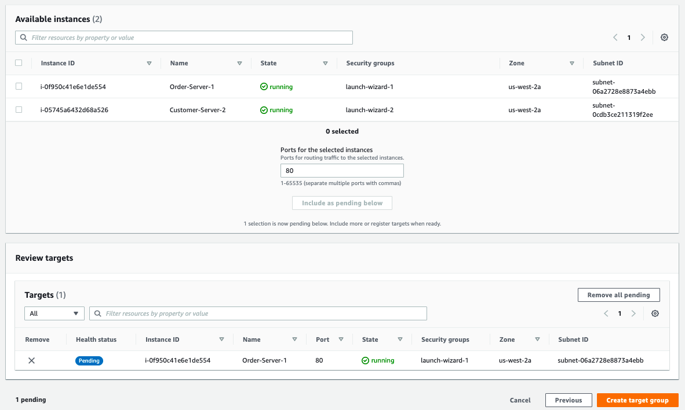

# 6. Assigned EC2 instance is in pending condition #
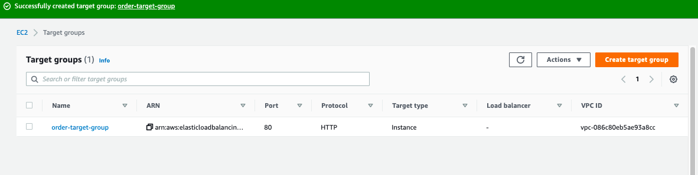

# 7. Customer target group is created #
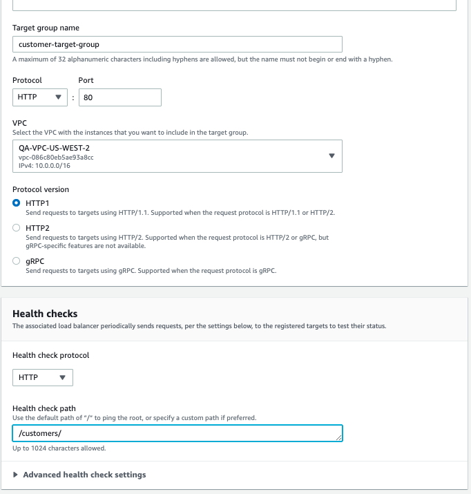

# 8. Healthcheck URL for cusomter EC2 instance is provided #
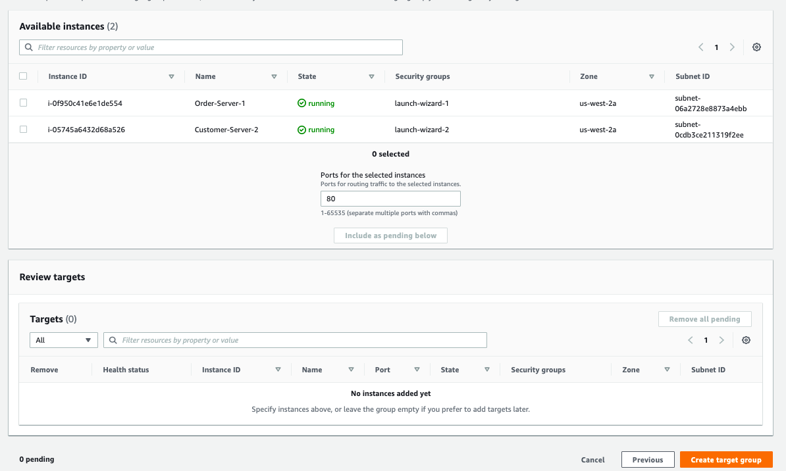

# 9. EC2 instance is added inside customer target group #
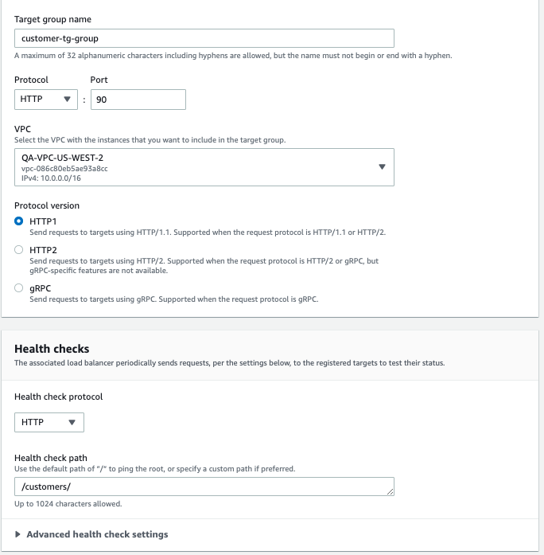

# 10. Target group is created for customer order #
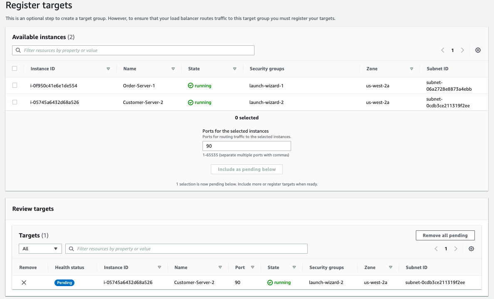
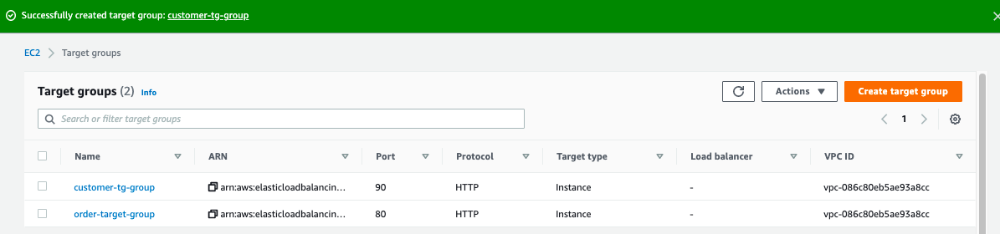

# 11. Application load balancer is created #
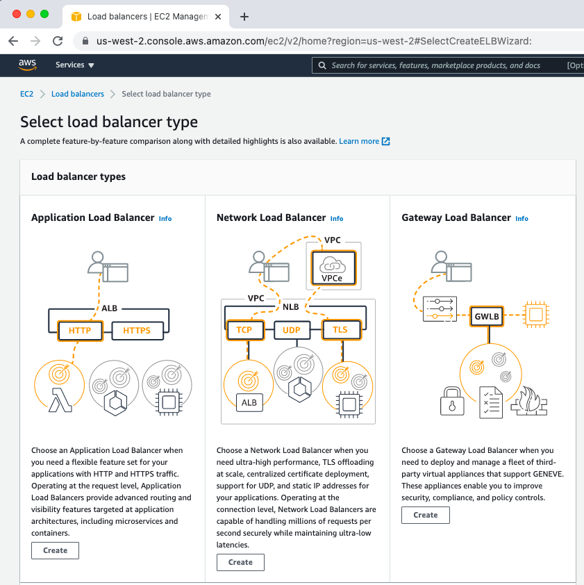

# 12. Application load balancer is converted to internet facing #
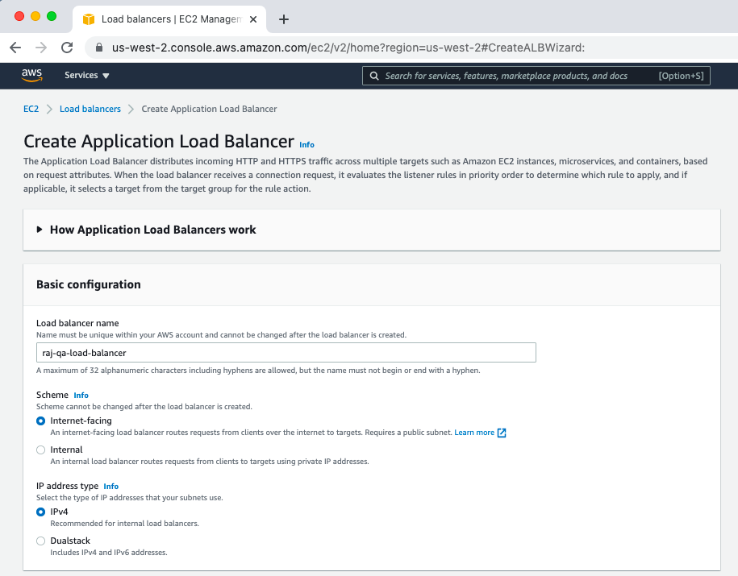

# 13. HTTP port is assigned to target group for load balancer #
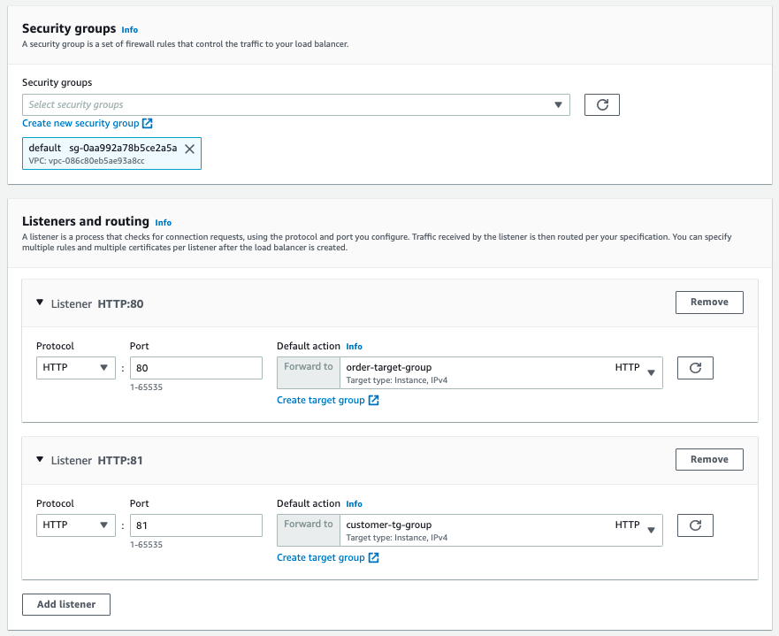
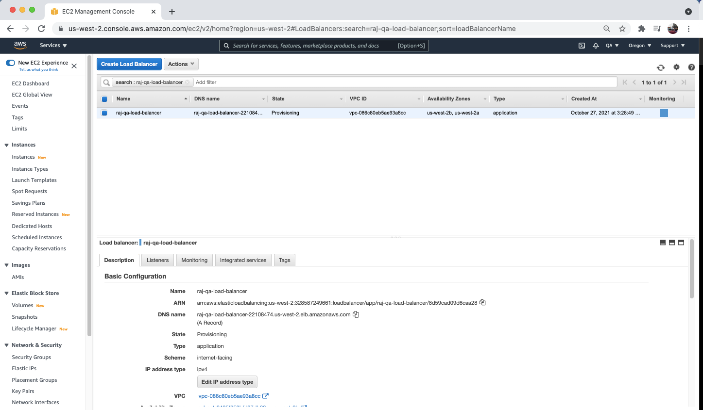

# Rule for load balancer is detected #
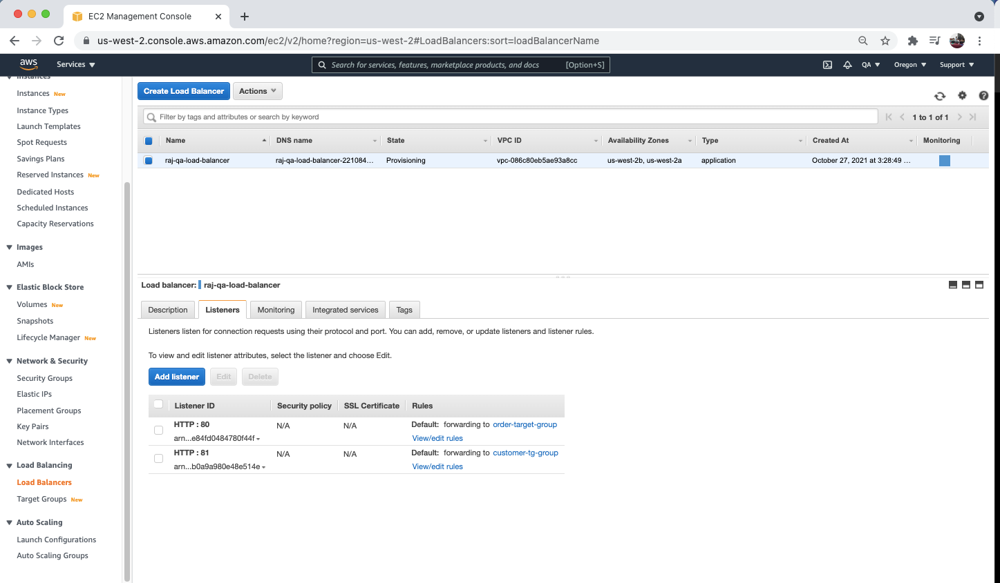