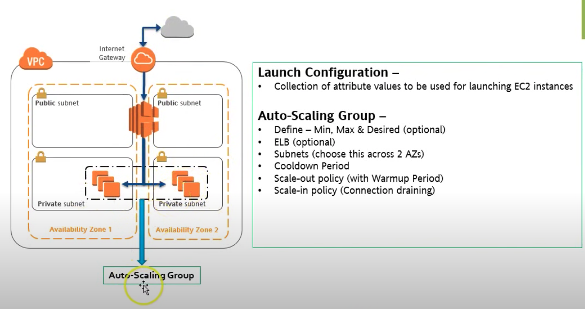
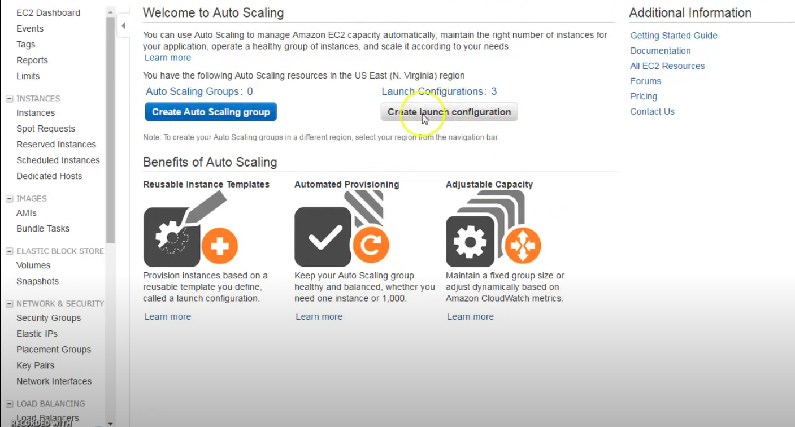
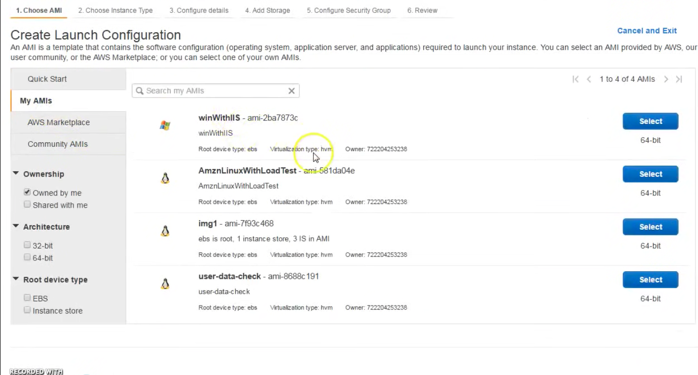
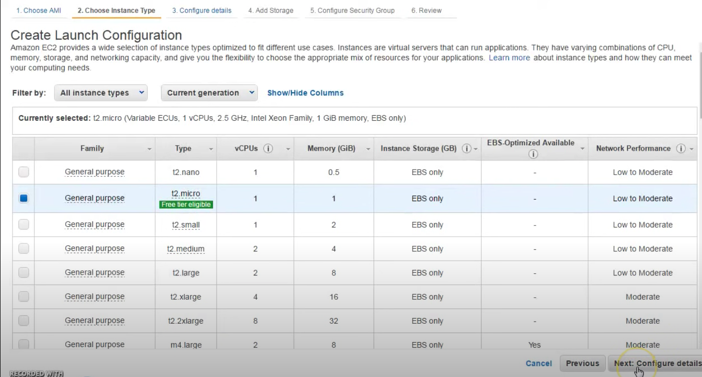
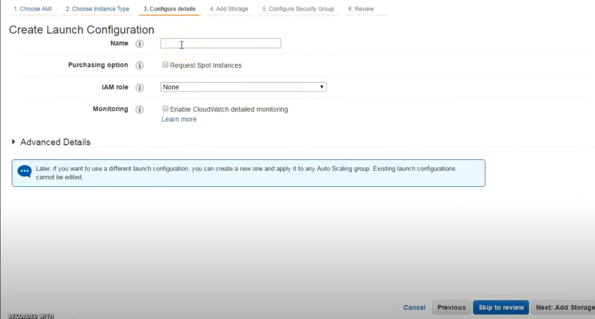
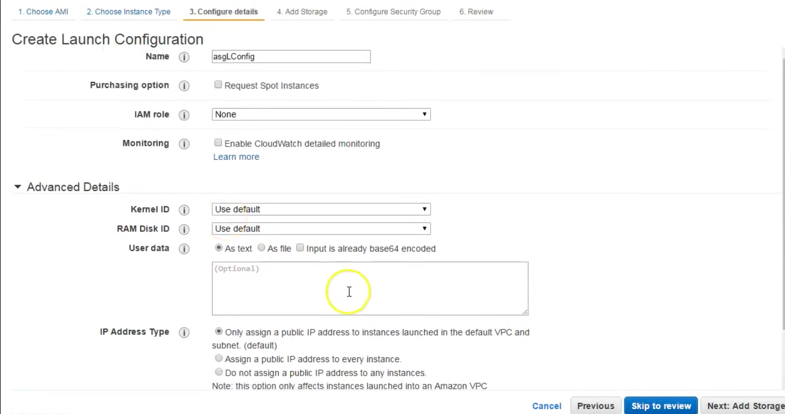
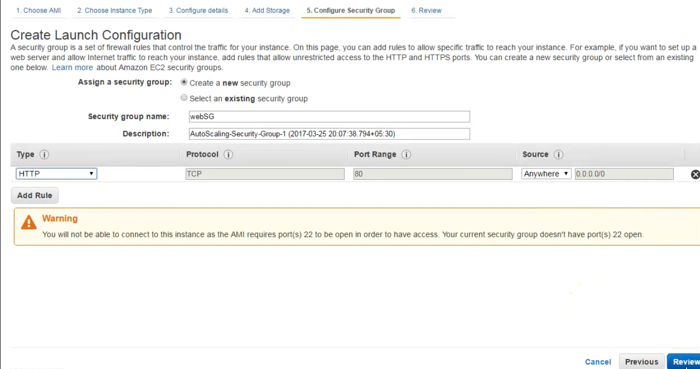
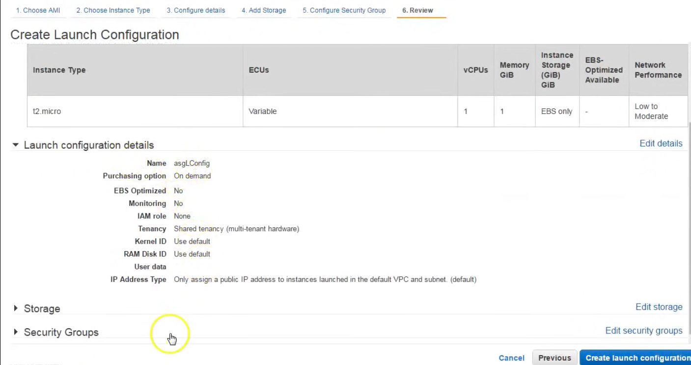
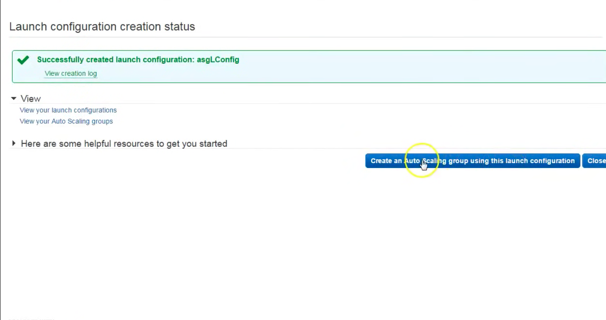

# Overview of AWS Auto Scaling Group #

# Launch Configuration # 
## 2.1 Introduction ##
1. A launch configuration is an instance configuration template that an Auto Scaling group uses to launch EC2 instances. 

2. When we create a launch configuration, we specify information for the instances. Include the ID of the Amazon Machine Image (AMI), the instance type, a key pair, one or more security groups, and a block device mapping.

## 2.2 Demo for launch configuration ##

<b>Note: Launch configuration is similar to launching AWS instance. </b>

