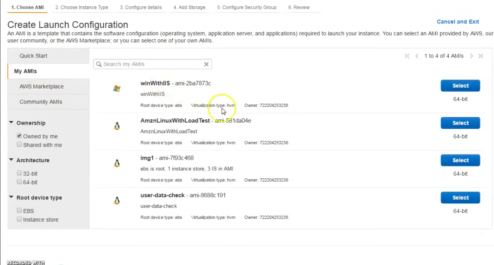

# Overview of AWS Auto Scaling Group #

# What is Crosszone load balancing #
1. It reduces the need to maintain equivalent numbers of instances in each enabled Availability Zone.

# Launch Configuration # 
## 2.1 Introduction ##
1. A launch configuration is an instance configuration template that an Auto Scaling group uses to launch EC2 instances. 

2. When we create a launch configuration, we specify information for the instances. Include the ID of the Amazon Machine Image (AMI), the instance type, a key pair, one or more security groups, and a block device mapping.

## 2.2 Demo for launch configuration ##

<b>Note: Launch configuration is similar to launching AWS instance. </b>

# 3. Auto Scaling Group #
## 3.1 Launch auto scaling group ##
### 3.1.1 Auto Scaling Group is Launched in two private subnets within VPC as depicted in top diagram ###

### 3.1.2 Auto Scaling Group starts with 2 but it will scale to 6 on the basis of need ###

### 3.1.3 Increase instance when execute policy is met ###

### 3.1.4  When CPU utilization is more than 80% for 1 period of 5 minutes ### 

### 3.1.5. When CPU utilization is more than 80% for 1 period of 5 minutes then add 1 instance ###

### 3.1.6 Scale out condition for auto scaling ###

### 3.1.7 When CPU utilization is less than 40% for 1 consective period of 5 minutes ###

### 3.1.8 When CPU utilization is less than 40% for 1 consectuve period of 5 minutes then remove 1 instance ###

### 3.1.9 No notification group is added ####

### 3.1.10 Ne Key Value paid for Auto Scaling Group ###

### 3.1.11 Confirmation of information for Auto Scaling Group ###

<b><i> Note: We can edit launch configuration but we can delete and copy. </i></b>

# 4. Launching Load Balancer #
### 4.1.1 Launch Loadbalancer ###

### 4.1.2 Select public subnet for load balancer ###

### 4.1.3 Assign security group ###

### 4.1.4 Configure health check ###

### 4.1.5 Perform Cross-Zone load Balancing if required ###

### 4.1.6 Configure load balancer from Auto Scaling ###
