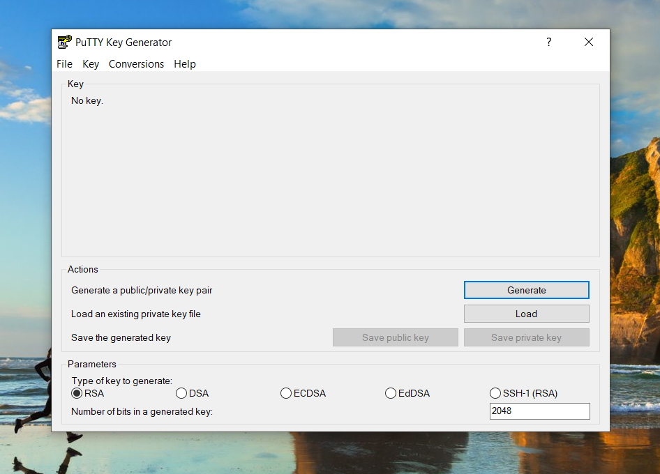
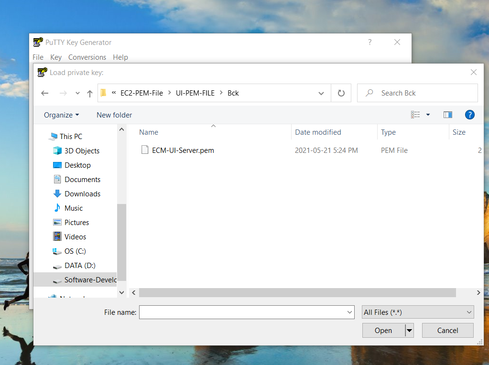
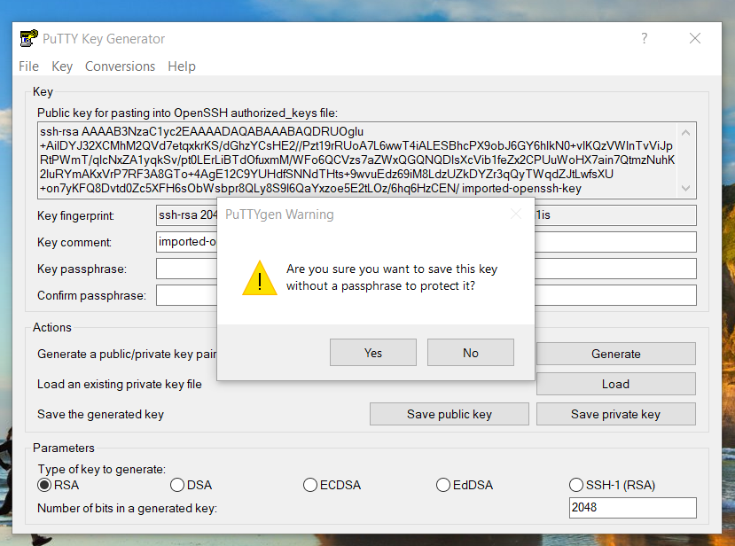
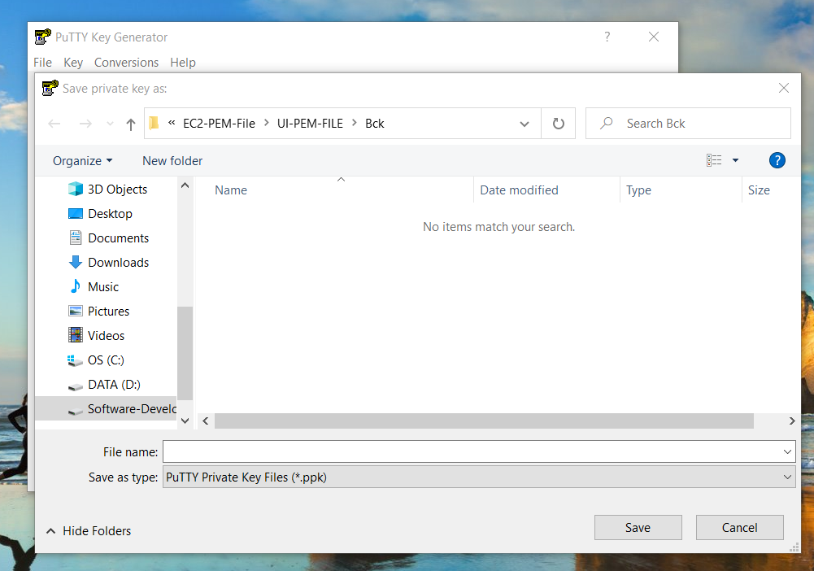
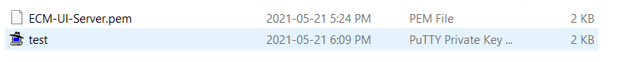
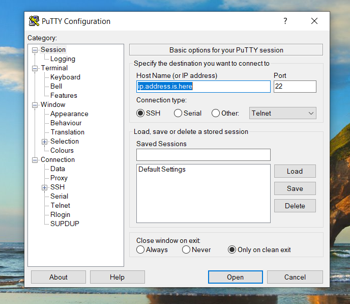
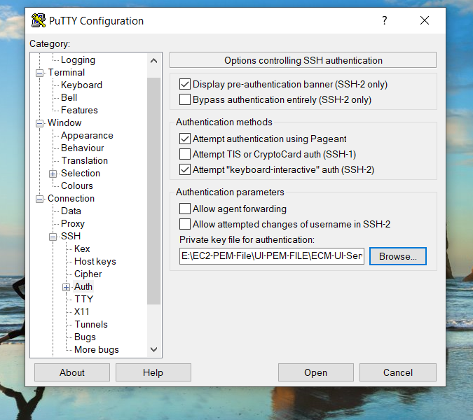
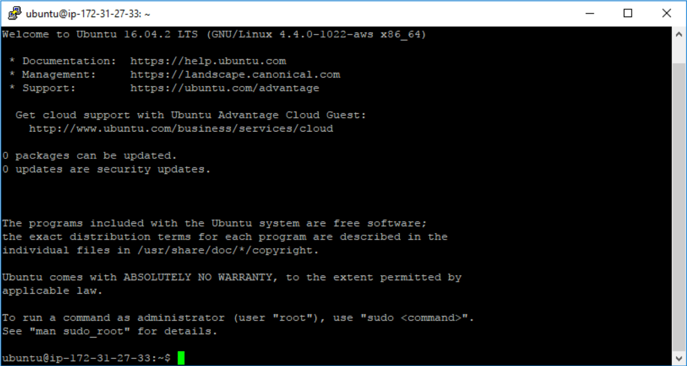

## 1. How to generate .ppk and connect to EC2 ##
### Generate a PuTTY Private Key (.ppk) File ###
- Download and install PuTTYKeyGen.
- Open the folder that PuTTYKeyGen was installed to (default path is C: > Program Files > PuTTY).
- Double-click on the file puttygen.exe.

- In PuTTY Key Generator, click the Load button and navigate to the folder that contains the private key file (.pem) 
created during the EC2 configuration process.

- Click on the PuTTY Private Key Files button in the lower-right corner of the window and select All Files (*.*).

- Select All Files in PuTTY Private Key Files
- Select your private key file (.pem) and agree to the dialog box.
- Click on save private key and generate ppk key as given below: 

### 2. Use PPK file to connect to Ec2 using Putty ###
- In the Host Name (or IP address) get the public IP address of EC2 instance and paste here.
- Use Port 22 because we will have port 22 located in EC2's Security Group for ssh connection

- In the Category pane on the left of the PuTTY Configuration window, under Connection, click on the + next to SSH to expand the choices (4), then click on Auth (5). Under Authentication parameters, click Browse and navigate to the directory where your PuTTY Private Key (.ppk) file is located (6). Click on the (.ppk) file to select it.

- Intitate the connection.

## Default username in the Ec2 ##
- For Amazon Linux 2 or the Amazon Linux AMI, the user name is ec2-user.
- For a CentOS AMI, the user name is centos.
- For a Debian AMI, the user name is admin.
- For a Fedora AMI, the user name is ec2-user or fedora.
- For a RHEL AMI, the user name is ec2-user or root.
- For a SUSE AMI, the user name is ec2-user or root.
- For an Ubuntu AMI, the user name is ubuntu.